**R Markdown**


## Load Dependencies


``` r
library(phyloseq)
library(tidyverse)
library(vegan)
library(Biostrings)
library(ggplot2)
library(Biostrings)
library(ggpubr)
library(decontam)
library(metagenomeSeq)
library(indicspecies)
library(stats4)
library(ggrepel)
library(ANCOMBC)
library(ggVennDiagram)
library(VennDiagram)
library(microbiome)
library(minpack.lm)
library(Hmisc)
library(dplyr)
library(scales)
library(DESeq2)
```

## Colorblind Palette

``` r
cbbPalette <- c("#000000", "#E69F00", "#56B4E9", "#009E73", "#0072B2", "#D55E00", "#CC79A7", "#F0E442")
ibm.cbb <- c("#648FFF", "#785EF0", "#DC267F", "#FE6100", "#004d4d")
tol.cbb <- c("#332288", "#117733", "#f95d6a", "#2f4b7c", "#44AA99", "#88CCEE", "#CC6677", "#AA4499", "#882255")
```

## Load files from HPC to create a phyloseq object

``` r
# Taxonomy 
#Edit the taxonomy rds
nbc.tax.fungi <- read.csv("Phyloseq_input/In_use_constax_taxonomy.csv")

nbc.tax.fungi$Lowest_Taxonomic_Rank <- ifelse(nbc.tax.fungi$Phylum == "unidentified", nbc.tax.fungi$Kingdom,
                                             ifelse(nbc.tax.fungi$Class == "unidentified", nbc.tax.fungi$Phylum,
                                                    ifelse(nbc.tax.fungi$Order == "unidentified", nbc.tax.fungi$Class,
                                                           ifelse(nbc.tax.fungi$Family == "unidentified", nbc.tax.fungi$Order,
                                                                  ifelse(nbc.tax.fungi$Genus == "unidentified", nbc.tax.fungi$Family,
                                                                         ifelse(nbc.tax.fungi$Species == "unidentified", nbc.tax.fungi$Genus, 
                                                                                paste(nbc.tax.fungi$Species)))))))

nbc.tax.fungi$Label <- paste(nbc.tax.fungi$OTU_ID, nbc.tax.fungi$Lowest_Taxonomic_Rank, sep = "_")

#create taxonomy variable
tax <- nbc.tax.fungi
head(tax)
```

```
##   OTU_ID Kingdom        Phylum              Class             Order
## 1   FOTU   Fungi    Ascomycota    Dothideomycetes      Pleosporales
## 2 FOTU_2   Fungi Basidiomycota Atractiellomycetes    Atractiellales
## 3 FOTU_3   Fungi    Ascomycota    Dothideomycetes    Cladosporiales
## 4 FOTU_4   Fungi    Ascomycota    Sordariomycetes       Hypocreales
## 5 FOTU_5   Fungi  unidentified       unidentified      unidentified
## 6 FOTU_6   Fungi    Ascomycota    Sordariomycetes Chaetosphaeriales
##               Family        Genus                       Species
## 1       unidentified unidentified                  unidentified
## 2 Hoehnelomycetaceae  Atractiella       Atractiella rhizophila 
## 3    Cladosporiaceae Cladosporium Cladosporium cladosporioides 
## 4        Nectriaceae     Fusarium                  unidentified
## 5       unidentified unidentified                  unidentified
## 6 Chaetosphaeriaceae     Codinaea                  unidentified
##                                                                                                                         High_level_taxonomy
## 1 Fungi-CCHF45,p__Ascomycota,c__Dothideomycetes,o__Pleosporales,f__Cucurbitariaceae,g__Pyrenochaetopsis,s__Pyrenochaetopsis_tabarestanensis
## 2                                                                                                                              unidentified
## 3                                           Fungi-ZANF35,p__Ascomycota,c__Dothideomycetes,o__Capnodiales,f__Cladosporiaceae,g__Cladosporium
## 4                                                   Fungi-CCHF67,p__Ascomycota,c__Sordariomycetes,o__Hypocreales,f__Nectriaceae,g__Fusarium
## 5                                                   Fungi-ZANF50,p__Ascomycota,c__Sordariomycetes,o__Hypocreales,f__Nectriaceae,g__Fusarium
## 6                 Fungi-ZANF68,p__Ascomycota,c__Sordariomycetes,o__Sordariales,f__Chaetomiaceae,g__Pseudothielavia,s__Pseudothielavia_arxii
##   HL_hit_percent_id HL_hit_query_cover         Lowest_Taxonomic_Rank
## 1            87.831                 85                  Pleosporales
## 2             0.000                  0       Atractiella rhizophila 
## 3           100.000                100 Cladosporium cladosporioides 
## 4           100.000                100                      Fusarium
## 5           100.000                100                         Fungi
## 6            76.889                100                      Codinaea
##                                  Label
## 1                    FOTU_Pleosporales
## 2       FOTU_2_Atractiella rhizophila 
## 3 FOTU_3_Cladosporium cladosporioides 
## 4                      FOTU_4_Fusarium
## 5                         FOTU_5_Fungi
## 6                      FOTU_6_Codinaea
```

``` r
rownames(tax) <- tax$OTU_ID
TAX.fungi <- phyloseq::tax_table(as.matrix(tax))

# OTU Table 
table <- read.csv("Phyloseq_input/OTU_TABLE_CSV_FUNGI.csv")
rownames(table) <- table$OTU_ID
table <- table[,-1]
OTU.fungi <- phyloseq::otu_table(table, taxa_are_rows = TRUE)

list(colnames(OTU.fungi))
```

```
## [[1]]
##   [1] "PCR_1_NC_plate2_2024"   "PCR_1_NC_plate3_2024"   "PCR_1_NC_plate4_2024"  
##   [4] "PCR_2_NC_plate1_2023"   "PCR_2_NC_plate2_2024"   "PCR_2_NC_plate3_2024"  
##   [7] "PCR_2_NC_plate4_2024"   "PCR_3_NC_plate1_2023"   "PCR_3_NC_plate2_2024"  
##  [10] "PCR_3_NC_plate3_2024"   "PC_Mock_Plate1_2023"    "PC_Mock_Plate2_2024"   
##  [13] "PC_Mock_Plate3_2024"    "Peg1101AIrrigated2023"  "Peg1101AIrrigated2024" 
##  [16] "Peg1101BIrrigated2023"  "Peg1101BIrrigated2024"  "Peg1101CIrrigated2023" 
##  [19] "Peg1101CIrrigated2024"  "Peg1102AIrrigated2023"  "Peg1102BIrrigated2023" 
##  [22] "Peg1102CIrrigated2023"  "Peg1104AIrrigated2024"  "Peg1104BIrrigated2024" 
##  [25] "Peg1104CIrrigated2024"  "Peg1202ADrought2023"    "Peg1202BDrought2023"   
##  [28] "Peg1202CDrought2023"    "Peg1203ADrought2024"    "Peg1203BDrought2024"   
##  [31] "Peg1203CDrought2024"    "Peg1204ADrought2023"    "Peg1204BDrought2023"   
##  [34] "Peg1204CDrought2023"    "Peg1205ADrought2024"    "Peg1205BDrought2024"   
##  [37] "Peg1205CDrought2024"    "Peg1302ADrought2023"    "Peg1302ADrought2024"   
##  [40] "Peg1302BDrought2023"    "Peg1302BDrought2024"    "Peg1302CDrought2023"   
##  [43] "Peg1302CDrought2024"    "Peg1304ADrought2023"    "Peg1304ADrought2024"   
##  [46] "Peg1304BDrought2023"    "Peg1304BDrought2024"    "Peg1304CDrought2023"   
##  [49] "Peg1304CDrought2024"    "Peg1401AIrrigated2023"  "Peg1401AIrrigated2024" 
##  [52] "Peg1401BIrrigated2023"  "Peg1401BIrrigated2024"  "Peg1401CIrrigated2023" 
##  [55] "Peg1401CIrrigated2024"  "Peg1403AIrrigated2023"  "Peg1403BIrrigated2023" 
##  [58] "Peg1403CIrrigated2023"  "Peg1404AIrrigated2024"  "Peg1404BIrrigated2024" 
##  [61] "Peg1404CIrrigated2024"  "Peg1501AIrrigated2023"  "Peg1501AIrrigated2024" 
##  [64] "Peg1501BIrrigated2023"  "Peg1501BIrrigated2024"  "Peg1501CIrrigated2023" 
##  [67] "Peg1501CIrrigated2024"  "Peg1503AIrrigated2023"  "Peg1503BIrrigated2023" 
##  [70] "Peg1503CIrrigated2023"  "Peg1504AIrrigated2024"  "Peg1504BIrrigated2024" 
##  [73] "Peg1504CIrrigated2024"  "Peg1601ADrought2023"    "Peg1601ADrought2024"   
##  [76] "Peg1601BDrought2023"    "Peg1601BDrought2024"    "Peg1601CDrought2023"   
##  [79] "Peg1601CDrought2024"    "Peg1602ADrought2024"    "Peg1602BDrought2024"   
##  [82] "Peg1602CDrought2024"    "Peg1604ADrought2023"    "Peg1604BDrought2023"   
##  [85] "Peg1604CDrought2023"    "Peg1701ADrought2024"    "Peg1701BDrought2024"   
##  [88] "Peg1701CDrought2024"    "Peg1702ADrought2023"    "Peg1702BDrought2023"   
##  [91] "Peg1702CDrought2023"    "Peg1705ADrought2023"    "Peg1705BDrought2023"   
##  [94] "Peg1705CDrought2023"    "Peg1801AIrrigated2023"  "Peg1801BIrrigated2023" 
##  [97] "Peg1801CIrrigated2023"  "Peg1802AIrrigated2024"  "Peg1802BIrrigated2024" 
## [100] "Peg1802CIrrigated2024"  "Peg1803AIrrigated2023"  "Peg1803BIrrigated2023" 
## [103] "Peg1803CIrrigated2023"  "Peg1805AIrrigated2024"  "Peg1805BIrrigated2024" 
## [106] "Peg1805CIrrigated2024"  "Peg2206AI"              "Peg2206BI"             
## [109] "Peg2206CI"              "Peg2208AI"              "Peg2208BI"             
## [112] "Peg2208CI"              "Peg2301AI"              "Peg2301BI"             
## [115] "Peg2301CI"              "Peg2302AI"              "Peg2302BI"             
## [118] "Peg2302CI"              "Peg2404AI"              "Peg2404BI"             
## [121] "Peg2404CI"              "Peg2406AI"              "Peg2406BI"             
## [124] "Peg2406CI"              "Peg2505AD"              "Peg2505BD"             
## [127] "Peg2505CD"              "Peg2506AD"              "Peg2506BD"             
## [130] "Peg2506CD"              "Peg2705AD"              "Peg2705BD"             
## [133] "Peg2705CD"              "Peg2709AD"              "Peg2709BD"             
## [136] "Peg2709CD"              "Peg2805AD"              "Peg2805BD"             
## [139] "Peg2805CD"              "Peg2809AD"              "Peg2809BD"             
## [142] "Peg2809CD"              "Peg_NC3"                "Peg_NC4"               
## [145] "Peg_NC5_2023"           "Peg_NC5_2024"           "Peg_NC6_2023"          
## [148] "Peg_NC6_2024"           "Peg_NC7_2023"           "Root1101AIrrigated2023"
## [151] "Root1101AIrrigated2024" "Root1101BIrrigated2023" "Root1101BIrrigated2024"
## [154] "Root1101CIrrigated2023" "Root1101CIrrigated2024" "Root1102AIrrigated2023"
## [157] "Root1102BIrrigated2023" "Root1102CIrrigated2023" "Root1104AIrrigated2024"
## [160] "Root1104BIrrigated2024" "Root1104CIrrigated2024" "Root1202ADrought2023"  
## [163] "Root1202BDrought2023"   "Root1202CDrought2023"   "Root1203ADrought2024"  
## [166] "Root1203BDrought2024"   "Root1203CDrought2024"   "Root1204ADrought2023"  
## [169] "Root1204BDrought2023"   "Root1204CDrought2023"   "Root1205ADrought2024"  
## [172] "Root1205BDrought2024"   "Root1205CDrought2024"   "Root1302ADrought2023"  
## [175] "Root1302ADrought2024"   "Root1302BDrought2023"   "Root1302BDrought2024"  
## [178] "Root1302CDrought2023"   "Root1302CDrought2024"   "Root1304ADrought2023"  
## [181] "Root1304ADrought2024"   "Root1304BDrought2023"   "Root1304BDrought2024"  
## [184] "Root1304CDrought2023"   "Root1304CDrought2024"   "Root1401AIrrigated2023"
## [187] "Root1401AIrrigated2024" "Root1401BIrrigated2023" "Root1401BIrrigated2024"
## [190] "Root1401CIrrigated2023" "Root1401CIrrigated2024" "Root1403AIrrigated2023"
## [193] "Root1403BIrrigated2023" "Root1403CIrrigated2023" "Root1404AIrrigated2024"
## [196] "Root1404BIrrigated2024" "Root1404CIrrigated2024" "Root1501AIrrigated2023"
## [199] "Root1501AIrrigated2024" "Root1501BIrrigated2023" "Root1501BIrrigated2024"
## [202] "Root1501CIrrigated2023" "Root1501CIrrigated2024" "Root1503AIrrigated2023"
## [205] "Root1503BIrrigated2023" "Root1503CIrrigated2023" "Root1504AIrrigated2024"
## [208] "Root1504BIrrigated2024" "Root1504CIrrigated2024" "Root1601ADrought2023"  
## [211] "Root1601ADrought2024"   "Root1601BDrought2023"   "Root1601BDrought2024"  
## [214] "Root1601CDrought2023"   "Root1601CDrought2024"   "Root1602ADrought2024"  
## [217] "Root1602BDrought2024"   "Root1602CDrought2024"   "Root1604ADrought2023"  
## [220] "Root1604BDrought2023"   "Root1604CDrought2023"   "Root1701ADrought2024"  
## [223] "Root1701BDrought2024"   "Root1701CDrought2024"   "Root1702ADrought2023"  
## [226] "Root1702BDrought2023"   "Root1702CDrought2023"   "Root1705ADrought2023"  
## [229] "Root1705BDrought2023"   "Root1705CDrought2023"   "Root1801AIrrigated2023"
## [232] "Root1801BIrrigated2023" "Root1801CIrrigated2023" "Root1802AIrrigated2024"
## [235] "Root1802BIrrigated2024" "Root1802CIrrigated2024" "Root1803AIrrigated2023"
## [238] "Root1803BIrrigated2023" "Root1803CIrrigated2023" "Root1805AIrrigated2024"
## [241] "Root1805BIrrigated2024" "Root1805CIrrigated2024" "Root2206AI"            
## [244] "Root2206BI"             "Root2206CI"             "Root2208AI"            
## [247] "Root2208BI"             "Root2208CI"             "Root2301AI"            
## [250] "Root2301BI"             "Root2301CI"             "Root2302AI"            
## [253] "Root2302BI"             "Root2302CI"             "Root2404AI"            
## [256] "Root2404BI"             "Root2404CI"             "Root2406AI"            
## [259] "Root2406BI"             "Root2406CI"             "Root2505AD"            
## [262] "Root2505BD"             "Root2505CD"             "Root2506AD"            
## [265] "Root2506BD"             "Root2506CD"             "Root2705AD"            
## [268] "Root2705BD"             "Root2705CD"             "Root2709AD"            
## [271] "Root2709BD"             "Root2709CD"             "Root2805AD"            
## [274] "Root2805BD"             "Root2805CD"             "Root2809AD"            
## [277] "Root2809BD"             "Root2809CD"             "Root_NC2"              
## [280] "Root_NC3_2023"          "Root_NC3_2024"          "Root_NC4_2023"         
## [283] "Root_NC4_2024"          "Root_NC5"               "Soil1101AIrrigated2023"
## [286] "Soil1101AIrrigated2024" "Soil1101BIrrigated2023" "Soil1101BIrrigated2024"
## [289] "Soil1101CIrrigated2023" "Soil1101CIrrigated2024" "Soil1102AIrrigated2023"
## [292] "Soil1102BIrrigated2023" "Soil1102CIrrigated2023" "Soil1104AIrrigated2024"
## [295] "Soil1104BIrrigated2024" "Soil1104CIrrigated2024" "Soil1202ADrought2023"  
## [298] "Soil1202BDrought2023"   "Soil1202CDrought2023"   "Soil1203ADrought2024"  
## [301] "Soil1203BDrought2024"   "Soil1203CDrought2024"   "Soil1204ADrought2023"  
## [304] "Soil1204BDrought2023"   "Soil1204CDrought2023"   "Soil1205ADrought2024"  
## [307] "Soil1205BDrought2024"   "Soil1205CDrought2024"   "Soil1302ADrought2023"  
## [310] "Soil1302ADrought2024"   "Soil1302BDrought2023"   "Soil1302BDrought2024"  
## [313] "Soil1302CDrought2023"   "Soil1302CDrought2024"   "Soil1304ADrought2023"  
## [316] "Soil1304ADrought2024"   "Soil1304BDrought2023"   "Soil1304BDrought2024"  
## [319] "Soil1304CDrought2023"   "Soil1304CDrought2024"   "Soil1401AIrrigated2023"
## [322] "Soil1401AIrrigated2024" "Soil1401BIrrigated2023" "Soil1401BIrrigated2024"
## [325] "Soil1401CIrrigated2023" "Soil1401CIrrigated2024" "Soil1403AIrrigated2023"
## [328] "Soil1403BIrrigated2023" "Soil1403CIrrigated2023" "Soil1404AIrrigated2024"
## [331] "Soil1404BIrrigated2024" "Soil1404CIrrigated2024" "Soil1501AIrrigated2023"
## [334] "Soil1501AIrrigated2024" "Soil1501BIrrigated2023" "Soil1501BIrrigated2024"
## [337] "Soil1501CIrrigated2023" "Soil1501CIrrigated2024" "Soil1503AIrrigated2023"
## [340] "Soil1503BIrrigated2023" "Soil1503CIrrigated2023" "Soil1504AIrrigated2024"
## [343] "Soil1504BIrrigated2024" "Soil1504CIrrigated2024" "Soil1601ADrought2023"  
## [346] "Soil1601ADrought2024"   "Soil1601BDrought2023"   "Soil1601BDrought2024"  
## [349] "Soil1601CDrought2023"   "Soil1601CDrought2024"   "Soil1602ADrought2024"  
## [352] "Soil1602BDrought2024"   "Soil1602CDrought2024"   "Soil1604ADrought2023"  
## [355] "Soil1604BDrought2023"   "Soil1604CDrought2023"   "Soil1701ADrought2024"  
## [358] "Soil1701BDrought2024"   "Soil1701CDrought2024"   "Soil1702ADrought2023"  
## [361] "Soil1702BDrought2023"   "Soil1702CDrought2023"   "Soil1705ADrought2023"  
## [364] "Soil1705BDrought2023"   "Soil1705CDrought2023"   "Soil1801AIrrigated2023"
## [367] "Soil1801BIrrigated2023" "Soil1801CIrrigated2023" "Soil1802AIrrigated2024"
## [370] "Soil1802BIrrigated2024" "Soil1802CIrrigated2024" "Soil1803AIrrigated2023"
## [373] "Soil1803BIrrigated2023" "Soil1803CIrrigated2023" "Soil1805AIrrigated2024"
## [376] "Soil1805BIrrigated2024" "Soil1805CIrrigated2024" "Soil2206AI"            
## [379] "Soil2206BI"             "Soil2206CI"             "Soil2208AI"            
## [382] "Soil2208BI"             "Soil2208CI"             "Soil2301AI"            
## [385] "Soil2301BI"             "Soil2301CI"             "Soil2302AI"            
## [388] "Soil2302BI"             "Soil2302CI"             "Soil2404AI"            
## [391] "Soil2404BI"             "Soil2404CI"             "Soil2406AI"            
## [394] "Soil2406BI"             "Soil2406CI"             "Soil2505AD"            
## [397] "Soil2505BD"             "Soil2505CD"             "Soil2506AD"            
## [400] "Soil2506BD"             "Soil2506CD"             "Soil2705AD"            
## [403] "Soil2705BD"             "Soil2705CD"             "Soil2709AD"            
## [406] "Soil2709BD"             "Soil2709CD"             "Soil2805AD"            
## [409] "Soil2805BD"             "Soil2805CD"             "Soil2809AD"            
## [412] "Soil2809BD"             "Soil2809CD"             "Soil_NC1_2023"         
## [415] "Soil_NC1_2024"          "Soil_NC1"               "Soil_NC2_2023"         
## [418] "Soil_NC2_2024"          "Soil_NC5"               "Soil_NC6"              
## [421] "Soil_NC7"               "Soil_PC1"               "Soil_PC2"              
## [424] "Soil_PC3"               "Soil_PC4"               "Undetermined"
```

``` r
# Metadata 
samples <- read.csv("Phyloseq_input/FungalMetadata_2024.csv", na.strings = "na")
rownames(samples) <- samples$Sample #row names must match OTU table headers
samples$Sample_Type <- ifelse(samples$Category == "True Sample", "Sample", 
                              ifelse(samples$Category == "NEC", "NEC",
                                     ifelse(samples$Category == "PCR_NEC", "NEC",
                                            ifelse(samples$Category == "PCR1_NC_110123", "NEC", 
                                                ifelse(samples$Category == "PCR2_NC_110123", "NEC",
                                                       ifelse(samples$Category == "PCR3_NC_110123", "NEC", "Mock"))))))
SAMP.fungi <- phyloseq::sample_data(samples)
view(SAMP.fungi)


# Fasta File
FASTA.fungi <- Biostrings::readDNAStringSet("Phyloseq_input/otus.fasta", format="fasta", seek.first.rec=TRUE, use.names=TRUE)

# Phyloseq Object Creation
phyloseq.start <- phyloseq(SAMP.fungi, TAX.fungi, OTU.fungi, FASTA.fungi)
head(rownames(samples))  # Sample names in metadata
```

```
## [1] "Soil2206AI" "Soil2206BI" "Soil2206CI" "Soil2208AI" "Soil2208BI"
## [6] "Soil2208CI"
```

``` r
head(colnames(OTU.fungi))  # Sample names in OTU table
```

```
## [1] "PCR_1_NC_plate2_2024" "PCR_1_NC_plate3_2024" "PCR_1_NC_plate4_2024"
## [4] "PCR_2_NC_plate1_2023" "PCR_2_NC_plate2_2024" "PCR_2_NC_plate3_2024"
```

``` r
x <- list(colnames(table))
y <- list(samples$Sample)

setdiff(x,y)
```

```
## [[1]]
##   [1] "PCR_1_NC_plate2_2024"   "PCR_1_NC_plate3_2024"   "PCR_1_NC_plate4_2024"  
##   [4] "PCR_2_NC_plate1_2023"   "PCR_2_NC_plate2_2024"   "PCR_2_NC_plate3_2024"  
##   [7] "PCR_2_NC_plate4_2024"   "PCR_3_NC_plate1_2023"   "PCR_3_NC_plate2_2024"  
##  [10] "PCR_3_NC_plate3_2024"   "PC_Mock_Plate1_2023"    "PC_Mock_Plate2_2024"   
##  [13] "PC_Mock_Plate3_2024"    "Peg1101AIrrigated2023"  "Peg1101AIrrigated2024" 
##  [16] "Peg1101BIrrigated2023"  "Peg1101BIrrigated2024"  "Peg1101CIrrigated2023" 
##  [19] "Peg1101CIrrigated2024"  "Peg1102AIrrigated2023"  "Peg1102BIrrigated2023" 
##  [22] "Peg1102CIrrigated2023"  "Peg1104AIrrigated2024"  "Peg1104BIrrigated2024" 
##  [25] "Peg1104CIrrigated2024"  "Peg1202ADrought2023"    "Peg1202BDrought2023"   
##  [28] "Peg1202CDrought2023"    "Peg1203ADrought2024"    "Peg1203BDrought2024"   
##  [31] "Peg1203CDrought2024"    "Peg1204ADrought2023"    "Peg1204BDrought2023"   
##  [34] "Peg1204CDrought2023"    "Peg1205ADrought2024"    "Peg1205BDrought2024"   
##  [37] "Peg1205CDrought2024"    "Peg1302ADrought2023"    "Peg1302ADrought2024"   
##  [40] "Peg1302BDrought2023"    "Peg1302BDrought2024"    "Peg1302CDrought2023"   
##  [43] "Peg1302CDrought2024"    "Peg1304ADrought2023"    "Peg1304ADrought2024"   
##  [46] "Peg1304BDrought2023"    "Peg1304BDrought2024"    "Peg1304CDrought2023"   
##  [49] "Peg1304CDrought2024"    "Peg1401AIrrigated2023"  "Peg1401AIrrigated2024" 
##  [52] "Peg1401BIrrigated2023"  "Peg1401BIrrigated2024"  "Peg1401CIrrigated2023" 
##  [55] "Peg1401CIrrigated2024"  "Peg1403AIrrigated2023"  "Peg1403BIrrigated2023" 
##  [58] "Peg1403CIrrigated2023"  "Peg1404AIrrigated2024"  "Peg1404BIrrigated2024" 
##  [61] "Peg1404CIrrigated2024"  "Peg1501AIrrigated2023"  "Peg1501AIrrigated2024" 
##  [64] "Peg1501BIrrigated2023"  "Peg1501BIrrigated2024"  "Peg1501CIrrigated2023" 
##  [67] "Peg1501CIrrigated2024"  "Peg1503AIrrigated2023"  "Peg1503BIrrigated2023" 
##  [70] "Peg1503CIrrigated2023"  "Peg1504AIrrigated2024"  "Peg1504BIrrigated2024" 
##  [73] "Peg1504CIrrigated2024"  "Peg1601ADrought2023"    "Peg1601ADrought2024"   
##  [76] "Peg1601BDrought2023"    "Peg1601BDrought2024"    "Peg1601CDrought2023"   
##  [79] "Peg1601CDrought2024"    "Peg1602ADrought2024"    "Peg1602BDrought2024"   
##  [82] "Peg1602CDrought2024"    "Peg1604ADrought2023"    "Peg1604BDrought2023"   
##  [85] "Peg1604CDrought2023"    "Peg1701ADrought2024"    "Peg1701BDrought2024"   
##  [88] "Peg1701CDrought2024"    "Peg1702ADrought2023"    "Peg1702BDrought2023"   
##  [91] "Peg1702CDrought2023"    "Peg1705ADrought2023"    "Peg1705BDrought2023"   
##  [94] "Peg1705CDrought2023"    "Peg1801AIrrigated2023"  "Peg1801BIrrigated2023" 
##  [97] "Peg1801CIrrigated2023"  "Peg1802AIrrigated2024"  "Peg1802BIrrigated2024" 
## [100] "Peg1802CIrrigated2024"  "Peg1803AIrrigated2023"  "Peg1803BIrrigated2023" 
## [103] "Peg1803CIrrigated2023"  "Peg1805AIrrigated2024"  "Peg1805BIrrigated2024" 
## [106] "Peg1805CIrrigated2024"  "Peg2206AI"              "Peg2206BI"             
## [109] "Peg2206CI"              "Peg2208AI"              "Peg2208BI"             
## [112] "Peg2208CI"              "Peg2301AI"              "Peg2301BI"             
## [115] "Peg2301CI"              "Peg2302AI"              "Peg2302BI"             
## [118] "Peg2302CI"              "Peg2404AI"              "Peg2404BI"             
## [121] "Peg2404CI"              "Peg2406AI"              "Peg2406BI"             
## [124] "Peg2406CI"              "Peg2505AD"              "Peg2505BD"             
## [127] "Peg2505CD"              "Peg2506AD"              "Peg2506BD"             
## [130] "Peg2506CD"              "Peg2705AD"              "Peg2705BD"             
## [133] "Peg2705CD"              "Peg2709AD"              "Peg2709BD"             
## [136] "Peg2709CD"              "Peg2805AD"              "Peg2805BD"             
## [139] "Peg2805CD"              "Peg2809AD"              "Peg2809BD"             
## [142] "Peg2809CD"              "Peg_NC3"                "Peg_NC4"               
## [145] "Peg_NC5_2023"           "Peg_NC5_2024"           "Peg_NC6_2023"          
## [148] "Peg_NC6_2024"           "Peg_NC7_2023"           "Root1101AIrrigated2023"
## [151] "Root1101AIrrigated2024" "Root1101BIrrigated2023" "Root1101BIrrigated2024"
## [154] "Root1101CIrrigated2023" "Root1101CIrrigated2024" "Root1102AIrrigated2023"
## [157] "Root1102BIrrigated2023" "Root1102CIrrigated2023" "Root1104AIrrigated2024"
## [160] "Root1104BIrrigated2024" "Root1104CIrrigated2024" "Root1202ADrought2023"  
## [163] "Root1202BDrought2023"   "Root1202CDrought2023"   "Root1203ADrought2024"  
## [166] "Root1203BDrought2024"   "Root1203CDrought2024"   "Root1204ADrought2023"  
## [169] "Root1204BDrought2023"   "Root1204CDrought2023"   "Root1205ADrought2024"  
## [172] "Root1205BDrought2024"   "Root1205CDrought2024"   "Root1302ADrought2023"  
## [175] "Root1302ADrought2024"   "Root1302BDrought2023"   "Root1302BDrought2024"  
## [178] "Root1302CDrought2023"   "Root1302CDrought2024"   "Root1304ADrought2023"  
## [181] "Root1304ADrought2024"   "Root1304BDrought2023"   "Root1304BDrought2024"  
## [184] "Root1304CDrought2023"   "Root1304CDrought2024"   "Root1401AIrrigated2023"
## [187] "Root1401AIrrigated2024" "Root1401BIrrigated2023" "Root1401BIrrigated2024"
## [190] "Root1401CIrrigated2023" "Root1401CIrrigated2024" "Root1403AIrrigated2023"
## [193] "Root1403BIrrigated2023" "Root1403CIrrigated2023" "Root1404AIrrigated2024"
## [196] "Root1404BIrrigated2024" "Root1404CIrrigated2024" "Root1501AIrrigated2023"
## [199] "Root1501AIrrigated2024" "Root1501BIrrigated2023" "Root1501BIrrigated2024"
## [202] "Root1501CIrrigated2023" "Root1501CIrrigated2024" "Root1503AIrrigated2023"
## [205] "Root1503BIrrigated2023" "Root1503CIrrigated2023" "Root1504AIrrigated2024"
## [208] "Root1504BIrrigated2024" "Root1504CIrrigated2024" "Root1601ADrought2023"  
## [211] "Root1601ADrought2024"   "Root1601BDrought2023"   "Root1601BDrought2024"  
## [214] "Root1601CDrought2023"   "Root1601CDrought2024"   "Root1602ADrought2024"  
## [217] "Root1602BDrought2024"   "Root1602CDrought2024"   "Root1604ADrought2023"  
## [220] "Root1604BDrought2023"   "Root1604CDrought2023"   "Root1701ADrought2024"  
## [223] "Root1701BDrought2024"   "Root1701CDrought2024"   "Root1702ADrought2023"  
## [226] "Root1702BDrought2023"   "Root1702CDrought2023"   "Root1705ADrought2023"  
## [229] "Root1705BDrought2023"   "Root1705CDrought2023"   "Root1801AIrrigated2023"
## [232] "Root1801BIrrigated2023" "Root1801CIrrigated2023" "Root1802AIrrigated2024"
## [235] "Root1802BIrrigated2024" "Root1802CIrrigated2024" "Root1803AIrrigated2023"
## [238] "Root1803BIrrigated2023" "Root1803CIrrigated2023" "Root1805AIrrigated2024"
## [241] "Root1805BIrrigated2024" "Root1805CIrrigated2024" "Root2206AI"            
## [244] "Root2206BI"             "Root2206CI"             "Root2208AI"            
## [247] "Root2208BI"             "Root2208CI"             "Root2301AI"            
## [250] "Root2301BI"             "Root2301CI"             "Root2302AI"            
## [253] "Root2302BI"             "Root2302CI"             "Root2404AI"            
## [256] "Root2404BI"             "Root2404CI"             "Root2406AI"            
## [259] "Root2406BI"             "Root2406CI"             "Root2505AD"            
## [262] "Root2505BD"             "Root2505CD"             "Root2506AD"            
## [265] "Root2506BD"             "Root2506CD"             "Root2705AD"            
## [268] "Root2705BD"             "Root2705CD"             "Root2709AD"            
## [271] "Root2709BD"             "Root2709CD"             "Root2805AD"            
## [274] "Root2805BD"             "Root2805CD"             "Root2809AD"            
## [277] "Root2809BD"             "Root2809CD"             "Root_NC2"              
## [280] "Root_NC3_2023"          "Root_NC3_2024"          "Root_NC4_2023"         
## [283] "Root_NC4_2024"          "Root_NC5"               "Soil1101AIrrigated2023"
## [286] "Soil1101AIrrigated2024" "Soil1101BIrrigated2023" "Soil1101BIrrigated2024"
## [289] "Soil1101CIrrigated2023" "Soil1101CIrrigated2024" "Soil1102AIrrigated2023"
## [292] "Soil1102BIrrigated2023" "Soil1102CIrrigated2023" "Soil1104AIrrigated2024"
## [295] "Soil1104BIrrigated2024" "Soil1104CIrrigated2024" "Soil1202ADrought2023"  
## [298] "Soil1202BDrought2023"   "Soil1202CDrought2023"   "Soil1203ADrought2024"  
## [301] "Soil1203BDrought2024"   "Soil1203CDrought2024"   "Soil1204ADrought2023"  
## [304] "Soil1204BDrought2023"   "Soil1204CDrought2023"   "Soil1205ADrought2024"  
## [307] "Soil1205BDrought2024"   "Soil1205CDrought2024"   "Soil1302ADrought2023"  
## [310] "Soil1302ADrought2024"   "Soil1302BDrought2023"   "Soil1302BDrought2024"  
## [313] "Soil1302CDrought2023"   "Soil1302CDrought2024"   "Soil1304ADrought2023"  
## [316] "Soil1304ADrought2024"   "Soil1304BDrought2023"   "Soil1304BDrought2024"  
## [319] "Soil1304CDrought2023"   "Soil1304CDrought2024"   "Soil1401AIrrigated2023"
## [322] "Soil1401AIrrigated2024" "Soil1401BIrrigated2023" "Soil1401BIrrigated2024"
## [325] "Soil1401CIrrigated2023" "Soil1401CIrrigated2024" "Soil1403AIrrigated2023"
## [328] "Soil1403BIrrigated2023" "Soil1403CIrrigated2023" "Soil1404AIrrigated2024"
## [331] "Soil1404BIrrigated2024" "Soil1404CIrrigated2024" "Soil1501AIrrigated2023"
## [334] "Soil1501AIrrigated2024" "Soil1501BIrrigated2023" "Soil1501BIrrigated2024"
## [337] "Soil1501CIrrigated2023" "Soil1501CIrrigated2024" "Soil1503AIrrigated2023"
## [340] "Soil1503BIrrigated2023" "Soil1503CIrrigated2023" "Soil1504AIrrigated2024"
## [343] "Soil1504BIrrigated2024" "Soil1504CIrrigated2024" "Soil1601ADrought2023"  
## [346] "Soil1601ADrought2024"   "Soil1601BDrought2023"   "Soil1601BDrought2024"  
## [349] "Soil1601CDrought2023"   "Soil1601CDrought2024"   "Soil1602ADrought2024"  
## [352] "Soil1602BDrought2024"   "Soil1602CDrought2024"   "Soil1604ADrought2023"  
## [355] "Soil1604BDrought2023"   "Soil1604CDrought2023"   "Soil1701ADrought2024"  
## [358] "Soil1701BDrought2024"   "Soil1701CDrought2024"   "Soil1702ADrought2023"  
## [361] "Soil1702BDrought2023"   "Soil1702CDrought2023"   "Soil1705ADrought2023"  
## [364] "Soil1705BDrought2023"   "Soil1705CDrought2023"   "Soil1801AIrrigated2023"
## [367] "Soil1801BIrrigated2023" "Soil1801CIrrigated2023" "Soil1802AIrrigated2024"
## [370] "Soil1802BIrrigated2024" "Soil1802CIrrigated2024" "Soil1803AIrrigated2023"
## [373] "Soil1803BIrrigated2023" "Soil1803CIrrigated2023" "Soil1805AIrrigated2024"
## [376] "Soil1805BIrrigated2024" "Soil1805CIrrigated2024" "Soil2206AI"            
## [379] "Soil2206BI"             "Soil2206CI"             "Soil2208AI"            
## [382] "Soil2208BI"             "Soil2208CI"             "Soil2301AI"            
## [385] "Soil2301BI"             "Soil2301CI"             "Soil2302AI"            
## [388] "Soil2302BI"             "Soil2302CI"             "Soil2404AI"            
## [391] "Soil2404BI"             "Soil2404CI"             "Soil2406AI"            
## [394] "Soil2406BI"             "Soil2406CI"             "Soil2505AD"            
## [397] "Soil2505BD"             "Soil2505CD"             "Soil2506AD"            
## [400] "Soil2506BD"             "Soil2506CD"             "Soil2705AD"            
## [403] "Soil2705BD"             "Soil2705CD"             "Soil2709AD"            
## [406] "Soil2709BD"             "Soil2709CD"             "Soil2805AD"            
## [409] "Soil2805BD"             "Soil2805CD"             "Soil2809AD"            
## [412] "Soil2809BD"             "Soil2809CD"             "Soil_NC1_2023"         
## [415] "Soil_NC1_2024"          "Soil_NC1"               "Soil_NC2_2023"         
## [418] "Soil_NC2_2024"          "Soil_NC5"               "Soil_NC6"              
## [421] "Soil_NC7"               "Soil_PC1"               "Soil_PC2"              
## [424] "Soil_PC3"               "Soil_PC4"               "Undetermined"
```

``` r
#save phyloseq object as an rds
saveRDS(phyloseq.start, "Phyloseq_input/Fungi-phyloseq.rds")
phyloseq.start <- readRDS("Phyloseq_input/Fungi-phyloseq.rds")
```

## Decontamination 

``` r
#Use the full dataset to call contaminants, then remove them, if they exist in the non plant OTU dataset
sample_data(phyloseq.start)$is.neg <- sample_data(phyloseq.start)$Sample_Type == "NEC"

contamdf.prev <- isContaminant(phyloseq.start, method="prevalence", neg="is.neg", threshold = 0.1, normalize = TRUE)
```

```
## Warning in .is_contaminant(seqtab, conc = conc, neg = neg, method = method, :
## Removed 1 samples with zero total counts (or frequency).
## Warning in .is_contaminant(seqtab, conc = conc, neg = neg, method = method, :
## Removed 1 samples with zero total counts (or frequency).
```

``` r
badTaxa <- rownames(contamdf.prev[contamdf.prev$contaminant == TRUE,])

print(badTaxa)
```

```
## [1] "FOTU_2133" "FOTU_2291" "FOTU_3765" "FOTU_4163" "FOTU_419"  "FOTU_4537"
## [7] "FOTU_4720" "FOTU_5769" "FOTU_942"
```

``` r
goodTaxa <- setdiff(taxa_names(phyloseq.start), badTaxa)
phyloseq.nobad <- prune_taxa(goodTaxa, phyloseq.start)

# transform data to presence absence
ps.pa <- transform_sample_counts(phyloseq.start, function(abund) 1*(abund>0))

# making a dataframe for both negative and positive samples.
ps.pa.neg <- prune_samples(sample_data(ps.pa)$Category == "NEC", ps.pa)
ps.pa.pos <- prune_samples(sample_data(ps.pa)$Category == "True Sample", ps.pa)

# Make data.frame of prevalence in positive and negative samples
df.pa <- data.frame(pa.pos=taxa_sums(ps.pa.pos), pa.neg=taxa_sums(ps.pa.neg),
                    contaminant=contamdf.prev$contaminant)


decontaminated <- ggplot(data=df.pa, aes(x=pa.neg, y=pa.pos, color=contaminant)) +
  geom_point() +
  xlab("Prevalence (Negative Controls)") + 
  ylab("Prevalence (True Samples)") + 
  ggtitle("") +
  theme_classic() + 
  scale_color_manual(values = c(cbbPalette[[1]], cbbPalette[[2]]))
print(decontaminated)
```

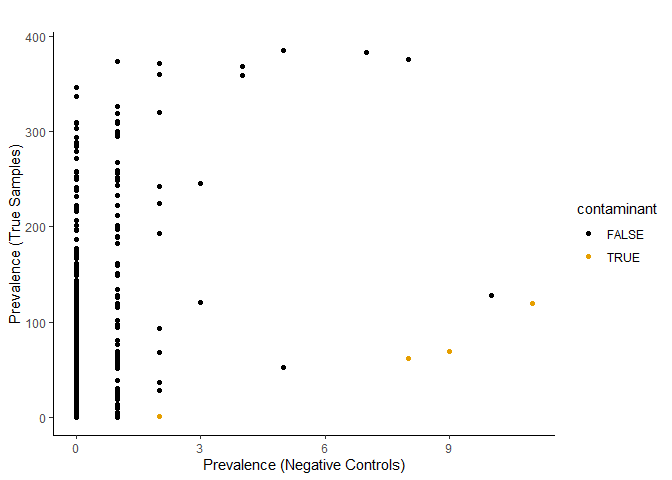<!-- -->

``` r
##Save plots
ggsave("Plots/Decontaminated_plot.png", plot = decontaminated, width = 6, height = 4, dpi = 400)
```

## Sub-setting to only kingdom fungi.

``` r
physeq.clean.samples <- phyloseq.nobad %>% 
  phyloseq::subset_taxa(Kingdom == "Fungi") %>% 
  subset_samples(Category == "True Sample") %>%
  phyloseq::filter_taxa(function(x) sum(x) > 0, TRUE)
```

## Remove samples with less than 5000 reads.

``` r
phyloseq.clean.filt <- physeq.clean.samples %>% 
  #subset_samples(Sample != "C122DT5") %>% #remove outlier (strange taxa)
  prune_samples(sample_sums(.) > 5000, .) %>% # remove samples below 5,000 reads
  phyloseq::filter_taxa(function(x) sum(x) > 0, TRUE) # remove taxa with less than 1 reads
```

## Save a clean RDS file

``` r
saveRDS(phyloseq.clean.filt, "Phyloseq_input/Fungi-phyloseq-clean.rds")
phyloseq.clean.filt <- readRDS("Phyloseq_input/Fungi-phyloseq-clean.rds")
```

## General Statistics

``` r
sample_sums(phyloseq.clean.filt) %>% ##Calculates the total read count for each sample 
  sort()   ##Orders the samples by read depth in ascending order.
```

```
##  Peg1101CIrrigated2024  Peg1504BIrrigated2024 Soil1805AIrrigated2024 
##                   5005                   5401                   5634 
##    Peg1304ADrought2024              Peg2206BI  Peg1802CIrrigated2024 
##                   6204                   6249                   6259 
##   Soil1701ADrought2024   Soil1601CDrought2024  Peg1504CIrrigated2024 
##                   6375                   6636                   6738 
##  Peg1805CIrrigated2024  Peg1104AIrrigated2024  Peg1802BIrrigated2024 
##                   6749                   6763                   6979 
## Soil1403CIrrigated2023  Peg1401CIrrigated2024 Soil1801CIrrigated2023 
##                   7261                   7385                   7477 
##  Peg1501BIrrigated2024  Peg1403BIrrigated2023    Peg1304CDrought2024 
##                   7626                   7678                   7722 
##   Soil1601ADrought2024   Soil1702ADrought2023   Soil1604CDrought2023 
##                   7772                   7788                   7867 
##             Soil2301AI   Soil1302ADrought2024   Soil1203CDrought2024 
##                   8059                   8452                   8523 
## Soil1401CIrrigated2023   Soil1705CDrought2023    Peg1701BDrought2024 
##                   8660                   8671                   8683 
##   Soil1302CDrought2023  Peg1104BIrrigated2024   Root1205ADrought2024 
##                   8852                   8989                   9064 
## Soil1801AIrrigated2023   Soil1205CDrought2024   Soil1601BDrought2024 
##                   9064                   9146                   9158 
## Soil1803AIrrigated2023  Peg1401BIrrigated2024    Peg1304BDrought2023 
##                   9195                   9220                   9253 
## Soil1501CIrrigated2023 Soil1403AIrrigated2023 Soil1404BIrrigated2024 
##                   9277                   9314                   9315 
##   Soil1702CDrought2023    Peg1701CDrought2024    Peg1304BDrought2024 
##                   9327                   9363                   9434 
##  Peg1404CIrrigated2024 Soil1101CIrrigated2023 Soil1102CIrrigated2023 
##                   9434                   9564                   9589 
## Soil1504BIrrigated2024   Soil1601CDrought2023             Soil2208CI 
##                  10125                  10276                  10348 
##   Soil1604BDrought2023   Soil1304BDrought2024    Peg1701ADrought2024 
##                  10369                  10376                  10572 
##   Soil1302ADrought2023 Soil1401BIrrigated2023              Peg2206AI 
##                  10624                  10980                  11267 
##   Soil1304CDrought2024  Peg1401AIrrigated2024 Soil1101BIrrigated2023 
##                  11279                  11288                  11486 
##   Soil1701BDrought2024 Soil1501BIrrigated2023             Soil2302CI 
##                  11526                  11547                  11553 
## Soil1802CIrrigated2024   Soil1602CDrought2024   Soil1304ADrought2023 
##                  11555                  11776                  11782 
##   Soil1205BDrought2024   Soil1304BDrought2023             Soil2406CI 
##                  11871                  11873                  11931 
## Root1401AIrrigated2024 Root1504AIrrigated2024             Root2208AI 
##                  11952                  12028                  12161 
##  Peg1802AIrrigated2024 Soil1801BIrrigated2023 Soil1805BIrrigated2024 
##                  12253                  12254                  12263 
## Root1404AIrrigated2024   Soil1702BDrought2023  Peg1803AIrrigated2023 
##                  12358                  12551                  12557 
##   Soil1304ADrought2024  Peg1805AIrrigated2024   Root1203BDrought2024 
##                  12597                  12647                  12792 
##   Soil1705BDrought2023 Root1104BIrrigated2024 Soil1401AIrrigated2023 
##                  12875                  12899                  13081 
## Soil1403BIrrigated2023  Peg1805BIrrigated2024              Peg2406BI 
##                  13099                  13189                  13266 
##  Peg1403AIrrigated2023   Soil1601ADrought2023             Soil2406AI 
##                  13289                  13325                  13360 
##   Soil1302BDrought2023             Soil2809BD             Soil2301BI 
##                  13399                  13635                  13712 
##             Soil2208BI Soil1803BIrrigated2023    Peg1205ADrought2024 
##                  13731                  13999                  14016 
## Root1104AIrrigated2024  Peg1101AIrrigated2023 Soil1102AIrrigated2023 
##                  14062                  14070                  14109 
##              Peg2301BI  Peg1102AIrrigated2023  Peg1102BIrrigated2023 
##                  14182                  14201                  14278 
## Root1501BIrrigated2023   Root1205CDrought2024  Peg1403CIrrigated2023 
##                  14330                  14341                  14351 
## Root1404CIrrigated2024  Peg1401AIrrigated2023   Root1204ADrought2023 
##                  14438                  14511                  14531 
##             Soil2404AI  Peg1404AIrrigated2024 Soil1104AIrrigated2024 
##                  14564                  14582                  14587 
##   Soil1202BDrought2023   Root1202CDrought2023 Root1802BIrrigated2024 
##                  14587                  14684                  14687 
##   Root1205BDrought2024 Root1401AIrrigated2023             Soil2506BD 
##                  14717                  14777                  14912 
##   Soil1601BDrought2023    Peg1302CDrought2024   Root1202ADrought2023 
##                  15008                  15062                  15098 
## Soil1501AIrrigated2023    Peg1601CDrought2024 Soil1404AIrrigated2024 
##                  15104                  15138                  15316 
##    Peg1702BDrought2023   Root1304ADrought2023 Soil1501AIrrigated2024 
##                  15378                  15426                  15433 
##              Peg2809BD    Peg1203ADrought2024    Peg1602CDrought2024 
##                  15550                  15663                  15833 
##  Peg1801CIrrigated2023   Root1304CDrought2023  Peg1801AIrrigated2023 
##                  15982                  15996                  16036 
##             Soil2404CI   Root1601CDrought2024              Peg2206CI 
##                  16090                  16129                  16298 
## Root1101CIrrigated2023   Root1601BDrought2023              Peg2208CI 
##                  16319                  16323                  16344 
##  Peg1104CIrrigated2024 Root1102BIrrigated2023 Root1503CIrrigated2023 
##                  16361                  16390                  16407 
## Root1101AIrrigated2024              Peg2406AI              Peg2406CI 
##                  16430                  16445                  16532 
##              Peg2208BI Soil1503BIrrigated2023              Peg2404AI 
##                  16580                  16707                  16716 
##    Peg1302BDrought2024 Soil1101BIrrigated2024   Root1302CDrought2023 
##                  16799                  16812                  16831 
##  Peg1501CIrrigated2023    Peg1205BDrought2024             Root2208CI 
##                  16842                  16870                  16871 
##   Root1302ADrought2023   Soil1202CDrought2023 Root1503AIrrigated2023 
##                  16920                  16971                  16972 
## Root1501BIrrigated2024  Peg1101BIrrigated2024    Peg1302ADrought2024 
##                  16998                  17020                  17125 
##   Soil1304CDrought2023    Peg1604ADrought2023    Peg1601ADrought2024 
##                  17181                  17268                  17341 
## Soil1104BIrrigated2024  Peg1501AIrrigated2023 Soil1102BIrrigated2023 
##                  17615                  17628                  17666 
## Root1102CIrrigated2023   Soil1302BDrought2024              Peg2705BD 
##                  17698                  17718                  17727 
##  Peg1801BIrrigated2023              Peg2302CI Soil1101CIrrigated2024 
##                  17814                  17904                  17930 
##             Soil2206CI   Root1702ADrought2023 Root1102AIrrigated2023 
##                  17932                  17933                  18057 
##  Peg1503CIrrigated2023 Root1803BIrrigated2023 Root1101BIrrigated2023 
##                  18078                  18249                  18284 
##   Root1602CDrought2024             Root2302CI             Root2805BD 
##                  18316                  18326                  18541 
##             Soil2404BI    Peg1601CDrought2023 Root1805BIrrigated2024 
##                  18543                  18560                  18647 
##    Peg1202BDrought2023 Soil1101AIrrigated2024    Peg1302BDrought2023 
##                  18665                  18671                  18703 
##   Root1601ADrought2024    Peg1702ADrought2023             Soil2705BD 
##                  18789                  18896                  19089 
##             Soil2302AI             Soil2505AD             Soil2805CD 
##                  19123                  19134                  19183 
##             Soil2809CD             Soil2506CD Root1802CIrrigated2024 
##                  19207                  19399                  19458 
##             Soil2301CI   Soil1204ADrought2023 Root1501AIrrigated2023 
##                  19516                  19535                  19585 
##    Peg1602BDrought2024    Peg1601BDrought2024 Root1802AIrrigated2024 
##                  19597                  19614                  19658 
##  Peg1401CIrrigated2023   Root1601BDrought2024    Peg1304ADrought2023 
##                  19662                  19713                  19721 
##    Peg1204CDrought2023 Root1504BIrrigated2024   Soil1202ADrought2023 
##                  19785                  19805                  19847 
## Root1403CIrrigated2023             Soil2406BI Root1501CIrrigated2023 
##                  19858                  19895                  19913 
## Root1503BIrrigated2023 Root1805AIrrigated2024             Soil2206BI 
##                  19926                  20001                  20010 
##   Soil1204CDrought2023   Root1705BDrought2023             Soil2208AI 
##                  20064                  20145                  20394 
## Soil1503CIrrigated2023              Peg2805CD              Peg2809CD 
##                  20473                  20502                  20553 
##   Soil1705ADrought2023             Root2206AI  Peg1101CIrrigated2023 
##                  20737                  20848                  20959 
##  Peg1401BIrrigated2023 Soil1802BIrrigated2024  Peg1101BIrrigated2023 
##                  20965                  21017                  21053 
##             Soil2505BD             Soil2302BI Root1101AIrrigated2023 
##                  21105                  21295                  21463 
##   Soil1204BDrought2023 Soil1803CIrrigated2023             Root2404CI 
##                  21588                  21606                  21677 
##    Peg1205CDrought2024             Soil2809AD   Soil1602BDrought2024 
##                  21987                  22068                  22107 
##    Peg1302ADrought2023 Root1401CIrrigated2024    Peg1602ADrought2024 
##                  22110                  22157                  22160 
## Soil1805CIrrigated2024             Root2206BI   Root1302BDrought2023 
##                  22269                  22281                  22351 
##   Root1204CDrought2023  Peg1501BIrrigated2023              Peg2404BI 
##                  22451                  22456                  22457 
##              Peg2208AI              Peg2302BI              Peg2805AD 
##                  22467                  22481                  22575 
##    Peg1304CDrought2023              Peg2301CI              Peg2302AI 
##                  22672                  22900                  22943 
##   Soil1203BDrought2024    Peg1302CDrought2023 Soil1101AIrrigated2023 
##                  23140                  23199                  23219 
##   Root1203CDrought2024  Peg1803CIrrigated2023             Soil2705CD 
##                  23278                  23341                  23629 
## Root1803CIrrigated2023  Peg1503BIrrigated2023    Peg1204ADrought2023 
##                  23700                  23814                  23839 
## Root1401CIrrigated2023 Root1401BIrrigated2024              Peg2805BD 
##                  24033                  24070                  24101 
##             Soil2709BD             Root2301CI Root1401BIrrigated2023 
##                  24271                  24335                  24490 
## Root1403BIrrigated2023   Root1702CDrought2023   Root1701ADrought2024 
##                  24528                  24814                  24882 
## Soil1503AIrrigated2023    Peg1204BDrought2023  Peg1101AIrrigated2024 
##                  24889                  25022                  25053 
##  Peg1503AIrrigated2023             Soil2206AI    Peg1203CDrought2024 
##                  25100                  25310                  25317 
##             Soil2709CD   Root1705CDrought2023   Soil1701CDrought2024 
##                  25324                  25440                  25464 
##   Root1304ADrought2024    Peg1705CDrought2023             Soil2805AD 
##                  25501                  25509                  25521 
##    Peg1604BDrought2023             Root2406BI             Soil2805BD 
##                  25533                  25672                  25699 
##   Soil1602ADrought2024    Peg1202ADrought2023   Root1601ADrought2023 
##                  25868                  25891                  25892 
##             Root2302BI   Root1304BDrought2023 Root1501AIrrigated2024 
##                  26270                  26331                  26514 
##             Root2505CD             Soil2505CD    Peg1202CDrought2023 
##                  26697                  26861                  26929 
##   Root1302BDrought2024   Root1302ADrought2024 Root1403AIrrigated2023 
##                  27231                  27375                  27730 
## Soil1401CIrrigated2024    Peg1705BDrought2023 Soil1501BIrrigated2024 
##                  27812                  27946                  28121 
##   Soil1203ADrought2024              Peg2404CI   Root1304CDrought2024 
##                  28182                  28396                  28900 
## Root1801BIrrigated2023             Root2705BD   Soil1302CDrought2024 
##                  28929                  29457                  29474 
##   Root1701BDrought2024   Root1304BDrought2024              Peg2301AI 
##                  29537                  30039                  30290 
## Soil1104CIrrigated2024 Root1101CIrrigated2024 Soil1404CIrrigated2024 
##                  30407                  30509                  30538 
##             Root2809AD   Root1204BDrought2023             Root2404AI 
##                  30830                  30872                  30881 
##   Root1202BDrought2023 Root1104CIrrigated2024              Peg2809AD 
##                  31128                  31165                  31274 
##   Root1203ADrought2024   Root1705ADrought2023 Root1801AIrrigated2023 
##                  31293                  31362                  31896 
## Root1801CIrrigated2023   Root1602ADrought2024             Soil2709AD 
##                  31917                  31986                  32137 
## Root1504CIrrigated2024             Soil2506AD              Peg2709CD 
##                  32178                  32731                  32921 
##             Root2206CI   Root1604ADrought2023   Root1604CDrought2023 
##                  33419                  33447                  33513 
##    Peg1601ADrought2023 Soil1401AIrrigated2024             Root2809CD 
##                  33940                  34270                  34529 
##             Root2709CD   Root1604BDrought2023   Root1602BDrought2024 
##                  34952                  35128                  35140 
## Root1501CIrrigated2024             Root2505BD   Root1701CDrought2024 
##                  35695                  35808                  35882 
##             Soil2705AD  Peg1803BIrrigated2023             Root2709BD 
##                  36011                  36306                  36877 
##             Root2302AI              Peg2705AD             Root2404BI 
##                  36918                  37020                  37456 
##              Peg2505AD             Root2406AI              Peg2506AD 
##                  38148                  38450                  38871 
##    Peg1203BDrought2024 Root1404BIrrigated2024             Root2709AD 
##                  39224                  39243                  39329 
##             Root2805CD              Peg2505BD              Peg2705CD 
##                  39423                  40277                  40929 
## Soil1504AIrrigated2024             Root2301BI              Peg2709BD 
##                  41881                  42374                  42375 
##              Peg2506BD             Root2301AI    Peg1601BDrought2023 
##                  43473                  43864                  44136 
## Soil1501CIrrigated2024             Root2809BD    Peg1604CDrought2023 
##                  44877                  45348                  45570 
##   Root1601CDrought2023 Soil1504CIrrigated2024             Root2505AD 
##                  47022                  47316                  47516 
##             Root2705CD    Peg1702CDrought2023              Peg2709AD 
##                  48067                  48305                  48388 
##             Root2208BI Root1101BIrrigated2024              Peg2505CD 
##                  49948                  50231                  50704 
##             Root2506AD              Peg2506CD Soil1401BIrrigated2024 
##                  50970                  54050                  54683 
##             Root2506CD             Root2805AD             Root2506BD 
##                  54764                  54991                  69089 
##             Root2705AD   Root1302CDrought2024 
##                  75941                  81811
```

``` r
# New number of total reads #8,085,375
sum(sample_sums(phyloseq.clean.filt)) #Calculates the total number of reads across all samples in the phyloseq object.= 39,24,376
```

```
## [1] 8085375
```

``` r
# Mean and median read depth per samples 
mean(sample_sums(phyloseq.clean.filt)) # 21618.65
```

```
## [1] 21618.65
```

``` r
median(sample_sums(phyloseq.clean.filt)) # 19,128.5
```

```
## [1] 19128.5
```

``` r
# Histogram including median read depth
read.depths <- data.frame(sample_sums(phyloseq.clean.filt)) #Converts the read depth information into a data frame (read.depths)
colnames(read.depths) <- "read.depth"
read.depth.plot <- ggplot(read.depths, aes(read.depth)) +
  geom_histogram(binwidth = 5000,fill = cbbPalette[[3]], color = "black") + 
  geom_vline(xintercept = median(sample_sums(phyloseq.clean.filt)), linetype = "dashed") + 
  theme_classic() + 
  xlab("Read Depth")
read.depth.plot
```

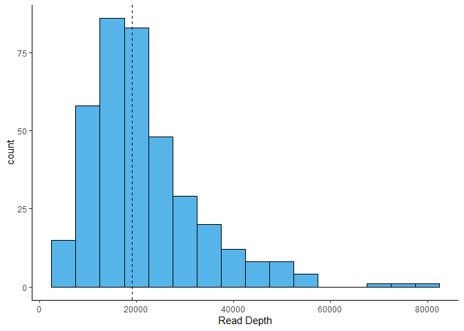<!-- -->

``` r
#save plot
ggsave("Plots/read.depths.plot.png", plot = read.depth.plot, width = 6, height = 4, dpi = 400)
```

## Rarefaction

``` r
#step1:Extracts the sample metadata from phyloseq.clean.filt into a data frame (sam.data) 
sam.data <- data.frame(phyloseq.clean.filt@sam_data) 
sam.data$Sample <- sam.data$Sample
tab <- as(otu_table(phyloseq.clean.filt), "matrix")
#class(tab) <- "matrix"
tab <- t(tab) # transpose observations to rows 
rare <- rarecurve(tab, step=500, lwd=2, ylab="OTU",  label=F, tidy = T) 
library(ggplot2)

fungi.rare.curve.extract2 <- left_join(rare, sam.data, by = c("Site" = "Sample")) 

fungi.rare <- ggplot(fungi.rare.curve.extract2, aes(x = Sample, y = Species, group = Site, color = interaction(Treatment, Tissue))) + 
  geom_point() +
  scale_color_manual(values = cbbPalette)+
  geom_line() + 
  xlab("Reads") + 
  ylab("Number of OTUs") + 
  ggtitle("Fungi")+
  theme_classic() + 
  geom_vline(xintercept = median(sample_sums(phyloseq.clean.filt)), linetype = "dashed") +
  ggtitle("") 

fungi.rare
```

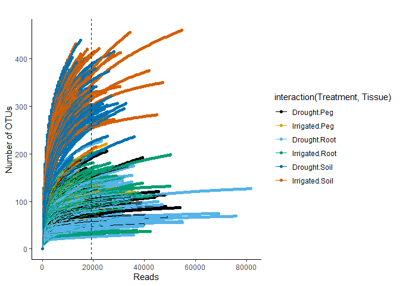<!-- -->

``` r
#save plot
ggsave("Plots/fungi.rareplot.png", plot = fungi.rare, width = 6, height = 4, dpi = 400)
```


## Alpha Diversity


``` r
phyloseq.clean.filt@sam_data$shannon <- estimate_richness(phyloseq.clean.filt, measures=c("Shannon"))$Shannon
phyloseq.clean.filt@sam_data$invsimpson <- estimate_richness(phyloseq.clean.filt, measures=c("InvSimpson"))$InvSimpson
phyloseq.clean.filt@sam_data$richness <- estimate_richness(phyloseq.clean.filt, measures=c("Observed"))$Observed
phyloseq.clean.filt@sam_data$even <- phyloseq.clean.filt@sam_data$shannon/log(phyloseq.clean.filt@sam_data$richness)

sample.data.fungi <- data.frame(phyloseq.clean.filt@sam_data)
```


``` r
# Define the years 
years <- c("2022", "2023", "2024")

# Define the diversity metrics
diversity_metrics <- c("shannon", "invsimpson", "richness", "even") 

# Create an empty list to store ANOVA results
anova_results <- list()

# Loop through diversity metrics and years to run ANOVA
for (metric in diversity_metrics) {
  for (yr in years) {
  data_subset <- subset(sample.data.fungi, Year == yr)   #Subset the data by year
  formula_obj <- as.formula(paste0(metric, " ~ Treatment*Tissue*P.variety")) # Create model formula dynamically
  model <- lm(formula_obj, data = data_subset)  # Fit the linear model and calculate ANOVA
  anova_table <- anova(model)
  result_name <- paste0(metric, "_", yr) # Store result in the list "shannon_2022"
  anova_results[[result_name]] <- anova_table
  } 
} 

#view the anova result

anova_results[["shannon_2022"]]
```

```
## Analysis of Variance Table
## 
## Response: shannon
##                            Df  Sum Sq Mean Sq F value    Pr(>F)    
## Treatment                   1  2.1255  2.1255 11.1649  0.001193 ** 
## Tissue                      2 28.8033 14.4016 75.6485 < 2.2e-16 ***
## P.variety                   1  0.2075  0.2075  1.0901  0.299103    
## Treatment:Tissue            2  0.4691  0.2346  1.2321  0.296295    
## Treatment:P.variety         1  0.1666  0.1666  0.8753  0.351871    
## Tissue:P.variety            2  0.2747  0.1373  0.7214  0.488710    
## Treatment:Tissue:P.variety  2  0.0425  0.0213  0.1116  0.894500    
## Residuals                  95 18.0857  0.1904                      
## ---
## Signif. codes:  0 '***' 0.001 '**' 0.01 '*' 0.05 '.' 0.1 ' ' 1
```

``` r
anova_results[["shannon_2023"]]
```

```
## Analysis of Variance Table
## 
## Response: shannon
##                             Df Sum Sq Mean Sq  F value  Pr(>F)    
## Treatment                    1  0.666   0.666   4.0183 0.04714 *  
## Tissue                       2 70.181  35.090 211.6274 < 2e-16 ***
## P.variety                    1  0.004   0.004   0.0214 0.88382    
## Treatment:Tissue             2  0.987   0.493   2.9755 0.05459 .  
## Treatment:P.variety          1  0.085   0.085   0.5099 0.47650    
## Tissue:P.variety             2  0.086   0.043   0.2584 0.77272    
## Treatment:Tissue:P.variety   2  0.281   0.140   0.8471 0.43106    
## Residuals                  127 21.058   0.166                     
## ---
## Signif. codes:  0 '***' 0.001 '**' 0.01 '*' 0.05 '.' 0.1 ' ' 1
```

``` r
anova_results[["shannon_2024"]]
```

```
## Analysis of Variance Table
## 
## Response: shannon
##                             Df Sum Sq Mean Sq F value  Pr(>F)    
## Treatment                    1  0.143  0.1430  0.4961 0.48263    
## Tissue                       2 31.970 15.9848 55.4695 < 2e-16 ***
## P.variety                    1  0.389  0.3888  1.3492 0.24781    
## Treatment:Tissue             2  0.019  0.0097  0.0338 0.96679    
## Treatment:P.variety          1  0.407  0.4065  1.4107 0.23736    
## Tissue:P.variety             2  0.031  0.0157  0.0544 0.94703    
## Treatment:Tissue:P.variety   2  2.313  1.1565  4.0131 0.02064 *  
## Residuals                  116 33.428  0.2882                    
## ---
## Signif. codes:  0 '***' 0.001 '**' 0.01 '*' 0.05 '.' 0.1 ' ' 1
```

``` r
anova_results[["invsimpson_2022"]]
```

```
## Analysis of Variance Table
## 
## Response: invsimpson
##                            Df  Sum Sq Mean Sq F value    Pr(>F)    
## Treatment                   1  182.23  182.23  9.5256  0.002655 ** 
## Tissue                      2 1531.60  765.80 40.0312 2.456e-13 ***
## P.variety                   1   11.71   11.71  0.6122  0.435919    
## Treatment:Tissue            2  214.65  107.32  5.6102  0.004977 ** 
## Treatment:P.variety         1   37.92   37.92  1.9822  0.162418    
## Tissue:P.variety            2    3.78    1.89  0.0989  0.905933    
## Treatment:Tissue:P.variety  2   36.03   18.01  0.9416  0.393616    
## Residuals                  95 1817.36   19.13                      
## ---
## Signif. codes:  0 '***' 0.001 '**' 0.01 '*' 0.05 '.' 0.1 ' ' 1
```

``` r
anova_results[["invsimpson_2023"]]
```

```
## Analysis of Variance Table
## 
## Response: invsimpson
##                             Df Sum Sq Mean Sq  F value Pr(>F)    
## Treatment                    1   43.9   43.95   2.4519 0.1199    
## Tissue                       2 4122.8 2061.42 115.0105 <2e-16 ***
## P.variety                    1    1.1    1.05   0.0586 0.8091    
## Treatment:Tissue             2   14.1    7.06   0.3940 0.6752    
## Treatment:P.variety          1    3.3    3.31   0.1844 0.6684    
## Tissue:P.variety             2   10.5    5.25   0.2928 0.7467    
## Treatment:Tissue:P.variety   2   16.4    8.20   0.4573 0.6340    
## Residuals                  127 2276.3   17.92                    
## ---
## Signif. codes:  0 '***' 0.001 '**' 0.01 '*' 0.05 '.' 0.1 ' ' 1
```

``` r
anova_results[["invsimpson_2024"]]
```

```
## Analysis of Variance Table
## 
## Response: invsimpson
##                             Df  Sum Sq Mean Sq F value    Pr(>F)    
## Treatment                    1    5.05    5.05  0.2043  0.652098    
## Tissue                       2 2039.90 1019.95 41.2566 2.929e-14 ***
## P.variety                    1   82.61   82.61  3.3416  0.070119 .  
## Treatment:Tissue             2   17.85    8.92  0.3610  0.697777    
## Treatment:P.variety          1   70.24   70.24  2.8413  0.094560 .  
## Tissue:P.variety             2   32.63   16.31  0.6599  0.518854    
## Treatment:Tissue:P.variety   2  253.64  126.82  5.1297  0.007333 ** 
## Residuals                  116 2867.77   24.72                      
## ---
## Signif. codes:  0 '***' 0.001 '**' 0.01 '*' 0.05 '.' 0.1 ' ' 1
```

``` r
anova_results[["richness_2022"]]
```

```
## Analysis of Variance Table
## 
## Response: richness
##                            Df  Sum Sq Mean Sq  F value    Pr(>F)    
## Treatment                   1   13263   13263  21.4237 1.165e-05 ***
## Tissue                      2 1079628  539814 871.9758 < 2.2e-16 ***
## P.variety                   1     848     848   1.3693   0.24486    
## Treatment:Tissue            2    4999    2500   4.0378   0.02075 *  
## Treatment:P.variety         1       2       2   0.0033   0.95421    
## Tissue:P.variety            2     923     461   0.7453   0.47733    
## Treatment:Tissue:P.variety  2     857     429   0.6925   0.50281    
## Residuals                  95   58812     619                       
## ---
## Signif. codes:  0 '***' 0.001 '**' 0.01 '*' 0.05 '.' 0.1 ' ' 1
```

``` r
anova_results[["richness_2023"]]
```

```
## Analysis of Variance Table
## 
## Response: richness
##                             Df  Sum Sq Mean Sq  F value  Pr(>F)    
## Treatment                    1      13      13   0.0115 0.91489    
## Tissue                       2 1729507  864754 779.7581 < 2e-16 ***
## P.variety                    1     175     175   0.1580 0.69169    
## Treatment:Tissue             2    8808    4404   3.9710 0.02124 *  
## Treatment:P.variety          1      82      82   0.0736 0.78658    
## Tissue:P.variety             2    2211    1106   0.9969 0.37188    
## Treatment:Tissue:P.variety   2    1509     754   0.6802 0.50836    
## Residuals                  127  140843    1109                     
## ---
## Signif. codes:  0 '***' 0.001 '**' 0.01 '*' 0.05 '.' 0.1 ' ' 1
```

``` r
anova_results[["richness_2024"]]
```

```
## Analysis of Variance Table
## 
## Response: richness
##                             Df Sum Sq Mean Sq  F value    Pr(>F)    
## Treatment                    1  35207   35207  19.6653 2.109e-05 ***
## Tissue                       2 781462  390731 218.2473 < 2.2e-16 ***
## P.variety                    1   2322    2322   1.2971   0.25708    
## Treatment:Tissue             2  44879   22439  12.5338 1.180e-05 ***
## Treatment:P.variety          1     28      28   0.0157   0.90046    
## Tissue:P.variety             2  14100    7050   3.9380   0.02215 *  
## Treatment:Tissue:P.variety   2   2833    1417   0.7913   0.45569    
## Residuals                  116 207676    1790                       
## ---
## Signif. codes:  0 '***' 0.001 '**' 0.01 '*' 0.05 '.' 0.1 ' ' 1
```

``` r
anova_results[["even_2022"]]
```

```
## Analysis of Variance Table
## 
## Response: even
##                            Df  Sum Sq  Mean Sq F value    Pr(>F)    
## Treatment                   1 0.02596 0.025962  3.3818 0.0690443 .  
## Tissue                      2 0.12084 0.060421  7.8705 0.0006874 ***
## P.variety                   1 0.01974 0.019737  2.5710 0.1121609    
## Treatment:Tissue            2 0.03856 0.019281  2.5115 0.0865203 .  
## Treatment:P.variety         1 0.00253 0.002527  0.3291 0.5675259    
## Tissue:P.variety            2 0.02346 0.011729  1.5278 0.2222885    
## Treatment:Tissue:P.variety  2 0.00505 0.002526  0.3290 0.7204399    
## Residuals                  95 0.72931 0.007677                      
## ---
## Signif. codes:  0 '***' 0.001 '**' 0.01 '*' 0.05 '.' 0.1 ' ' 1
```

``` r
anova_results[["even_2023"]]
```

```
## Analysis of Variance Table
## 
## Response: even
##                             Df  Sum Sq Mean Sq F value  Pr(>F)    
## Treatment                    1 0.02605 0.02605  3.9850 0.04805 *  
## Tissue                       2 0.89109 0.44554 68.1558 < 2e-16 ***
## P.variety                    1 0.00052 0.00052  0.0801 0.77764    
## Treatment:Tissue             2 0.02328 0.01164  1.7807 0.17270    
## Treatment:P.variety          1 0.00356 0.00356  0.5451 0.46171    
## Tissue:P.variety             2 0.00149 0.00075  0.1140 0.89232    
## Treatment:Tissue:P.variety   2 0.01444 0.00722  1.1048 0.33444    
## Residuals                  127 0.83021 0.00654                    
## ---
## Signif. codes:  0 '***' 0.001 '**' 0.01 '*' 0.05 '.' 0.1 ' ' 1
```

``` r
anova_results[["even_2024"]]
```

```
## Analysis of Variance Table
## 
## Response: even
##                             Df  Sum Sq  Mean Sq F value    Pr(>F)    
## Treatment                    1 0.00004 0.000041  0.0043  0.947959    
## Tissue                       2 0.43117 0.215585 22.6752 4.874e-09 ***
## P.variety                    1 0.01751 0.017506  1.8413  0.177436    
## Treatment:Tissue             2 0.01098 0.005492  0.5777  0.562807    
## Treatment:P.variety          1 0.01838 0.018384  1.9337  0.167021    
## Tissue:P.variety             2 0.00067 0.000334  0.0351  0.965485    
## Treatment:Tissue:P.variety   2 0.10145 0.050723  5.3351  0.006074 ** 
## Residuals                  116 1.10287 0.009508                      
## ---
## Signif. codes:  0 '***' 0.001 '**' 0.01 '*' 0.05 '.' 0.1 ' ' 1
```

``` r
# Save the anaova result
for (i in seq_along(anova_results)) {
  name <- names(anova_results)[i]
  capture.output(anova_results[[i]], file = paste0("Tables/",name, ".doc"))
}

# Create empty list to store plots
combined_plots <- list()

# Loop through diversity indices to create one combined plot per index (for all years)
for (metric in diversity_metrics) {
  combined_plots[[metric]] <- sample.data.fungi %>%
    ggplot(aes(x = Tissue, y = .data[[metric]], fill = Treatment)) +  # Select metric dynamically
    geom_boxplot() +
    theme_classic() +
    facet_wrap(~Year, scales = "free") +  # Separate panels for each year
    stat_compare_means(method = "t.test", label = "p.signif", hide.ns = TRUE, size = 3, vjust = 1.2) +
    stat_compare_means(method = "t.test", aes(label = paste0("p = ", after_stat(p.format))),
                                             size = 3, vjust = -0.5) +
    theme(legend.position = "bottom")
}

#plot
combined_plots[["shannon"]]
```

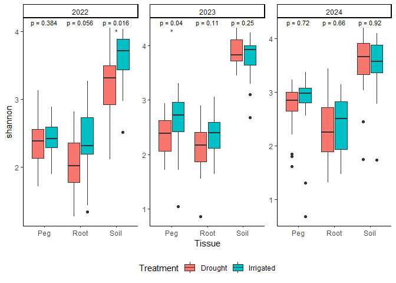<!-- -->

``` r
combined_plots[["invsimpson"]]
```

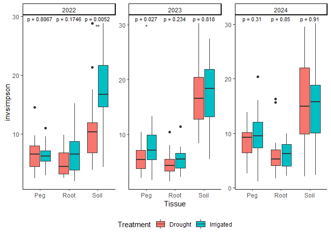<!-- -->

``` r
combined_plots[["richness"]]
```

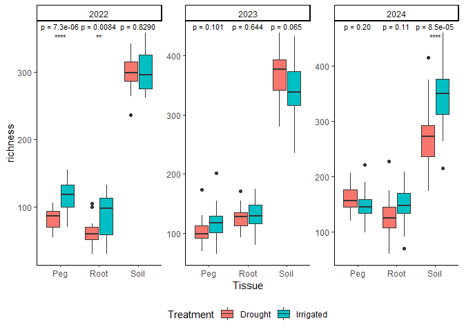<!-- -->

``` r
combined_plots[["even"]]
```

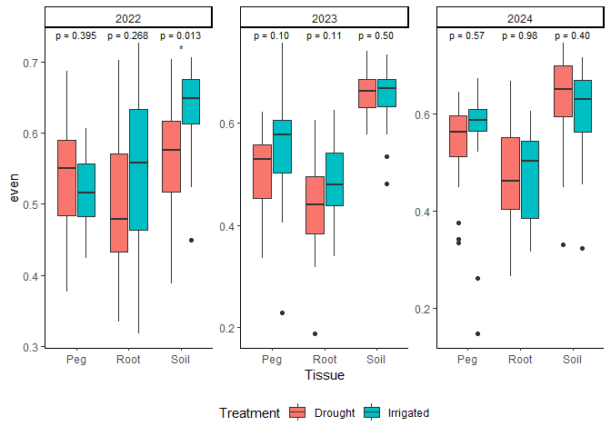<!-- -->

``` r
# Arrange all diversity index plots into a final combined figure
final_combined_plot <- ggarrange(
  combined_plots[["shannon"]],
  combined_plots[["invsimpson"]],
  combined_plots[["richness"]],
  combined_plots[["even"]],
  nrow = 2, ncol = 2,
  common.legend = TRUE,
  legend = "bottom"
)

# Display the final combined plot
final_combined_plot
```

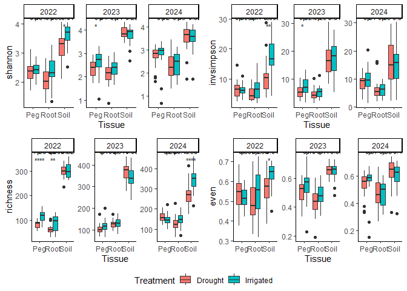<!-- -->

``` r
#save individual plots
ggsave("Plots/shannon_final.png", plot = combined_plots[["shannon"]], width = 10, height = 6, dpi = 400)
ggsave("Plots/Invsimpson_final.png", plot = combined_plots[["invsimpson"]], width = 10, height = 6, dpi = 400)
ggsave("Plots/Richness_final.png", plot = combined_plots[["richness"]], width = 10, height = 6, dpi = 400)
ggsave("Plots/Eveness_final.png", plot = combined_plots[["even"]], width = 10, height = 6, dpi = 400)

#save plot
ggsave("Plots/Final_combined_alpha_diversity_plot1.png", plot = final_combined_plot, width = 18, height = 12, dpi = 400)
```

## Metagenome CSS normalization

``` r
MGS <- phyloseq_to_metagenomeSeq(phyloseq.clean.filt)
p <- metagenomeSeq::cumNormStatFast(MGS)
```

```
## Default value being used.
```

``` r
MGS <- metagenomeSeq::cumNorm(MGS, p =p)

metagenomeSeq::normFactors(MGS) # exports the normalized factors for each sample
```

```
##  Peg1101AIrrigated2023  Peg1101AIrrigated2024  Peg1101BIrrigated2023 
##                    241                    222                    857 
##  Peg1101BIrrigated2024  Peg1101CIrrigated2023  Peg1101CIrrigated2024 
##                    208                    217                    106 
##  Peg1102AIrrigated2023  Peg1102BIrrigated2023  Peg1104AIrrigated2024 
##                    215                   1032                    111 
##  Peg1104BIrrigated2024  Peg1104CIrrigated2024    Peg1202ADrought2023 
##                     65                    134                    220 
##    Peg1202BDrought2023    Peg1202CDrought2023    Peg1203ADrought2024 
##                    254                    229                    115 
##    Peg1203BDrought2024    Peg1203CDrought2024    Peg1204ADrought2023 
##                    147                    211                    199 
##    Peg1204BDrought2023    Peg1204CDrought2023    Peg1205ADrought2024 
##                    287                    182                    123 
##    Peg1205BDrought2024    Peg1205CDrought2024    Peg1302ADrought2023 
##                    158                    101                    305 
##    Peg1302ADrought2024    Peg1302BDrought2023    Peg1302BDrought2024 
##                    172                    193                    139 
##    Peg1302CDrought2023    Peg1302CDrought2024    Peg1304ADrought2023 
##                    167                    154                    125 
##    Peg1304ADrought2024    Peg1304BDrought2023    Peg1304BDrought2024 
##                     93                    218                    127 
##    Peg1304CDrought2023    Peg1304CDrought2024  Peg1401AIrrigated2023 
##                    148                     81                    256 
##  Peg1401AIrrigated2024  Peg1401BIrrigated2023  Peg1401BIrrigated2024 
##                    130                    193                    118 
##  Peg1401CIrrigated2023  Peg1401CIrrigated2024  Peg1403AIrrigated2023 
##                    316                    138                    226 
##  Peg1403BIrrigated2023  Peg1403CIrrigated2023  Peg1404AIrrigated2024 
##                    149                    154                    126 
##  Peg1404CIrrigated2024  Peg1501AIrrigated2023  Peg1501BIrrigated2023 
##                    123                    370                    191 
##  Peg1501BIrrigated2024  Peg1501CIrrigated2023  Peg1503AIrrigated2023 
##                    101                    288                    278 
##  Peg1503BIrrigated2023  Peg1503CIrrigated2023  Peg1504BIrrigated2024 
##                    633                    246                     71 
##  Peg1504CIrrigated2024    Peg1601ADrought2023    Peg1601ADrought2024 
##                    100                    197                    114 
##    Peg1601BDrought2023    Peg1601BDrought2024    Peg1601CDrought2023 
##                    121                    173                    181 
##    Peg1601CDrought2024    Peg1602ADrought2024    Peg1602BDrought2024 
##                    167                    158                    115 
##    Peg1602CDrought2024    Peg1604ADrought2023    Peg1604BDrought2023 
##                    138                    114                    223 
##    Peg1604CDrought2023    Peg1701ADrought2024    Peg1701BDrought2024 
##                    392                     97                    123 
##    Peg1701CDrought2024    Peg1702ADrought2023    Peg1702BDrought2023 
##                    125                    173                    334 
##    Peg1702CDrought2023    Peg1705BDrought2023    Peg1705CDrought2023 
##                    725                    253                    175 
##  Peg1801AIrrigated2023  Peg1801BIrrigated2023  Peg1801CIrrigated2023 
##                    196                     84                    133 
##  Peg1802AIrrigated2024  Peg1802BIrrigated2024  Peg1802CIrrigated2024 
##                    131                    124                    136 
##  Peg1803AIrrigated2023  Peg1803BIrrigated2023  Peg1803CIrrigated2023 
##                    241                    268                    121 
##  Peg1805AIrrigated2024  Peg1805BIrrigated2024  Peg1805CIrrigated2024 
##                    190                    123                    139 
##              Peg2206AI              Peg2206BI              Peg2206CI 
##                    112                    143                    115 
##              Peg2208AI              Peg2208BI              Peg2208CI 
##                    137                    145                    200 
##              Peg2301AI              Peg2301BI              Peg2301CI 
##                    157                    159                    150 
##              Peg2302AI              Peg2302BI              Peg2302CI 
##                    203                    367                    182 
##              Peg2404AI              Peg2404BI              Peg2404CI 
##                    315                    133                    137 
##              Peg2406AI              Peg2406BI              Peg2406CI 
##                     96                    112                    120 
##              Peg2505AD              Peg2505BD              Peg2505CD 
##                    278                    419                    269 
##              Peg2506AD              Peg2506BD              Peg2506CD 
##                    410                    278                    221 
##              Peg2705AD              Peg2705BD              Peg2705CD 
##                    202                    299                    250 
##              Peg2709AD              Peg2709BD              Peg2709CD 
##                    100                    251                    146 
##              Peg2805AD              Peg2805BD              Peg2805CD 
##                    265                    295                    279 
##              Peg2809AD              Peg2809BD              Peg2809CD 
##                    327                    126                    214 
## Root1101AIrrigated2023 Root1101AIrrigated2024 Root1101BIrrigated2023 
##                    215                    261                    124 
## Root1101BIrrigated2024 Root1101CIrrigated2023 Root1101CIrrigated2024 
##                    216                    126                    174 
## Root1102AIrrigated2023 Root1102BIrrigated2023 Root1102CIrrigated2023 
##                    186                    409                    169 
## Root1104AIrrigated2024 Root1104BIrrigated2024 Root1104CIrrigated2024 
##                    123                    275                     37 
##   Root1202ADrought2023   Root1202BDrought2023   Root1202CDrought2023 
##                    151                    205                    194 
##   Root1203ADrought2024   Root1203BDrought2024   Root1203CDrought2024 
##                    215                    109                    307 
##   Root1204ADrought2023   Root1204BDrought2023   Root1204CDrought2023 
##                    139                    233                    146 
##   Root1205ADrought2024   Root1205BDrought2024   Root1205CDrought2024 
##                    150                    319                    451 
##   Root1302ADrought2023   Root1302ADrought2024   Root1302BDrought2023 
##                    171                    202                    209 
##   Root1302BDrought2024   Root1302CDrought2023   Root1302CDrought2024 
##                     85                     61                    181 
##   Root1304ADrought2023   Root1304ADrought2024   Root1304BDrought2023 
##                     99                    110                    192 
##   Root1304BDrought2024   Root1304CDrought2023   Root1304CDrought2024 
##                     83                    101                    147 
## Root1401AIrrigated2023 Root1401AIrrigated2024 Root1401BIrrigated2023 
##                    125                     41                    284 
## Root1401BIrrigated2024 Root1401CIrrigated2023 Root1401CIrrigated2024 
##                    318                     53                    193 
## Root1403AIrrigated2023 Root1403BIrrigated2023 Root1403CIrrigated2023 
##                    209                    428                    225 
## Root1404AIrrigated2024 Root1404BIrrigated2024 Root1404CIrrigated2024 
##                     79                    129                    103 
## Root1501AIrrigated2023 Root1501AIrrigated2024 Root1501BIrrigated2023 
##                    144                    272                    419 
## Root1501BIrrigated2024 Root1501CIrrigated2023 Root1501CIrrigated2024 
##                    195                    322                    196 
## Root1503AIrrigated2023 Root1503BIrrigated2023 Root1503CIrrigated2023 
##                    240                    257                    291 
## Root1504AIrrigated2024 Root1504BIrrigated2024 Root1504CIrrigated2024 
##                    175                    356                    131 
##   Root1601ADrought2023   Root1601ADrought2024   Root1601BDrought2023 
##                    266                    385                    127 
##   Root1601BDrought2024   Root1601CDrought2023   Root1601CDrought2024 
##                    137                    258                    210 
##   Root1602ADrought2024   Root1602BDrought2024   Root1602CDrought2024 
##                    169                    141                    100 
##   Root1604ADrought2023   Root1604BDrought2023   Root1604CDrought2023 
##                    549                    290                    344 
##   Root1701ADrought2024   Root1701BDrought2024   Root1701CDrought2024 
##                    109                    207                    172 
##   Root1702ADrought2023   Root1702CDrought2023   Root1705ADrought2023 
##                    179                    397                    243 
##   Root1705BDrought2023   Root1705CDrought2023 Root1801AIrrigated2023 
##                    160                     63                    349 
## Root1801BIrrigated2023 Root1801CIrrigated2023 Root1802AIrrigated2024 
##                    358                    537                     96 
## Root1802BIrrigated2024 Root1802CIrrigated2024 Root1803BIrrigated2023 
##                    181                    185                    156 
## Root1803CIrrigated2023 Root1805AIrrigated2024 Root1805BIrrigated2024 
##                     75                    128                    247 
##             Root2206AI             Root2206BI             Root2206CI 
##                    381                    757                    499 
##             Root2208AI             Root2208BI             Root2208CI 
##                    259                    798                    112 
##             Root2301AI             Root2301BI             Root2301CI 
##                    111                    562                   1535 
##             Root2302AI             Root2302BI             Root2302CI 
##                    870                    778                    310 
##             Root2404AI             Root2404BI             Root2404CI 
##                    388                    176                    356 
##             Root2406AI             Root2406BI             Root2505AD 
##                    229                    460                    214 
##             Root2505BD             Root2505CD             Root2506AD 
##                    279                    560                    177 
##             Root2506BD             Root2506CD             Root2705AD 
##                    633                    447                    871 
##             Root2705BD             Root2705CD             Root2709AD 
##                    531                    629                    342 
##             Root2709BD             Root2709CD             Root2805AD 
##                     64                    188                    458 
##             Root2805BD             Root2805CD             Root2809AD 
##                    165                    306                     62 
##             Root2809BD             Root2809CD Soil1101AIrrigated2023 
##                    228                    204                    478 
## Soil1101AIrrigated2024 Soil1101BIrrigated2023 Soil1101BIrrigated2024 
##                    522                    429                    421 
## Soil1101CIrrigated2023 Soil1101CIrrigated2024 Soil1102AIrrigated2023 
##                    416                    507                    449 
## Soil1102BIrrigated2023 Soil1102CIrrigated2023 Soil1104AIrrigated2024 
##                    339                    309                    425 
## Soil1104BIrrigated2024 Soil1104CIrrigated2024   Soil1202ADrought2023 
##                    346                    824                    389 
##   Soil1202BDrought2023   Soil1202CDrought2023   Soil1203ADrought2024 
##                    463                    338                    595 
##   Soil1203BDrought2024   Soil1203CDrought2024   Soil1204ADrought2023 
##                    517                    299                    453 
##   Soil1204BDrought2023   Soil1204CDrought2023   Soil1205BDrought2024 
##                    437                    611                    180 
##   Soil1205CDrought2024   Soil1302ADrought2023   Soil1302ADrought2024 
##                    211                    387                    417 
##   Soil1302BDrought2023   Soil1302BDrought2024   Soil1302CDrought2023 
##                    431                    668                    420 
##   Soil1302CDrought2024   Soil1304ADrought2023   Soil1304ADrought2024 
##                    878                    367                    291 
##   Soil1304BDrought2023   Soil1304BDrought2024   Soil1304CDrought2023 
##                    406                    385                    585 
##   Soil1304CDrought2024 Soil1401AIrrigated2023 Soil1401AIrrigated2024 
##                    295                    505                    370 
## Soil1401BIrrigated2023 Soil1401BIrrigated2024 Soil1401CIrrigated2023 
##                    357                    550                    217 
## Soil1401CIrrigated2024 Soil1403AIrrigated2023 Soil1403BIrrigated2023 
##                    307                    317                    337 
## Soil1403CIrrigated2023 Soil1404AIrrigated2024 Soil1404BIrrigated2024 
##                    271                    356                    382 
## Soil1404CIrrigated2024 Soil1501AIrrigated2023 Soil1501AIrrigated2024 
##                    480                    415                    274 
## Soil1501BIrrigated2023 Soil1501BIrrigated2024 Soil1501CIrrigated2023 
##                    315                    762                    360 
## Soil1501CIrrigated2024 Soil1503AIrrigated2023 Soil1503BIrrigated2023 
##                    669                    491                    304 
## Soil1503CIrrigated2023 Soil1504AIrrigated2024 Soil1504BIrrigated2024 
##                    486                    464                    310 
## Soil1504CIrrigated2024   Soil1601ADrought2023   Soil1601ADrought2024 
##                    599                    445                    313 
##   Soil1601BDrought2023   Soil1601BDrought2024   Soil1601CDrought2023 
##                    447                    406                    400 
##   Soil1601CDrought2024   Soil1602ADrought2024   Soil1602BDrought2024 
##                    275                    470                    558 
##   Soil1602CDrought2024   Soil1604BDrought2023   Soil1604CDrought2023 
##                    445                    375                    344 
##   Soil1701ADrought2024   Soil1701BDrought2024   Soil1701CDrought2024 
##                    165                    202                    287 
##   Soil1702ADrought2023   Soil1702BDrought2023   Soil1702CDrought2023 
##                    284                    465                    335 
##   Soil1705ADrought2023   Soil1705BDrought2023   Soil1705CDrought2023 
##                    520                    512                    413 
## Soil1801AIrrigated2023 Soil1801BIrrigated2023 Soil1801CIrrigated2023 
##                    307                    473                    334 
## Soil1802BIrrigated2024 Soil1802CIrrigated2024 Soil1803AIrrigated2023 
##                    172                    329                    400 
## Soil1803BIrrigated2023 Soil1803CIrrigated2023 Soil1805AIrrigated2024 
##                    496                    628                    224 
## Soil1805BIrrigated2024 Soil1805CIrrigated2024             Soil2206AI 
##                    288                    417                    318 
##             Soil2206BI             Soil2206CI             Soil2208AI 
##                    293                    399                    317 
##             Soil2208BI             Soil2208CI             Soil2301AI 
##                    272                    325                    269 
##             Soil2301BI             Soil2301CI             Soil2302AI 
##                    187                    250                    305 
##             Soil2302BI             Soil2302CI             Soil2404AI 
##                    527                    369                    384 
##             Soil2404BI             Soil2404CI             Soil2406AI 
##                    508                    319                    391 
##             Soil2406BI             Soil2406CI             Soil2505AD 
##                    521                    369                    343 
##             Soil2505BD             Soil2505CD             Soil2506AD 
##                    383                    389                    321 
##             Soil2506BD             Soil2506CD             Soil2705AD 
##                    346                    363                    218 
##             Soil2705BD             Soil2705CD             Soil2709AD 
##                    320                    382                    283 
##             Soil2709BD             Soil2709CD             Soil2805AD 
##                    349                    259                    404 
##             Soil2805BD             Soil2805CD             Soil2809AD 
##                    359                    340                    311 
##             Soil2809BD             Soil2809CD 
##                    269                    368
```

``` r
norm.fungi <- metagenomeSeq::MRcounts(MGS, norm = T)

norm.fungi.OTU <- phyloseq::otu_table(norm.fungi, taxa_are_rows = TRUE)

fungi.css.norm <- phyloseq::phyloseq(norm.fungi.OTU, TAX.fungi, FASTA.fungi, SAMP.fungi)


## Save a clean RDS file
saveRDS(fungi.css.norm, "Phyloseq_input/Fungi-phyloseq-clean-CSS.rds")
physeq.css <- readRDS("Phyloseq_input/Fungi-phyloseq-clean-CSS.rds")
```
## Permanova
### Sub setting according to year


``` r
##Year 2022
fungi.css.norm.2022 <- subset_samples(fungi.css.norm, Year == "2022") %>%
  phyloseq::filter_taxa(function(x) sum(x) > 0, TRUE)

##Year 2023
fungi.css.norm.2023 <- subset_samples(fungi.css.norm, Year == "2023") %>%
  phyloseq::filter_taxa(function(x) sum(x) > 0, TRUE)

##Year 2024
fungi.css.norm.2024 <- subset_samples(fungi.css.norm, Year == "2024") %>%
  phyloseq::filter_taxa(function(x) sum(x) > 0, TRUE)
```

### Loop for global permanova

``` r
# Define the years
years <- c("2022", "2023", "2024")

# Loop through each year
for (yr in years) {
  
  # Dynamically get the phyloseq object for that year
  ps_year <- get(paste0("fungi.css.norm.", yr))
  
  # Calculate Bray-Curtis distance matrix
  bray_dist <- phyloseq::distance(ps_year, method = "bray")
  
  # Run PERMANOVA with interaction terms and by = "term"
  set.seed(1234)
  permanova_global_result <- adonis2(bray_dist ~ Treatment * Tissue * P.variety,
                    data = as(sample_data(ps_year), "data.frame"),
                    by = "term",
                    permutations = 999) 
  # Capture the result
  capture.output(permanova_global_result,
                 file = paste0("Tables/Global_permanova/Permanova_", yr, ".doc"))
}
```

### Loop for beta diversity: pcoa and permanova; betadispersion and anisom 

``` r
# Define the years and tissue types (assuming you already have fungi.css.norm.2022, etc.)
plot_list <- list()
years <- c("2022", "2023", "2024")
tissues <- c("Peg", "Root", "Soil")

for (yr in years) {
  # Get the year-specific phyloseq object (e.g., fungi.css.norm.2022)
  ps_year <- get(paste0("fungi.css.norm.", yr))
  
  for (tissue in tissues) {
    # Subset by tissue (already subset by year)
    ps_tissue <- subset_samples(ps_year, Tissue == tissue)
    
    # Calculate Bray-Curtis distance
    bray_dist <- phyloseq::distance(ps_tissue, method = "bray")
    
    # PERMANOVA Analysis
    set.seed(12325)
    permanova_result <- adonis2(bray_dist ~ Treatment,
                                data = as(sample_data(ps_tissue), "data.frame"),
                                permutations = 999)
    capture.output(permanova_result,
                  file = paste0("Tables/Permanova/Permanova_", yr, "_", tissue, ".doc"))
    
    # Beta Dispersion Analysis
    dispersion_result <- betadisper(bray_dist, sample_data(ps_tissue)$Treatment)
    beta_disp_result <- permutest(dispersion_result, permutations = 999)
   capture.output(beta_disp_result,
                   file = paste0("Tables/Beta_dispersion/BetaDispersion_", yr, "_", tissue, ".doc"))
    
    # ANOSIM Analysis
    anosim_result <- anosim(bray_dist, sample_data(ps_tissue)$Treatment)
    capture.output(anosim_result,
                  file = paste0("Tables/Anosim/ANOSIM_", yr, "_", tissue, ".doc"))
    
    # Visualization: Bray-Curtis PCoA Ordination Plot with global aesthetics
    ordination <- ordinate(ps_tissue, method = "PCoA", distance = "bray")
    ord_data <- data.frame(ordination$vectors)
    # Ensure the Tissue variable is available (if it’s constant, this is optional)
    ord_data$Tissue <- as.factor(sample_data(ps_tissue)$Tissue)
    ord_data$Treatment <- sample_data(ps_tissue)$Treatment
    
    p <- ggplot(ord_data, aes(x = Axis.1, y = Axis.2, fill = Treatment, shape = Tissue)) +
      geom_point(size = 4, alpha = 0.7) +
      stat_ellipse(aes(color = Treatment), type = "t", level = 0.95) +
      ggtitle(paste("Year", yr)) +   #Adds year title
      scale_shape_manual(name = "Tissue",
                         values = c("Peg" = 21, "Root" = 22, "Soil" = 23)) +
      scale_fill_manual(values = cbbPalette, name = "Treatment") +
      scale_color_manual(values = cbbPalette) +
      xlab(paste("PCoA1 -", round(100 * ordination$values$Relative_eig[1], 2), "%")) +
      ylab(paste("PCoA2 -", round(100 * ordination$values$Relative_eig[2], 2), "%")) +
      guides(fill = guide_legend(override.aes = list(shape = 21)),
             shape = guide_legend(override.aes = list(fill = "black"))) +
      theme_bw() +
      theme(axis.title.x = element_text(face = "bold", size = 9),
               axis.title.y = element_text(face = "bold", size = ),
               axis.text.x  = element_text(face = "bold", size = 10),
               axis.text.y  = element_text(face = "bold", size = 10)) 
      
    # Instead of saving the plot, store it in the list with a unique name
    plot_list[[paste(yr, tissue, sep = "_")]] <- p
    
    # Optional: print progress to the console
    cat("Saved analyses and plot for Year", yr, "and Tissue", tissue, "\n")
  }
}
```

```
## Saved analyses and plot for Year 2022 and Tissue Peg 
## Saved analyses and plot for Year 2022 and Tissue Root 
## Saved analyses and plot for Year 2022 and Tissue Soil 
## Saved analyses and plot for Year 2023 and Tissue Peg 
## Saved analyses and plot for Year 2023 and Tissue Root 
## Saved analyses and plot for Year 2023 and Tissue Soil 
## Saved analyses and plot for Year 2024 and Tissue Peg 
## Saved analyses and plot for Year 2024 and Tissue Root 
## Saved analyses and plot for Year 2024 and Tissue Soil
```

``` r
# Initialize a list to store the arranged plots for each tissue type
combined_by_tissue <- list()

for (tissue in tissues) {
  # Extract plots for this tissue across all years
  tissue_plots <- lapply(years, function(yr) {
    plot_list[[paste(yr, tissue, sep = "_")]]
  })
  
  # Arrange the plots in one row (or adjust nrow/ncol as desired)
  combined_by_tissue[[tissue]] <- ggarrange(plotlist = tissue_plots,
                                            ncol = length(years),
                                            nrow = 1,
                                            common.legend = TRUE,
                                            legend = "bottom",
                                            labels = "auto")
}

# View each of the combined plots 
combined_by_tissue[["Peg"]]
```

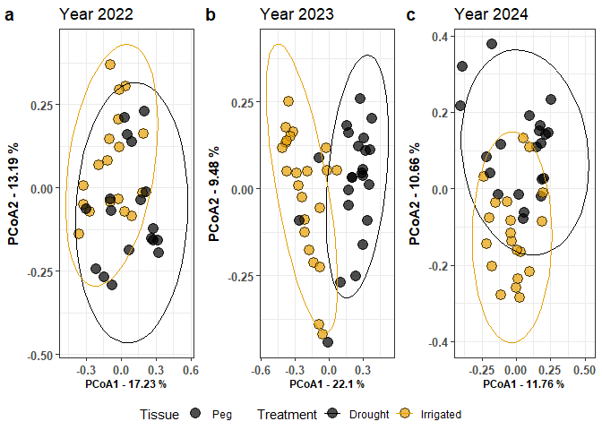<!-- -->

``` r
combined_by_tissue[["Root"]]
```

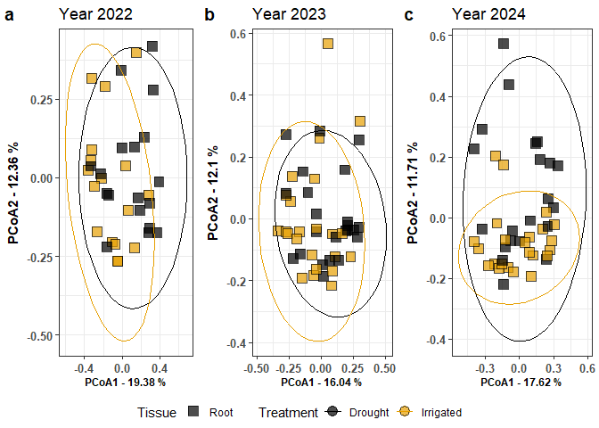<!-- -->

``` r
combined_by_tissue[["Soil"]]
```

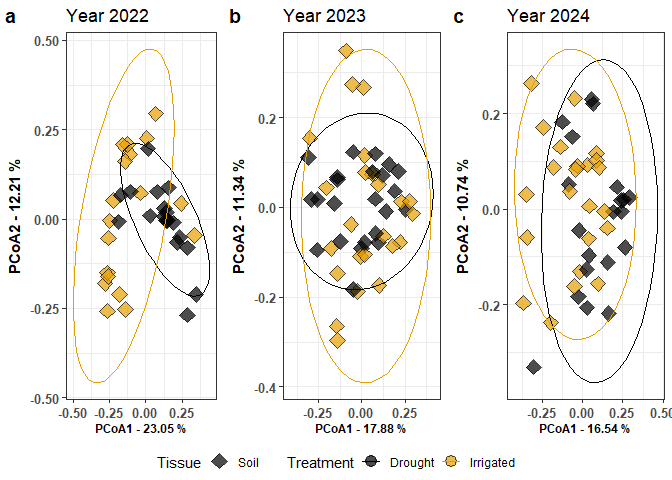<!-- -->

``` r
#save the combined plot

ggsave("Plots/PCoA_Peg_AllYears.png",
       plot = combined_by_tissue[["Peg"]],
       width = 8, height = 6, dpi = 400)

ggsave("Plots/PCoA_Root_AllYears.png",
       plot = combined_by_tissue[["Root"]],
       width = 8, height = 6, dpi = 400)

ggsave("Plots/PCoA_Soil_AllYears.png",
       plot = combined_by_tissue[["Soil"]],
       width = 8, height = 6, dpi = 400)
```
## Differential Abundance 
### Filtering for Differential Abundance 

``` r
# Filtering data to only include Peg tissue between Drought and Irrigated treatments, using normalized data

#Year_2022
diff_peg_2022 <- phyloseq.clean.filt %>%
  # Filter for "Peg" tissue type and both treatments
  phyloseq::subset_samples(Year == 2022 & Tissue == "Peg" & Treatment %in% c("Irrigated", "Drought")) %>%
  phyloseq::filter_taxa(function(x) sum(x) > 0, TRUE)

diff_peg_2023 <- phyloseq.clean.filt %>%
  # Filter for "Peg" tissue type and both treatments
  phyloseq::subset_samples(Year == 2023 & Tissue == "Peg" & Treatment %in% c("Irrigated", "Drought")) %>%
  phyloseq::filter_taxa(function(x) sum(x) > 0, TRUE) 

#Year_2024
diff_peg_2024 <- phyloseq.clean.filt %>%
  # Filter for "Peg" tissue type and both treatments
  phyloseq::subset_samples(Year == 2024 & Tissue == "Peg" & Treatment %in% c("Irrigated", "Drought")) %>%
  phyloseq::filter_taxa(function(x) sum(x) > 0, TRUE)
```

### Differential Abundance Analysis with DESeq2

#### 2022 Peg Tissue

``` r
# Convert the phyloseq object to a DESeq2 object.
# Here, we use the "Treatment" column in your sample metadata as the design variable.
dds <- phyloseq_to_deseq2(diff_peg_2022, ~ Treatment)
```

```
## converting counts to integer mode
```

```
## Warning in DESeqDataSet(se, design = design, ignoreRank): some variables in
## design formula are characters, converting to factors
```

``` r
# Run the DESeq2 analysis using the Wald test and parametric fit.
dds <- DESeq(dds, test = "Wald", fitType = "parametric")
```

```
## estimating size factors
```

```
## estimating dispersions
```

```
## gene-wise dispersion estimates
```

```
## mean-dispersion relationship
```

```
## final dispersion estimates
```

```
## fitting model and testing
```

```
## -- replacing outliers and refitting for 202 genes
## -- DESeq argument 'minReplicatesForReplace' = 7 
## -- original counts are preserved in counts(dds)
```

```
## estimating dispersions
```

```
## fitting model and testing
```

``` r
# Extract the results.
# Here, cooksCutoff is set to FALSE to disable filtering based on Cook's distance.
res <- results(dds, cooksCutoff = FALSE)

# Set a significance threshold for the adjusted p-value.
alpha <- 1

# Filter to keep only significant taxa.
sigtab <- res[which(res$padj < alpha), ]

# Combine the DESeq2 results with the taxonomy data.
# This assumes that the row names of the DESeq2 result match the taxa in the phyloseq object.
sigtab <- cbind(as(sigtab, "data.frame"),
                as(tax_table(diff_peg_2022)[rownames(sigtab), ], "matrix"))

sigtab
```

```
##               baseMean log2FoldChange     lfcSE        stat       pvalue
## FOTU_2     538.8427439    -1.20147353 1.1324416 -1.06095848 2.887088e-01
## FOTU_2001    9.8017092     0.49475306 1.2913695  0.38312277 7.016287e-01
## FOTU_201     4.5829165    -0.57197843 2.3921066 -0.23911076 8.110197e-01
## FOTU_204     5.4667206    -0.94683855 1.7177323 -0.55121426 5.814868e-01
## FOTU_207     1.4679257     3.02311253 2.4518448  1.23299508 2.175776e-01
## FOTU_208     8.1904816    -0.97577574 0.6679273 -1.46090120 1.440426e-01
## FOTU_209    12.7414301     1.75930332 1.5281244  1.15128276 2.496159e-01
## FOTU_21     80.4446239     2.05841811 2.2161788  0.92881408 3.529854e-01
## FOTU_215    77.2693882     2.50252288 1.0128554  2.47076023 1.348262e-02
## FOTU_2194    1.5637272     5.14033126 2.9367496  1.75034711 8.005844e-02
## FOTU_22    252.2156951     0.08929749 0.8137323  0.10973816 9.126170e-01
## FOTU_223     3.9659842     4.74794493 1.8345283  2.58810123 9.650661e-03
## FOTU_224     2.1451533     3.38785566 2.1589376  1.56922352 1.165959e-01
## FOTU_23     48.6099952    -2.60862409 1.2552465 -2.07817682 3.769308e-02
## FOTU_230    12.1050553     0.77658735 0.8582311  0.90486973 3.655344e-01
## FOTU_233     4.1570655    -2.22873425 1.5831609 -1.40777492 1.591977e-01
## FOTU_235    24.9950438     0.83012084 1.2371838  0.67097616 5.022357e-01
## FOTU_2376    1.8272072     5.35894311 2.0412652  2.62530466 8.657147e-03
## FOTU_24     28.7018641     5.47555711 1.2008792  4.55962343 5.124543e-06
## FOTU_2401    1.2335264    -1.57109469 1.9837128 -0.79199706 4.283624e-01
## FOTU_243     0.9623740     3.30886897 1.9363174  1.70884637 8.747941e-02
## FOTU_244     5.1239506     0.09319139 2.0304795  0.04589625 9.633929e-01
## FOTU_2451    1.1359025     4.66609377 2.9414646  1.58631646 1.126675e-01
## FOTU_25      4.1151981     1.19743416 1.9468515  0.61506187 5.385139e-01
## FOTU_257     4.2432890     6.40860936 1.6242182  3.94565778 7.958121e-05
## FOTU_259    10.3392283     2.31124509 1.2231456  1.88959112 5.881267e-02
## FOTU_26    548.8288891    -1.68934042 0.8537154 -1.97880972 4.783743e-02
## FOTU_260     1.2556543     4.14588960 2.5659527  1.61573111 1.061525e-01
## FOTU_262     8.0744987     3.26261993 1.7245713  1.89184404 5.851176e-02
## FOTU_263    10.0879525     0.92034110 1.5744768  0.58453773 5.588586e-01
## FOTU_269     4.7235221     6.73106019 1.9711635  3.41476512 6.383703e-04
## FOTU_278     8.6775055     0.94398810 1.3483527  0.70010475 4.838619e-01
## FOTU_28    107.6231446    -0.41565918 0.8614815 -0.48249343 6.294555e-01
## FOTU_286     3.3951991    -2.35620118 1.8836524 -1.25086836 2.109825e-01
## FOTU_29     49.0959378     1.65826543 0.7890049  2.10171766 3.557802e-02
## FOTU_2914    1.1146072     4.63780914 2.9417970  1.57652251 1.149054e-01
## FOTU_2930  152.4825326    -0.88702460 0.6506350 -1.36332130 1.727813e-01
## FOTU_294    15.5361630     0.64136399 1.5195355  0.42207897 6.729674e-01
## FOTU_3    3749.3189225    -0.53969923 0.6127909 -0.88072333 3.784676e-01
## FOTU_305     2.8400982    -0.79908056 2.0374473 -0.39219693 6.949127e-01
## FOTU_3076    1.1591762    -2.90691252 2.9298947 -0.99215597 3.211214e-01
## FOTU_308     2.6947329     5.17186276 2.1111297  2.44980814 1.429324e-02
## FOTU_31      2.6809574     0.38585847 1.0910377  0.35366192 7.235923e-01
## FOTU_3124    6.0972629     0.25561913 1.3331680  0.19173813 8.479473e-01
## FOTU_320     1.9914449     2.90444828 2.0419023  1.42242273 1.549036e-01
## FOTU_3203   20.8612026     4.77673145 1.7620425  2.71090596 6.709965e-03
## FOTU_322     9.6700987    -1.14422547 1.4752946 -0.77559120 4.379904e-01
## FOTU_3236   14.6812310     2.63188154 1.1726896  2.24431224 2.481232e-02
## FOTU_326     1.2811361     1.58648335 2.1611098  0.73410586 4.628842e-01
## FOTU_327     1.3830898    -2.94924539 2.4391620 -1.20912240 2.266158e-01
## FOTU_332     4.8022430     3.40409199 1.9033789  1.78844687 7.370394e-02
## FOTU_342    90.5563853     6.88677638 1.2437017  5.53732171 3.071321e-08
## FOTU_35      4.3945524     3.38160174 2.1752804  1.55455899 1.200511e-01
## FOTU_354     4.2180145     0.48264239 1.8665405  0.25857590 7.959625e-01
## FOTU_36    281.1516940     2.34977964 1.0622344  2.21211038 2.695904e-02
## FOTU_37     33.1328951     1.67573271 1.2316165  1.36059614 1.736414e-01
## FOTU_373     1.3629254    -1.06283115 2.9223188 -0.36369446 7.160862e-01
## FOTU_374     1.4138361    -3.18198842 2.9290747 -1.08634595 2.773260e-01
## FOTU_376    11.3959379     1.68975314 0.8191871  2.06271937 3.913930e-02
## FOTU_3784    1.0255692    -0.51962068 1.4573371 -0.35655489 7.214251e-01
## FOTU_386     1.6037215     3.59134607 2.4625309  1.45839632 1.447313e-01
## FOTU_39    310.3578255     3.98585214 1.3177913  3.02464604 2.489243e-03
## FOTU_390     5.7387588     7.02106540 2.2826351  3.07585968 2.098966e-03
## FOTU_4    3284.1306909     1.23449583 0.6772579  1.82278555 6.833588e-02
## FOTU_40     43.2284960     6.78844071 1.5558021  4.36330608 1.281115e-05
## FOTU_403    15.6884222     0.51544697 1.3999287  0.36819516 7.127277e-01
## FOTU_41   1094.3493992     5.52710035 0.7998383  6.91027259 4.837233e-12
## FOTU_410     4.2073871     5.63434449 1.8805608  2.99609806 2.734585e-03
## FOTU_414     0.9392838     3.17310222 2.3891774  1.32811494 1.841401e-01
## FOTU_4260    1.1983967     4.74952084 2.5226841  1.88272514 5.973763e-02
## FOTU_429     0.8724960     4.28497028 2.9462484  1.45438189 1.458405e-01
## FOTU_43      2.6898118     3.68271107 1.7127299  2.15019961 3.153943e-02
## FOTU_430     6.6272525     3.40937580 1.5779424  2.16064652 3.072266e-02
## FOTU_432     1.4121979     4.99869371 2.5140212  1.98832599 4.677565e-02
## FOTU_433     0.9556287     2.41927818 2.2650184  1.06810533 2.854730e-01
## FOTU_435     4.3291554     4.97710513 1.6240761  3.06457632 2.179785e-03
## FOTU_44     85.2187663    -1.02456645 0.9880408 -1.03696776 2.997509e-01
## FOTU_4410    4.2721957     6.04103577 2.1094928  2.86373845 4.186736e-03
## FOTU_455     0.9258671     4.39487815 2.5064104  1.75345515 7.952391e-02
## FOTU_46      6.8351654     2.00327825 1.3982942  1.43265860 1.519554e-01
## FOTU_4645    1.2595780     4.82111445 2.9397527  1.63997282 1.010108e-01
## FOTU_473    18.5632715     4.61043542 1.5235874  3.02603933 2.477801e-03
## FOTU_4738    1.8266905    -2.37877516 1.7275058 -1.37699983 1.685123e-01
## FOTU_4760    1.1607387    -0.19240407 0.9572206 -0.20100285 8.406963e-01
## FOTU_481     5.1106026     6.85401119 2.2650857  3.02593908 2.478622e-03
## FOTU_484   136.3226157     0.21644011 0.6306318  0.34321154 7.314393e-01
## FOTU_49    307.8074394    -2.46803924 0.8961145 -2.75415599 5.884371e-03
## FOTU_4990    2.8050796    -2.55547824 1.7502349 -1.46007729 1.442688e-01
## FOTU_5    1432.1571438     0.94230822 0.5925266  1.59032224 1.117622e-01
## FOTU_50      1.7095973    -2.63337598 2.1847029 -1.20537028 2.280604e-01
## FOTU_5156    3.7317836    -0.42923298 1.1117311 -0.38609425 6.994269e-01
## FOTU_52     11.9118436     2.98285165 1.5892297  1.87691658 6.052953e-02
## FOTU_522     6.7174467     0.87083615 1.6839960  0.51712485 6.050690e-01
## FOTU_5227    1.1811453     4.72614074 2.0037540  2.35864317 1.834188e-02
## FOTU_523     6.6310327     5.15842942 2.0189046  2.55506351 1.061684e-02
## FOTU_532    12.7881289     2.45603725 1.4517129  1.69182027 9.068025e-02
## FOTU_54      2.0806640     4.23703939 2.4339707  1.74079306 8.171986e-02
## FOTU_547     1.0491455    -0.93601464 2.0236319 -0.46254194 6.436927e-01
## FOTU_557     1.7153896    -2.39541497 2.0301120 -1.17994227 2.380232e-01
## FOTU_5576    1.3972872    -1.02596564 1.5697706 -0.65357678 5.133845e-01
## FOTU_57      8.0986988     6.84062814 1.6636866  4.11172872 3.927076e-05
## FOTU_5771    4.6124564    -1.06844496 2.0006271 -0.53405502 5.933035e-01
## FOTU_5772    2.0288984     5.52215366 2.3315903  2.36840656 1.786489e-02
## FOTU_58    256.4289593     4.29581786 1.1499416  3.73568343 1.872061e-04
## FOTU_584     9.3597874     7.72676637 2.8759705  2.68666403 7.216950e-03
## FOTU_59     14.4155161    -1.64495675 1.4584406 -1.12788737 2.593675e-01
## FOTU_6     158.7972529     1.00308075 1.2261736  0.81805771 4.133242e-01
## FOTU_60      2.4444195     0.47624431 2.9044499  0.16397057 8.697543e-01
## FOTU_618    15.6781855     6.53776170 1.3486957  4.84746985 1.250460e-06
## FOTU_622     2.3545215     5.72401610 2.3782453  2.40682329 1.609195e-02
## FOTU_623     4.5705040    -0.40462054 0.8689403 -0.46564828 6.414673e-01
## FOTU_625    12.8879932     5.29954053 1.4386134  3.68378354 2.297974e-04
## FOTU_639     4.0751207     6.34179516 1.7054206  3.71861054 2.003216e-04
## FOTU_64      2.9438608    -1.65435595 1.2256301 -1.34980032 1.770800e-01
## FOTU_640     6.5576111     0.54850950 1.3994452  0.39194782 6.950968e-01
## FOTU_641     1.5810563     5.15655917 2.3181931  2.22438723 2.612240e-02
## FOTU_645     0.8650513     4.30564881 2.9459721  1.46153753 1.438680e-01
## FOTU_652     1.1814332     1.53259463 1.9082759  0.80313054 4.218993e-01
## FOTU_657     7.2094183     5.61029636 1.8548866  3.02460343 2.489593e-03
## FOTU_7    2260.3715986     1.26849826 0.7690924  1.64934434 9.907711e-02
## FOTU_70    160.7074200     0.05269450 0.8567399  0.06150584 9.509564e-01
## FOTU_706     0.9565677     3.55379583 1.6874349  2.10603435 3.520137e-02
## FOTU_708     3.0316241     2.45878539 2.7721992  0.88694399 3.751091e-01
## FOTU_71      8.1753911     5.72684211 1.6619961  3.44576143 5.694529e-04
## FOTU_72     25.1464464     0.83264835 0.9957236  0.83622434 4.030287e-01
## FOTU_723     1.0684182     3.75446850 2.5675794  1.46225993 1.436700e-01
## FOTU_73     15.5503441    -0.61475690 1.8869072 -0.32580135 7.445747e-01
## FOTU_75      1.3603132     0.95386431 2.4970824  0.38199152 7.024677e-01
## FOTU_760     1.6165723     5.20528694 2.2123730  2.35280710 1.863230e-02
## FOTU_762     1.2608102     3.58956851 2.0985288  1.71051670 8.717037e-02
## FOTU_778     3.6963430     4.73014828 2.0586528  2.29769118 2.157937e-02
## FOTU_78     17.3650303    -0.85776060 1.5494513 -0.55358992 5.798595e-01
## FOTU_783     1.2843558     4.86386381 2.9393115  1.65476294 9.797259e-02
## FOTU_784    20.3126747     1.38263047 0.7917197  1.74636353 8.074780e-02
## FOTU_79      2.3459310     2.33707908 1.7542136  1.33226594 1.827728e-01
## FOTU_792    16.6263866     6.41055759 1.6402712  3.90823039 9.297462e-05
## FOTU_8    5553.0220530     1.50783512 0.8130768  1.85448047 6.367045e-02
## FOTU_80      4.5046200    -1.97473525 1.7441553 -1.13220150 2.575497e-01
## FOTU_803     0.8636349     4.28956042 1.9769120  2.16982874 3.001982e-02
## FOTU_813     2.1455178     5.59209810 2.3573928  2.37215375 1.768473e-02
## FOTU_82    372.8309443     5.61715539 1.2441740  4.51476691 6.338645e-06
## FOTU_83      3.8039391     6.42257381 2.2043194  2.91363118 3.572517e-03
## FOTU_834     3.2263559     6.18594830 2.2160474  2.79143316 5.247520e-03
## FOTU_84      3.0803096     3.76281837 1.8304234  2.05570924 3.981055e-02
## FOTU_857     1.0721735     4.59027864 2.9423701  1.56006163 1.187453e-01
## FOTU_86      1.3402365     4.90307110 2.7219676  1.80129664 7.165614e-02
## FOTU_87    161.1022334    -1.71067699 0.6266350 -2.72994156 6.334555e-03
## FOTU_88     62.1139685    -1.40691649 1.0967424 -1.28281395 1.995573e-01
## FOTU_89     31.4199135    -3.23285782 1.7151586 -1.88487403 5.944685e-02
## FOTU_9    1446.0456989     2.02503896 0.8159185  2.48191322 1.306791e-02
## FOTU_91     11.4479935    -1.02762364 1.4299615 -0.71863727 4.723644e-01
## FOTU_912     1.5323887    -0.74661650 1.8477285 -0.40407263 6.861593e-01
## FOTU_919     1.3250071     4.87870478 2.9391614  1.65989687 9.693520e-02
## FOTU_923     1.6516448     5.20378371 2.7384900  1.90023837 5.740185e-02
## FOTU_926     2.0201492     2.81956228 2.0572936  1.37052009 1.705246e-01
## FOTU_93    179.4800388     0.71515335 1.0803608  0.66195787 5.079982e-01
## FOTU_95      8.5754582     0.55072914 1.1334025  0.48590781 6.270325e-01
## FOTU_96     54.3052785    -3.86015330 1.1699305 -3.29947239 9.686676e-04
## FOTU_965     3.4793335     1.55882997 1.8504954  0.84238523 3.995724e-01
## FOTU_97     57.9293246    -0.27786864 1.7398252 -0.15971067 8.731090e-01
## FOTU_996     1.3506828     4.93418659 2.5202974  1.95777947 5.025590e-02
## FOTU_999     1.7075692     2.62778727 2.1488969  1.22285402 2.213848e-01
##                   padj    OTU_ID Kingdom            Phylum              Class
## FOTU_2    4.175966e-01    FOTU_2   Fungi     Basidiomycota Atractiellomycetes
## FOTU_2001 7.741480e-01 FOTU_2001   Fungi      unidentified       unidentified
## FOTU_201  8.476464e-01  FOTU_201   Fungi     Basidiomycota     Agaricomycetes
## FOTU_204  7.029915e-01  FOTU_204   Fungi        Ascomycota    Sordariomycetes
## FOTU_207  3.455644e-01  FOTU_207   Fungi        Ascomycota    Dothideomycetes
## FOTU_208  2.654624e-01  FOTU_208   Fungi        Ascomycota    Dothideomycetes
## FOTU_209  3.779232e-01  FOTU_209   Fungi     Basidiomycota Microbotryomycetes
## FOTU_21   4.972491e-01   FOTU_21   Fungi     Basidiomycota     Agaricomycetes
## FOTU_215  6.424071e-02  FOTU_215   Fungi     Basidiomycota Microbotryomycetes
## FOTU_2194 1.918640e-01 FOTU_2194   Fungi     Basidiomycota     Agaricomycetes
## FOTU_22   9.240247e-01   FOTU_22   Fungi      unidentified       unidentified
## FOTU_223  5.043249e-02  FOTU_223   Fungi      unidentified       unidentified
## FOTU_224  2.331917e-01  FOTU_224   Fungi        Ascomycota    Sordariomycetes
## FOTU_23   1.221256e-01   FOTU_23   Fungi        Ascomycota    Sordariomycetes
## FOTU_230  5.104877e-01  FOTU_230   Fungi        Ascomycota    Dothideomycetes
## FOTU_233  2.803264e-01  FOTU_233   Fungi     Basidiomycota     Agaricomycetes
## FOTU_235  6.356421e-01  FOTU_235   Fungi      unidentified       unidentified
## FOTU_2376 4.674859e-02 FOTU_2376   Fungi      unidentified       unidentified
## FOTU_24   2.053721e-04   FOTU_24   Fungi        Ascomycota    Sordariomycetes
## FOTU_2401 5.641846e-01 FOTU_2401   Fungi     Basidiomycota Atractiellomycetes
## FOTU_243  1.996009e-01  FOTU_243   Fungi     Glomeromycota     Glomeromycetes
## FOTU_244  9.633929e-01  FOTU_244   Fungi        Ascomycota    Sordariomycetes
## FOTU_2451 2.310398e-01 FOTU_2451   Fungi        Ascomycota      Leotiomycetes
## FOTU_25   6.659484e-01   FOTU_25   Fungi      unidentified       unidentified
## FOTU_257  1.611519e-03  FOTU_257   Fungi     Basidiomycota    Tremellomycetes
## FOTU_259  1.607505e-01  FOTU_259   Fungi        Ascomycota    Sordariomycetes
## FOTU_26   1.435123e-01   FOTU_26   Fungi        Ascomycota    Sordariomycetes
## FOTU_260  2.233337e-01  FOTU_260   Fungi     Basidiomycota     Agaricomycetes
## FOTU_262  1.607505e-01  FOTU_262   Fungi     Basidiomycota    Tremellomycetes
## FOTU_263  6.858719e-01  FOTU_263   Fungi        Ascomycota    Dothideomycetes
## FOTU_269  7.386857e-03  FOTU_269   Fungi      unidentified       unidentified
## FOTU_278  6.172097e-01  FOTU_278   Fungi      unidentified       unidentified
## FOTU_28   7.389260e-01   FOTU_28   Fungi        Ascomycota    Dothideomycetes
## FOTU_286  3.384076e-01  FOTU_286   Fungi        Ascomycota    Sordariomycetes
## FOTU_29   1.176253e-01   FOTU_29   Fungi        Ascomycota    Dothideomycetes
## FOTU_2914 2.326835e-01 FOTU_2914   Fungi        Ascomycota    Dothideomycetes
## FOTU_2930 2.930198e-01 FOTU_2930   Fungi        Ascomycota    Sordariomycetes
## FOTU_294  7.731966e-01  FOTU_294   Fungi        Ascomycota    Dothideomycetes
## FOTU_3    5.195911e-01    FOTU_3   Fungi        Ascomycota    Dothideomycetes
## FOTU_305  7.741480e-01  FOTU_305   Fungi        Ascomycota    Dothideomycetes
## FOTU_3076 4.563305e-01 FOTU_3076   Fungi      unidentified       unidentified
## FOTU_308  6.615726e-02  FOTU_308   Fungi        Ascomycota    Sordariomycetes
## FOTU_31   7.763043e-01   FOTU_31   Fungi        Ascomycota    Sordariomycetes
## FOTU_3124 8.749520e-01 FOTU_3124   Fungi     Basidiomycota Microbotryomycetes
## FOTU_320  2.757624e-01  FOTU_320   Fungi     Basidiomycota    Tremellomycetes
## FOTU_3203 3.882194e-02 FOTU_3203   Fungi        Ascomycota    Dothideomycetes
## FOTU_322  5.722133e-01  FOTU_322   Fungi        Ascomycota    Dothideomycetes
## FOTU_3236 9.570466e-02 FOTU_3236   Fungi        Ascomycota    Dothideomycetes
## FOTU_326  5.998980e-01  FOTU_326   Fungi        Ascomycota    Sordariomycetes
## FOTU_327  3.518646e-01  FOTU_327   Fungi        Ascomycota    Dothideomycetes
## FOTU_332  1.836929e-01  FOTU_332   Fungi     Basidiomycota    Tremellomycetes
## FOTU_342  2.487770e-06  FOTU_342   Fungi        Ascomycota    Sordariomycetes
## FOTU_35   2.343167e-01   FOTU_35   Fungi        Ascomycota    Dothideomycetes
## FOTU_354  8.373112e-01  FOTU_354   Fungi        Ascomycota    Dothideomycetes
## FOTU_36   9.925828e-02   FOTU_36   Fungi        Ascomycota    Sordariomycetes
## FOTU_37   2.930198e-01   FOTU_37   Fungi        Ascomycota    Dothideomycetes
## FOTU_373  7.763043e-01  FOTU_373   Fungi     Basidiomycota    Tremellomycetes
## FOTU_374  4.084255e-01  FOTU_374   Fungi      unidentified       unidentified
## FOTU_376  1.240252e-01  FOTU_376   Fungi        Ascomycota    Dothideomycetes
## FOTU_3784 7.763043e-01 FOTU_3784   Fungi      unidentified       unidentified
## FOTU_386  2.654624e-01  FOTU_386   Fungi        Ascomycota    Dothideomycetes
## FOTU_39   1.920543e-02   FOTU_39   Fungi        Ascomycota    Sordariomycetes
## FOTU_390  1.920543e-02  FOTU_390   Fungi     Basidiomycota     Agaricomycetes
## FOTU_4    1.757208e-01    FOTU_4   Fungi        Ascomycota    Sordariomycetes
## FOTU_40   3.459011e-04   FOTU_40   Fungi        Ascomycota    Sordariomycetes
## FOTU_403  7.763043e-01  FOTU_403   Fungi        Ascomycota     Eurotiomycetes
## FOTU_41   7.836318e-10   FOTU_41   Fungi        Ascomycota    Sordariomycetes
## FOTU_410  2.013649e-02  FOTU_410   Fungi        Ascomycota    Dothideomycetes
## FOTU_414  3.013202e-01  FOTU_414   Fungi        Ascomycota    Sordariomycetes
## FOTU_4260 1.607505e-01 FOTU_4260   Fungi        Ascomycota    Sordariomycetes
## FOTU_429  2.654624e-01  FOTU_429   Fungi        Ascomycota    Sordariomycetes
## FOTU_43   1.087104e-01   FOTU_43   Fungi        Ascomycota    Sordariomycetes
## FOTU_430  1.081972e-01  FOTU_430   Fungi        Ascomycota    Dothideomycetes
## FOTU_432  1.429746e-01  FOTU_432   Fungi     Basidiomycota     Agaricomycetes
## FOTU_433  4.166363e-01  FOTU_433   Fungi        Ascomycota    Sordariomycetes
## FOTU_435  1.920543e-02  FOTU_435   Fungi        Ascomycota       unidentified
## FOTU_44   4.297314e-01   FOTU_44   Fungi        Ascomycota    Sordariomycetes
## FOTU_4410 2.826046e-02 FOTU_4410   Fungi        Ascomycota    Sordariomycetes
## FOTU_455  1.918640e-01  FOTU_455   Fungi        Ascomycota    Dothideomycetes
## FOTU_46   2.735198e-01   FOTU_46   Fungi      unidentified       unidentified
## FOTU_4645 2.153125e-01 FOTU_4645   Fungi        Ascomycota    Sordariomycetes
## FOTU_473  1.920543e-02  FOTU_473   Fungi        Ascomycota    Sordariomycetes
## FOTU_4738 2.930198e-01 FOTU_4738   Fungi     Basidiomycota  Ustilaginomycetes
## FOTU_4760 8.730308e-01 FOTU_4760   Fungi      unidentified       unidentified
## FOTU_481  1.920543e-02  FOTU_481   Fungi     Basidiomycota    Tremellomycetes
## FOTU_484  7.795603e-01  FOTU_484   Fungi        Ascomycota    Sordariomycetes
## FOTU_49   3.666416e-02   FOTU_49   Fungi        Ascomycota    Dothideomycetes
## FOTU_4990 2.654624e-01 FOTU_4990   Fungi     Basidiomycota Atractiellomycetes
## FOTU_5    2.310398e-01    FOTU_5   Fungi      unidentified       unidentified
## FOTU_50   3.518646e-01   FOTU_50   Fungi        Ascomycota    Sordariomycetes
## FOTU_5156 7.741480e-01 FOTU_5156   Fungi      unidentified       unidentified
## FOTU_52   1.607505e-01   FOTU_52   Fungi        Ascomycota    Sordariomycetes
## FOTU_522  7.207440e-01  FOTU_522   Fungi     Basidiomycota Microbotryomycetes
## FOTU_5227 7.546080e-02 FOTU_5227   Fungi        Ascomycota    Dothideomycetes
## FOTU_523  5.374776e-02  FOTU_523   Fungi        Ascomycota       unidentified
## FOTU_532  2.040306e-01  FOTU_532   Fungi        Ascomycota    Dothideomycetes
## FOTU_54   1.918640e-01   FOTU_54   Fungi        Ascomycota    Sordariomycetes
## FOTU_547  7.448444e-01  FOTU_547   Fungi        Ascomycota    Sordariomycetes
## FOTU_557  3.637713e-01  FOTU_557   Fungi        Ascomycota     Eurotiomycetes
## FOTU_5576 6.397561e-01 FOTU_5576   Fungi        Ascomycota    Sordariomycetes
## FOTU_57   9.088375e-04   FOTU_57   Fungi        Ascomycota      Pezizomycetes
## FOTU_5771 7.119642e-01 FOTU_5771   Fungi     Basidiomycota     Agaricomycetes
## FOTU_5772 7.546080e-02 FOTU_5772   Fungi        Ascomycota    Dothideomycetes
## FOTU_58   2.950191e-03   FOTU_58   Fungi        Ascomycota    Sordariomycetes
## FOTU_584  4.031538e-02  FOTU_584   Fungi     Basidiomycota     Agaricomycetes
## FOTU_59   3.854820e-01   FOTU_59   Fungi      unidentified       unidentified
## FOTU_6    5.533762e-01    FOTU_6   Fungi        Ascomycota    Sordariomycetes
## FOTU_60   8.895828e-01   FOTU_60   Fungi     Basidiomycota     Agaricomycetes
## FOTU_618  6.752486e-05  FOTU_618   Fungi        Ascomycota    Sordariomycetes
## FOTU_622  7.241379e-02  FOTU_622   Fungi     Basidiomycota    Tremellomycetes
## FOTU_623  7.448444e-01  FOTU_623   Fungi        Ascomycota    Sordariomycetes
## FOTU_625  3.102265e-03  FOTU_625   Fungi      unidentified       unidentified
## FOTU_639  2.950191e-03  FOTU_639   Fungi        Ascomycota    Dothideomycetes
## FOTU_64   2.957419e-01   FOTU_64   Fungi        Ascomycota     Eurotiomycetes
## FOTU_640  7.741480e-01  FOTU_640   Fungi        Ascomycota    Dothideomycetes
## FOTU_641  9.841463e-02  FOTU_641   Fungi Mortierellomycota Mortierellomycetes
## FOTU_645  2.654624e-01  FOTU_645   Fungi     Rozellomycota       unidentified
## FOTU_652  5.602269e-01  FOTU_652   Fungi   Chytridiomycota      Lobulomycetes
## FOTU_657  1.920543e-02  FOTU_657   Fungi     Basidiomycota    Tremellomycetes
## FOTU_7    2.140066e-01    FOTU_7   Fungi        Ascomycota    Sordariomycetes
## FOTU_70   9.568629e-01   FOTU_70   Fungi        Ascomycota    Dothideomycetes
## FOTU_706  1.176253e-01  FOTU_706   Fungi        Ascomycota    Dothideomycetes
## FOTU_708  5.193818e-01  FOTU_708   Fungi        Ascomycota     Orbiliomycetes
## FOTU_71   7.096259e-03   FOTU_71   Fungi        Ascomycota    Dothideomycetes
## FOTU_72   5.440888e-01   FOTU_72   Fungi        Ascomycota    Dothideomycetes
## FOTU_723  2.654624e-01  FOTU_723   Fungi        Ascomycota    Sordariomycetes
## FOTU_73   7.883732e-01   FOTU_73   Fungi     Basidiomycota     Agaricomycetes
## FOTU_75   7.741480e-01   FOTU_75   Fungi        Ascomycota    Sordariomycetes
## FOTU_760  7.546080e-02  FOTU_760   Fungi        Ascomycota    Dothideomycetes
## FOTU_762  1.996009e-01  FOTU_762   Fungi        Ascomycota    Dothideomycetes
## FOTU_778  8.526483e-02  FOTU_778   Fungi        Ascomycota     Eurotiomycetes
## FOTU_78   7.029915e-01   FOTU_78   Fungi        Ascomycota    Dothideomycetes
## FOTU_783  2.140066e-01  FOTU_783   Fungi        Ascomycota    Sordariomycetes
## FOTU_784  1.918640e-01  FOTU_784   Fungi      unidentified       unidentified
## FOTU_79   3.013202e-01   FOTU_79   Fungi        Ascomycota    Dothideomycetes
## FOTU_792  1.673543e-03  FOTU_792   Fungi     Basidiomycota     Agaricomycetes
## FOTU_8    1.663647e-01    FOTU_8   Fungi        Ascomycota    Dothideomycetes
## FOTU_80   3.854820e-01   FOTU_80   Fungi        Ascomycota    Sordariomycetes
## FOTU_803  1.080714e-01  FOTU_803   Fungi   Chytridiomycota       unidentified
## FOTU_813  7.546080e-02  FOTU_813   Fungi        Ascomycota    Dothideomycetes
## FOTU_82   2.053721e-04   FOTU_82   Fungi        Ascomycota    Dothideomycetes
## FOTU_83   2.516295e-02   FOTU_83   Fungi      unidentified       unidentified
## FOTU_834  3.400393e-02  FOTU_834   Fungi        Ascomycota    Dothideomycetes
## FOTU_84   1.240252e-01   FOTU_84   Fungi        Ascomycota    Sordariomycetes
## FOTU_857  2.343167e-01  FOTU_857   Fungi        Ascomycota    Dothideomycetes
## FOTU_86   1.813796e-01   FOTU_86   Fungi        Ascomycota    Dothideomycetes
## FOTU_87   3.800733e-02   FOTU_87   Fungi        Ascomycota   Geoglossomycetes
## FOTU_88   3.232828e-01   FOTU_88   Fungi        Ascomycota    Sordariomycetes
## FOTU_89   1.607505e-01   FOTU_89   Fungi      unidentified       unidentified
## FOTU_9    6.415156e-02    FOTU_9   Fungi      unidentified       unidentified
## FOTU_91   6.073257e-01   FOTU_91   Fungi        Ascomycota    Sordariomycetes
## FOTU_912  7.741480e-01  FOTU_912   Fungi        Ascomycota    Dothideomycetes
## FOTU_919  2.140066e-01  FOTU_919   Fungi     Basidiomycota     Agaricomycetes
## FOTU_923  1.607505e-01  FOTU_923   Fungi     Basidiomycota     Agaricomycetes
## FOTU_926  2.930198e-01  FOTU_926   Fungi      unidentified       unidentified
## FOTU_93   6.379513e-01   FOTU_93   Fungi        Ascomycota    Sordariomycetes
## FOTU_95   7.389260e-01   FOTU_95   Fungi        Ascomycota    Dothideomycetes
## FOTU_96   1.046161e-02   FOTU_96   Fungi      unidentified       unidentified
## FOTU_965  5.439556e-01  FOTU_965   Fungi        Ascomycota    Sordariomycetes
## FOTU_97   8.895828e-01   FOTU_97   Fungi        Ascomycota    Dothideomycetes
## FOTU_996  1.480265e-01  FOTU_996   Fungi     Basidiomycota    Tremellomycetes
## FOTU_999  3.481975e-01  FOTU_999   Fungi     Basidiomycota     Agaricomycetes
##                       Order               Family            Genus
## FOTU_2       Atractiellales   Hoehnelomycetaceae      Atractiella
## FOTU_2001      unidentified         unidentified     unidentified
## FOTU_201         Agaricales      Psathyrellaceae      Psathyrella
## FOTU_204        Sordariales        Chaetomiaceae  Acrophialophora
## FOTU_207       Pleosporales    Phaeosphaeriaceae        Setophoma
## FOTU_208       Pleosporales        Massarinaceae     Stagonospora
## FOTU_209    Sporidiobolales     Sporidiobolaceae   Sporobolomyces
## FOTU_21      Cantharellales    Ceratobasidiaceae     unidentified
## FOTU_215       unidentified         unidentified     unidentified
## FOTU_2194    Cantharellales        Oliveoniaceae        Oliveonia
## FOTU_22        unidentified         unidentified     unidentified
## FOTU_223       unidentified         unidentified     unidentified
## FOTU_224        Hypocreales         unidentified     unidentified
## FOTU_23         Hypocreales       Bionectriaceae       Acremonium
## FOTU_230        Venturiales    Sympoventuriaceae  Scolecobasidium
## FOTU_233       unidentified         unidentified     unidentified
## FOTU_235       unidentified         unidentified     unidentified
## FOTU_2376      unidentified         unidentified     unidentified
## FOTU_24       Glomerellales       Glomerellaceae   Colletotrichum
## FOTU_2401    Atractiellales   Hoehnelomycetaceae      Atractiella
## FOTU_243       Gigasporales        Racocetraceae       Cetraspora
## FOTU_244      Glomerellales Plectosphaerellaceae          Lectera
## FOTU_2451        Helotiales      Sclerotiniaceae      Amphobotrys
## FOTU_25        unidentified         unidentified     unidentified
## FOTU_257        Tremellales         unidentified     unidentified
## FOTU_259      Lulworthiales       Lulworthiaceae     unidentified
## FOTU_26         Hypocreales         unidentified     unidentified
## FOTU_260     Cantharellales    Ceratobasidiaceae      Rhizoctonia
## FOTU_262        Tremellales          Bulleraceae          Bullera
## FOTU_263       Pleosporales        Pleosporaceae       Curvularia
## FOTU_269       unidentified         unidentified     unidentified
## FOTU_278       unidentified         unidentified     unidentified
## FOTU_28   Mycosphaerellales   Mycosphaerellaceae       Cercospora
## FOTU_286        Hypocreales       Sarocladiaceae      Sarocladium
## FOTU_29   Botryosphaeriales   Botryosphaeriaceae     Macrophomina
## FOTU_2914       Capnodiales         unidentified     unidentified
## FOTU_2930       Hypocreales          Nectriaceae         Fusarium
## FOTU_294       Pleosporales        Pleosporaceae     unidentified
## FOTU_3       Cladosporiales      Cladosporiaceae     Cladosporium
## FOTU_305       Pleosporales Tetraplosphaeriaceae        Tetraploa
## FOTU_3076      unidentified         unidentified     unidentified
## FOTU_308        Hypocreales     Stachybotryaceae     unidentified
## FOTU_31            Branch06         unidentified     unidentified
## FOTU_3124      unidentified       Chrysozymaceae     unidentified
## FOTU_320        Tremellales   Bulleribasidiaceae        Hannaella
## FOTU_3203      Pleosporales           Torulaceae           Torula
## FOTU_322       Pleosporales    Phaeosphaeriaceae       Leptospora
## FOTU_3236      Pleosporales    Phaeosphaeriaceae    Phaeosphaeria
## FOTU_326        Hypocreales         Hypocreaceae      Trichoderma
## FOTU_327       Pleosporales          Latoruaceae       Polyschema
## FOTU_332        Tremellales   Bulleribasidiaceae        Hannaella
## FOTU_342      Glomerellales       Glomerellaceae   Colletotrichum
## FOTU_35        Pleosporales      Melanommataceae        Tumularia
## FOTU_354       Pleosporales        Pleosporaceae     unidentified
## FOTU_36          Xylariales      Microdochiaceae     Microdochium
## FOTU_37        Pleosporales        Pleosporaceae     unidentified
## FOTU_373        Tremellales    Cuniculitremaceae      Kockovaella
## FOTU_374       unidentified         unidentified     unidentified
## FOTU_376        Venturiales    Sympoventuriaceae  Scolecobasidium
## FOTU_3784      unidentified         unidentified     unidentified
## FOTU_386       unidentified         unidentified     unidentified
## FOTU_39         Hypocreales     Stachybotryaceae      Myrothecium
## FOTU_390     Cantharellales    Ceratobasidiaceae      Rhizoctonia
## FOTU_4          Hypocreales          Nectriaceae         Fusarium
## FOTU_40         Hypocreales     Stachybotryaceae     Stachybotrys
## FOTU_403    Chaetothyriales    Cyphellophoraceae    Cyphellophora
## FOTU_41       Glomerellales Plectosphaerellaceae Plectosphaerella
## FOTU_410       Pleosporales     Dictyosporiaceae Neodendryphiella
## FOTU_414        Hypocreales     Stachybotryaceae     unidentified
## FOTU_4260      Diaporthales        Diaporthaceae        Diaporthe
## FOTU_429        Sordariales    Lasiosphaeriaceae     unidentified
## FOTU_43         Sordariales        Chaetomiaceae         Humicola
## FOTU_430       Pleosporales    Phaeosphaeriaceae       Leptospora
## FOTU_432     Cantharellales    Ceratobasidiaceae     unidentified
## FOTU_433        Hypocreales      Cordycipitaceae    Simplicillium
## FOTU_435       unidentified         unidentified     unidentified
## FOTU_44        Diaporthales        Diaporthaceae        Diaporthe
## FOTU_4410  Amphisphaeriales        Apiosporaceae       Nigrospora
## FOTU_455       Pleosporales Astrosphaeriellaceae       Pithomyces
## FOTU_46        unidentified         unidentified     unidentified
## FOTU_4645       Hypocreales     Stachybotryaceae          Alfaria
## FOTU_473       Diaporthales        Diaporthaceae        Diaporthe
## FOTU_4738     Ustilaginales       Ustilaginaceae     Moesziomyces
## FOTU_4760      unidentified         unidentified     unidentified
## FOTU_481        Tremellales  Rhynchogastremaceae     Papiliotrema
## FOTU_484        Hypocreales          Nectriaceae         Fusarium
## FOTU_49        Pleosporales        Pleosporaceae       Alternaria
## FOTU_4990    Atractiellales   Hoehnelomycetaceae      Atractiella
## FOTU_5         unidentified         unidentified     unidentified
## FOTU_50         Hypocreales          Nectriaceae     Penicillifer
## FOTU_5156      unidentified         unidentified     unidentified
## FOTU_52         Hypocreales Myrotheciomycetaceae   Emericellopsis
## FOTU_522       unidentified       Chrysozymaceae     unidentified
## FOTU_5227      Pleosporales     Dictyosporiaceae Neodendryphiella
## FOTU_523       unidentified         unidentified     unidentified
## FOTU_532       Pleosporales    Phaeosphaeriaceae     unidentified
## FOTU_54       Glomerellales Plectosphaerellaceae     unidentified
## FOTU_547        Sordariales        Chaetomiaceae     unidentified
## FOTU_557    Chaetothyriales      Trichomeriaceae           Knufia
## FOTU_5576       Hypocreales          Nectriaceae         Fusarium
## FOTU_57           Pezizales           Pezizaceae     unidentified
## FOTU_5771    Cantharellales    Ceratobasidiaceae      Rhizoctonia
## FOTU_5772      Pleosporales           Torulaceae           Torula
## FOTU_58       Glomerellales Plectosphaerellaceae          Lectera
## FOTU_584        Polyporales          Meruliaceae     Hydnophlebia
## FOTU_59        unidentified         unidentified     unidentified
## FOTU_6    Chaetosphaeriales   Chaetosphaeriaceae         Codinaea
## FOTU_60      Cantharellales        Oliveoniaceae        Oliveonia
## FOTU_618      Glomerellales       Glomerellaceae   Colletotrichum
## FOTU_622        Tremellales         unidentified     unidentified
## FOTU_623        Hypocreales          Nectriaceae         Fusarium
## FOTU_625       unidentified         unidentified     unidentified
## FOTU_639        Tubeufiales         Tubeufiaceae    Helicosporium
## FOTU_64          Eurotiales       Aspergillaceae      Penicillium
## FOTU_640       Pleosporales         unidentified     unidentified
## FOTU_641     Mortierellales      Mortierellaceae      Mortierella
## FOTU_645       unidentified         unidentified     unidentified
## FOTU_652    Lobulomycetales         unidentified     unidentified
## FOTU_657        Tremellales      Cryptococcaceae     Cryptococcus
## FOTU_7          Hypocreales     Stachybotryaceae     unidentified
## FOTU_70        Pleosporales        Pleosporaceae       Curvularia
## FOTU_706        Venturiales    Sympoventuriaceae  Scolecobasidium
## FOTU_708         Orbiliales         unidentified     unidentified
## FOTU_71         Tubeufiales         Tubeufiaceae         Helicoma
## FOTU_72        Pleosporales         unidentified     unidentified
## FOTU_723   Amphisphaeriales        Sporocadaceae   Pestalotiopsis
## FOTU_73         Polyporales          Meruliaceae     Hydnophlebia
## FOTU_75         Hypocreales          Nectriaceae        Fusicolla
## FOTU_760  Botryosphaeriales     Phyllostictaceae     unidentified
## FOTU_762        Venturiales    Sympoventuriaceae  Scolecobasidium
## FOTU_778         Eurotiales       Aspergillaceae      Penicillium
## FOTU_78        Pleosporales         unidentified     unidentified
## FOTU_783       Diaporthales        Diaporthaceae        Diaporthe
## FOTU_784       unidentified         unidentified     unidentified
## FOTU_79        Pleosporales           Torulaceae           Torula
## FOTU_792          Phallales           Phallaceae     unidentified
## FOTU_8         Pleosporales    Phaeosphaeriaceae        Paraphoma
## FOTU_80         Hypocreales      Tilachlidiaceae     Tilachlidium
## FOTU_803       unidentified         unidentified     unidentified
## FOTU_813       Pleosporales         unidentified     unidentified
## FOTU_82        Pleosporales           Torulaceae           Torula
## FOTU_83        unidentified         unidentified     unidentified
## FOTU_834       Pleosporales    Phaeosphaeriaceae  Ophiosphaerella
## FOTU_84         Hypocreales         Hypocreaceae      Trichoderma
## FOTU_857       Pleosporales        Pleosporaceae        Bipolaris
## FOTU_86    Minutisphaerales    Minutisphaeraceae    Minutisphaera
## FOTU_87        Geoglossales        Geoglossaceae   Glutinoglossum
## FOTU_88    Amphisphaeriales      Hyponectriaceae    Monographella
## FOTU_89        unidentified         unidentified     unidentified
## FOTU_9         unidentified         unidentified     unidentified
## FOTU_91         Sordariales        Chaetomiaceae       Chaetomium
## FOTU_912        Venturiales    Sympoventuriaceae       Ochroconis
## FOTU_919        Polyporales      Ganodermataceae        Ganoderma
## FOTU_923        Polyporales      Ganodermataceae        Ganoderma
## FOTU_926       unidentified         unidentified     unidentified
## FOTU_93        Diaporthales        Diaporthaceae        Diaporthe
## FOTU_95        unidentified         unidentified     unidentified
## FOTU_96        unidentified         unidentified     unidentified
## FOTU_965   Amphisphaeriales        Apiosporaceae       Nigrospora
## FOTU_97        Pleosporales         unidentified     unidentified
## FOTU_996        Tremellales  Rhynchogastremaceae     Papiliotrema
## FOTU_999         Agaricales         Pleurotaceae     Nematoctonus
##                                 Species
## FOTU_2          Atractiella rhizophila 
## FOTU_2001                  unidentified
## FOTU_201                   unidentified
## FOTU_204         Acrophialophora levis 
## FOTU_207                   unidentified
## FOTU_208      Stagonospora heteroderae 
## FOTU_209                   unidentified
## FOTU_21                    unidentified
## FOTU_215                   unidentified
## FOTU_2194                  unidentified
## FOTU_22                    unidentified
## FOTU_223                   unidentified
## FOTU_224                   unidentified
## FOTU_23         Acremonium fusidioides 
## FOTU_230                   unidentified
## FOTU_233                   unidentified
## FOTU_235                   unidentified
## FOTU_2376                  unidentified
## FOTU_24                    unidentified
## FOTU_2401       Atractiella rhizophila 
## FOTU_243                   unidentified
## FOTU_244                   unidentified
## FOTU_2451           Amphobotrys ricini 
## FOTU_25                    unidentified
## FOTU_257                   unidentified
## FOTU_259                   unidentified
## FOTU_26                    unidentified
## FOTU_260                   unidentified
## FOTU_262                  Bullera alba 
## FOTU_263                   unidentified
## FOTU_269                   unidentified
## FOTU_278                   unidentified
## FOTU_28                    unidentified
## FOTU_286           Sarocladium glaucum 
## FOTU_29        Macrophomina phaseolina 
## FOTU_2914                  unidentified
## FOTU_2930  Fusarium neocosmosporiellum 
## FOTU_294                   unidentified
## FOTU_3    Cladosporium cladosporioides 
## FOTU_305                   unidentified
## FOTU_3076                  unidentified
## FOTU_308                   unidentified
## FOTU_31                    unidentified
## FOTU_3124                  unidentified
## FOTU_320                   unidentified
## FOTU_3203                  Torula fici 
## FOTU_322         Leptospora macarangae 
## FOTU_3236          Phaeosphaeria musae 
## FOTU_326             Trichoderma lixii 
## FOTU_327      Polyschema sclerotigenum 
## FOTU_332                   unidentified
## FOTU_342                   unidentified
## FOTU_35                    unidentified
## FOTU_354                   unidentified
## FOTU_36                    unidentified
## FOTU_37                    unidentified
## FOTU_373          Kockovaella ischaemi 
## FOTU_374                   unidentified
## FOTU_376   Scolecobasidium constrictum 
## FOTU_3784                  unidentified
## FOTU_386                   unidentified
## FOTU_39          Myrothecium inundatum 
## FOTU_390                   unidentified
## FOTU_4                     unidentified
## FOTU_40      Stachybotrys limonisporus 
## FOTU_403     Cyphellophora fusarioides 
## FOTU_41    Plectosphaerella cucumerina 
## FOTU_410                   unidentified
## FOTU_414                   unidentified
## FOTU_4260                  unidentified
## FOTU_429                   unidentified
## FOTU_43                    unidentified
## FOTU_430        Leptospora thailandica 
## FOTU_432                   unidentified
## FOTU_433                   unidentified
## FOTU_435                   unidentified
## FOTU_44             Diaporthe miriciae 
## FOTU_4410                  unidentified
## FOTU_455        Pithomyces graminicola 
## FOTU_46                    unidentified
## FOTU_4645                  unidentified
## FOTU_473                   unidentified
## FOTU_4738         Moesziomyces aphidis 
## FOTU_4760                  unidentified
## FOTU_481            Papiliotrema fusca 
## FOTU_484   Fusarium neocosmosporiellum 
## FOTU_49          Alternaria tenuissima 
## FOTU_4990       Atractiella rhizophila 
## FOTU_5                     unidentified
## FOTU_50   Penicillifer diparietisporus 
## FOTU_5156                  unidentified
## FOTU_52                    unidentified
## FOTU_522                   unidentified
## FOTU_5227        Neodendryphiella mali 
## FOTU_523                   unidentified
## FOTU_532                   unidentified
## FOTU_54                    unidentified
## FOTU_547                   unidentified
## FOTU_557               Knufia tsunedae 
## FOTU_5576  Fusarium neocosmosporiellum 
## FOTU_57                    unidentified
## FOTU_5771                  unidentified
## FOTU_5772                  Torula fici 
## FOTU_58            Lectera nordwiniana 
## FOTU_584         Hydnophlebia omnivora 
## FOTU_59                    unidentified
## FOTU_6                     unidentified
## FOTU_60                    unidentified
## FOTU_618                   unidentified
## FOTU_622                   unidentified
## FOTU_623                   unidentified
## FOTU_625                   unidentified
## FOTU_639                   unidentified
## FOTU_64                    unidentified
## FOTU_640                   unidentified
## FOTU_641                   unidentified
## FOTU_645                   unidentified
## FOTU_652                   unidentified
## FOTU_657           Cryptococcus aureus 
## FOTU_7                     unidentified
## FOTU_70                    unidentified
## FOTU_706       Scolecobasidium terreum 
## FOTU_708                   unidentified
## FOTU_71                    unidentified
## FOTU_72                    unidentified
## FOTU_723                   unidentified
## FOTU_73                    unidentified
## FOTU_75           Fusicolla acetilerea 
## FOTU_760                   unidentified
## FOTU_762      Scolecobasidium cordanae 
## FOTU_778          Penicillium oxalicum 
## FOTU_78                    unidentified
## FOTU_783                   unidentified
## FOTU_784                   unidentified
## FOTU_79                    unidentified
## FOTU_792                   unidentified
## FOTU_8              Paraphoma radicina 
## FOTU_80        Tilachlidium brachiatum 
## FOTU_803                   unidentified
## FOTU_813                   unidentified
## FOTU_82                    Torula fici 
## FOTU_83                    unidentified
## FOTU_834    Ophiosphaerella agrostidis 
## FOTU_84     Trichoderma brevicompactum 
## FOTU_857                   unidentified
## FOTU_86                    unidentified
## FOTU_87       Glutinoglossum persoonii 
## FOTU_88                    unidentified
## FOTU_89                    unidentified
## FOTU_9                     unidentified
## FOTU_91                    unidentified
## FOTU_912              Ochroconis musae 
## FOTU_919                   unidentified
## FOTU_923             Ganoderma lobatum 
## FOTU_926                   unidentified
## FOTU_93                    unidentified
## FOTU_95                    unidentified
## FOTU_96                    unidentified
## FOTU_965                   unidentified
## FOTU_97                    unidentified
## FOTU_996        Papiliotrema plantarum 
## FOTU_999      Nematoctonus pachysporus 
##                                                                                                                                 High_level_taxonomy
## FOTU_2                                                                                                                                 unidentified
## FOTU_2001                    Fungi-CCHF49C,p__Ascomycota,c__Eurotiomycetes,o__Eurotiales,f__Aspergillaceae,g__Talaromyces,s__Talaromyces_domesticus
## FOTU_201                                                                                                                               unidentified
## FOTU_204                  Fungi-ZANF68,p__Ascomycota,c__Sordariomycetes,o__Sordariales,f__Chaetomiaceae,g__Pseudothielavia,s__Pseudothielavia_arxii
## FOTU_207                                                                              Fungi-ZANF81,p__Ascomycota,c__Dothideomycetes,o__Pleosporales
## FOTU_208  Fungi-CCHF45,p__Ascomycota,c__Dothideomycetes,o__Pleosporales,f__Cucurbitariaceae,g__Pyrenochaetopsis,s__Pyrenochaetopsis_tabarestanensis
## FOTU_209                               Fungi-ZANF11,p__Basidiomycota,c__Microbotryomycetes,o__Sporidiobolales,f__Sporidiobolaceae,g__Sporobolomyces
## FOTU_21                                                      Fungi-ZANF59,p__Basidiomycota,c__Agaricomycetes,o__Cantharellales,f__Ceratobasidiaceae
## FOTU_215                                                                                                                               unidentified
## FOTU_2194                                                                                                                              unidentified
## FOTU_22                                                                                                                                unidentified
## FOTU_223                                                                                                                               unidentified
## FOTU_224                                                          Fungi-CCHF65,p__Ascomycota,c__Sordariomycetes,o__Hypocreales,f__,g__Sesquicillium
## FOTU_23                                                                                                                                unidentified
## FOTU_230                                                                                                                               unidentified
## FOTU_233                                                                                                                               unidentified
## FOTU_235                                        Fungi-ZANF76,p__Ascomycota,c__Sordariomycetes,o__Hypocreales,f__,g__Sarocladium,s__Sarocladium_zeae
## FOTU_2376                                              Fungi-ZANF71,p__Ascomycota,c__Dothideomycetes,o__Pleosporales,f__Pleosporaceae,g__Alternaria
## FOTU_24                                          Fungi-ZANF36,p__Ascomycota,c__Sordariomycetes,o__Glomerellales,f__Glomerellaceae,g__Colletotrichum
## FOTU_2401                                                                                                                              unidentified
## FOTU_243                                                                                                                               unidentified
## FOTU_244            Fungi-CHH3_A,p__Ascomycota,c__Sordariomycetes,o__Glomerellales,f__Plectosphaerellaceae,g__Gibellulopsis,s__Gibellulopsis_piscis
## FOTU_2451                                                                                                                              unidentified
## FOTU_25                                                     Fungi-CCHF67,p__Ascomycota,c__Sordariomycetes,o__Hypocreales,f__Nectriaceae,g__Fusarium
## FOTU_257                                                                            Fungi-EMMF39,p__Basidiomycota,c__Tremellomycetes,o__Tremellales
## FOTU_259                                                                                                                               unidentified
## FOTU_26                                                                                                                                unidentified
## FOTU_260                                                                                                                               unidentified
## FOTU_262                                  Fungi-EMMF94,p__Basidiomycota,c__Tremellomycetes,o__Tremellales,f__Bulleraceae,g__Bullera,s__Bullera_alba
## FOTU_263               Fungi-CHH16,p__Ascomycota,c__Dothideomycetes,o__Pleosporales,f__Pleosporaceae,g__Curvularia,s__Curvularia_xishuangbannaensis
## FOTU_269               Fungi-CHH16,p__Ascomycota,c__Dothideomycetes,o__Pleosporales,f__Pleosporaceae,g__Curvularia,s__Curvularia_xishuangbannaensis
## FOTU_278                                                                                                                               unidentified
## FOTU_28                                    Fungi-ZANF21,p__Ascomycota,c__Dothideomycetes,o__Mycosphaerellales,f__Mycosphaerellaceae,g__Zymoseptoria
## FOTU_286                                        Fungi-ZANF38,p__Ascomycota,c__Sordariomycetes,o__Hypocreales,f__,g__Sarocladium,s__Sarocladium_zeae
## FOTU_29         Fungi-ZANF51,p__Ascomycota,c__Dothideomycetes,o__Botryosphaeriales,f__Botryosphaeriaceae,g__Macrophomina,s__Macrophomina_phaseolina
## FOTU_2914                                                                                                                              unidentified
## FOTU_2930                    Fungi-ZANF69,p__Ascomycota,c__Sordariomycetes,o__Hypocreales,f__Nectriaceae,g__Fusarium,s__Fusarium_neocosmosporiellum
## FOTU_294                                                                                                                               unidentified
## FOTU_3                                              Fungi-ZANF35,p__Ascomycota,c__Dothideomycetes,o__Capnodiales,f__Cladosporiaceae,g__Cladosporium
## FOTU_305                                                                                                                               unidentified
## FOTU_3076                                                                             Fungi-ZANF81,p__Ascomycota,c__Dothideomycetes,o__Pleosporales
## FOTU_308                       Fungi-CCHF44,p__Ascomycota,c__Sordariomycetes,o__Hypocreales,f__Bionectriaceae,g__Clonostachys,s__Clonostachys_rosea
## FOTU_31                                                                                                                                unidentified
## FOTU_3124                                                                                                                              unidentified
## FOTU_320                                                                             Fungi-EMMF7,p__Basidiomycota,c__Tremellomycetes,o__Tremellales
## FOTU_3203                                                                                                                              unidentified
## FOTU_322                                                                                                                               unidentified
## FOTU_3236                                                                             Fungi-ZANF81,p__Ascomycota,c__Dothideomycetes,o__Pleosporales
## FOTU_326                                                Fungi-ZANF64,p__Ascomycota,c__Sordariomycetes,o__Hypocreales,f__Hypocreaceae,g__Trichoderma
## FOTU_327                                                                                                                               unidentified
## FOTU_332                                  Fungi-CCHF69,p__Mucoromycota,c__Mucoromycetes,o__Mucorales,f__Mucoraceae,g__Mucor,s__Mucor_circinelloides
## FOTU_342                                         Fungi-ZANF36,p__Ascomycota,c__Sordariomycetes,o__Glomerellales,f__Glomerellaceae,g__Colletotrichum
## FOTU_35                                                                                                                                unidentified
## FOTU_354               Fungi-CHH16,p__Ascomycota,c__Dothideomycetes,o__Pleosporales,f__Pleosporaceae,g__Curvularia,s__Curvularia_xishuangbannaensis
## FOTU_36                                                                                                                                unidentified
## FOTU_37                Fungi-CHH16,p__Ascomycota,c__Dothideomycetes,o__Pleosporales,f__Pleosporaceae,g__Curvularia,s__Curvularia_xishuangbannaensis
## FOTU_373                                                                                                                               unidentified
## FOTU_374                                        Fungi-CCHF63,p__Basidiomycota,c__Tremellomycetes,o__Tremellales,f__Trimorphomycetaceae,g__Saitozyma
## FOTU_376                                                                                                                               unidentified
## FOTU_3784                                                   Fungi-ZANF62,p__Ascomycota,c__Sordariomycetes,o__Hypocreales,f__Nectriaceae,g__Fusarium
## FOTU_386                                                                                                                               unidentified
## FOTU_39                                                           Fungi-CCHF65,p__Ascomycota,c__Sordariomycetes,o__Hypocreales,f__,g__Sesquicillium
## FOTU_390                                                                                                                               unidentified
## FOTU_4                                                      Fungi-CCHF67,p__Ascomycota,c__Sordariomycetes,o__Hypocreales,f__Nectriaceae,g__Fusarium
## FOTU_40                                         Fungi-ZANF38,p__Ascomycota,c__Sordariomycetes,o__Hypocreales,f__,g__Sarocladium,s__Sarocladium_zeae
## FOTU_403                                                                                                                               unidentified
## FOTU_41                                  Fungi-CCHF41,p__Ascomycota,c__Sordariomycetes,o__Glomerellales,f__Plectosphaerellaceae,g__Plectosphaerella
## FOTU_410                                                                                                                               unidentified
## FOTU_414                       Fungi-CCHF44,p__Ascomycota,c__Sordariomycetes,o__Hypocreales,f__Bionectriaceae,g__Clonostachys,s__Clonostachys_rosea
## FOTU_4260                                                                                                                              unidentified
## FOTU_429                  Fungi-ZANF68,p__Ascomycota,c__Sordariomycetes,o__Sordariales,f__Chaetomiaceae,g__Pseudothielavia,s__Pseudothielavia_arxii
## FOTU_43                             Fungi-CCHF66,p__Ascomycota,c__Sordariomycetes,o__Sordariales,f__Chaetomiaceae,g__Humicola,s__Humicola_sardiniae
## FOTU_430                                                                                                                               unidentified
## FOTU_432                                                                                                                               unidentified
## FOTU_433                                                                                                                               unidentified
## FOTU_435                                                                                                                               unidentified
## FOTU_44                                                                                                                                unidentified
## FOTU_4410                                                         Fungi-CCHF65,p__Ascomycota,c__Sordariomycetes,o__Hypocreales,f__,g__Sesquicillium
## FOTU_455                                                                                                                               unidentified
## FOTU_46                                                     Fungi-ZANF62,p__Ascomycota,c__Sordariomycetes,o__Hypocreales,f__Nectriaceae,g__Fusarium
## FOTU_4645                                                                                                                              unidentified
## FOTU_473                                                                                                                               unidentified
## FOTU_4738                                                                                                                              unidentified
## FOTU_4760                                                   Fungi-ZANF50,p__Ascomycota,c__Sordariomycetes,o__Hypocreales,f__Nectriaceae,g__Fusarium
## FOTU_481                                                                                                                               unidentified
## FOTU_484                     Fungi-ZANF69,p__Ascomycota,c__Sordariomycetes,o__Hypocreales,f__Nectriaceae,g__Fusarium,s__Fusarium_neocosmosporiellum
## FOTU_49                                                Fungi-ZANF71,p__Ascomycota,c__Dothideomycetes,o__Pleosporales,f__Pleosporaceae,g__Alternaria
## FOTU_4990                                                                                                                              unidentified
## FOTU_5                                                      Fungi-ZANF50,p__Ascomycota,c__Sordariomycetes,o__Hypocreales,f__Nectriaceae,g__Fusarium
## FOTU_50                      Fungi-ZANF69,p__Ascomycota,c__Sordariomycetes,o__Hypocreales,f__Nectriaceae,g__Fusarium,s__Fusarium_neocosmosporiellum
## FOTU_5156 Fungi-CCHF45,p__Ascomycota,c__Dothideomycetes,o__Pleosporales,f__Cucurbitariaceae,g__Pyrenochaetopsis,s__Pyrenochaetopsis_tabarestanensis
## FOTU_52                                                                                                                                unidentified
## FOTU_522                                                                                                                               unidentified
## FOTU_5227                                                                                                                              unidentified
## FOTU_523                                                                                                                               unidentified
## FOTU_532                                                                              Fungi-ZANF81,p__Ascomycota,c__Dothideomycetes,o__Pleosporales
## FOTU_54             Fungi-CHH3_A,p__Ascomycota,c__Sordariomycetes,o__Glomerellales,f__Plectosphaerellaceae,g__Gibellulopsis,s__Gibellulopsis_piscis
## FOTU_547                  Fungi-ZANF68,p__Ascomycota,c__Sordariomycetes,o__Sordariales,f__Chaetomiaceae,g__Pseudothielavia,s__Pseudothielavia_arxii
## FOTU_557                                                                                                                               unidentified
## FOTU_5576                    Fungi-ZANF69,p__Ascomycota,c__Sordariomycetes,o__Hypocreales,f__Nectriaceae,g__Fusarium,s__Fusarium_neocosmosporiellum
## FOTU_57                                                                                                                                unidentified
## FOTU_5771                                                                                                                              unidentified
## FOTU_5772                                                                                                                              unidentified
## FOTU_58             Fungi-CHH3_A,p__Ascomycota,c__Sordariomycetes,o__Glomerellales,f__Plectosphaerellaceae,g__Gibellulopsis,s__Gibellulopsis_piscis
## FOTU_584                                                                                                                               unidentified
## FOTU_59                        Fungi-CCHF44,p__Ascomycota,c__Sordariomycetes,o__Hypocreales,f__Bionectriaceae,g__Clonostachys,s__Clonostachys_rosea
## FOTU_6                    Fungi-ZANF68,p__Ascomycota,c__Sordariomycetes,o__Sordariales,f__Chaetomiaceae,g__Pseudothielavia,s__Pseudothielavia_arxii
## FOTU_60                                                                                                                                unidentified
## FOTU_618                                         Fungi-ZANF36,p__Ascomycota,c__Sordariomycetes,o__Glomerellales,f__Glomerellaceae,g__Colletotrichum
## FOTU_622                                                                           Fungi-EMMF100,p__Basidiomycota,c__Tremellomycetes,o__Tremellales
## FOTU_623                                                    Fungi-CCHF67,p__Ascomycota,c__Sordariomycetes,o__Hypocreales,f__Nectriaceae,g__Fusarium
## FOTU_625      Fungi-OEO_O302,p__Mortierellomycota,c__Mortierellomycetes,o__Mortierellales,f__Mortierellaceae,g__Linnemannia,s__Linnemannia_elongata
## FOTU_639                                                                                                                               unidentified
## FOTU_64                                                Fungi-OEO_O50,p__Ascomycota,c__Eurotiomycetes,o__Eurotiales,f__Aspergillaceae,g__Penicillium
## FOTU_640                                                                              Fungi-ZANF81,p__Ascomycota,c__Dothideomycetes,o__Pleosporales
## FOTU_641        Fungi-OEO_O278,p__Mortierellomycota,c__Mortierellomycetes,o__Mortierellales,f__Mortierellaceae,g__Linnemannia,s__Linnemannia_gamsii
## FOTU_645                                                                                                                               unidentified
## FOTU_652                                                                                                                               unidentified
## FOTU_657                                                                            Fungi-EMMF39,p__Basidiomycota,c__Tremellomycetes,o__Tremellales
## FOTU_7                         Fungi-CCHF44,p__Ascomycota,c__Sordariomycetes,o__Hypocreales,f__Bionectriaceae,g__Clonostachys,s__Clonostachys_rosea
## FOTU_70                Fungi-CHH16,p__Ascomycota,c__Dothideomycetes,o__Pleosporales,f__Pleosporaceae,g__Curvularia,s__Curvularia_xishuangbannaensis
## FOTU_706                                                                                                                               unidentified
## FOTU_708                                                                                                                               unidentified
## FOTU_71                                                                                                                                unidentified
## FOTU_72                                                                                                                                unidentified
## FOTU_723                                                                                                                               unidentified
## FOTU_73                                                                                                                                unidentified
## FOTU_75                                                     Fungi-CCHF67,p__Ascomycota,c__Sordariomycetes,o__Hypocreales,f__Nectriaceae,g__Fusarium
## FOTU_760                                                                                                                               unidentified
## FOTU_762                                                                                                                               unidentified
## FOTU_778                                               Fungi-OEO_O50,p__Ascomycota,c__Eurotiomycetes,o__Eurotiales,f__Aspergillaceae,g__Penicillium
## FOTU_78                                                                                                                                unidentified
## FOTU_783                                                                                                                               unidentified
## FOTU_784  Fungi-CCHF45,p__Ascomycota,c__Dothideomycetes,o__Pleosporales,f__Cucurbitariaceae,g__Pyrenochaetopsis,s__Pyrenochaetopsis_tabarestanensis
## FOTU_79                                                                                                                                unidentified
## FOTU_792                                                                                                                               unidentified
## FOTU_8                                                                                                                                 unidentified
## FOTU_80                                                                                                                                unidentified
## FOTU_803                                                                                                                               unidentified
## FOTU_813  Fungi-CCHF45,p__Ascomycota,c__Dothideomycetes,o__Pleosporales,f__Cucurbitariaceae,g__Pyrenochaetopsis,s__Pyrenochaetopsis_tabarestanensis
## FOTU_82                                                                                                                                unidentified
## FOTU_83                                                                                                                                unidentified
## FOTU_834                                                                              Fungi-ZANF81,p__Ascomycota,c__Dothideomycetes,o__Pleosporales
## FOTU_84                       Fungi-CHH1,p__Ascomycota,c__Sordariomycetes,o__Hypocreales,f__Hypocreaceae,g__Trichoderma,s__Trichoderma_turrialbense
## FOTU_857               Fungi-CHH16,p__Ascomycota,c__Dothideomycetes,o__Pleosporales,f__Pleosporaceae,g__Curvularia,s__Curvularia_xishuangbannaensis
## FOTU_86                                                                                                                                unidentified
## FOTU_87                                                                                                                                unidentified
## FOTU_88                                                           Fungi-CCHF65,p__Ascomycota,c__Sordariomycetes,o__Hypocreales,f__,g__Sesquicillium
## FOTU_89                                                                                                                                unidentified
## FOTU_9                       Fungi-CCHF49C,p__Ascomycota,c__Eurotiomycetes,o__Eurotiales,f__Aspergillaceae,g__Talaromyces,s__Talaromyces_domesticus
## FOTU_91                   Fungi-ZANF68,p__Ascomycota,c__Sordariomycetes,o__Sordariales,f__Chaetomiaceae,g__Pseudothielavia,s__Pseudothielavia_arxii
## FOTU_912                                                                                                                               unidentified
## FOTU_919                                                                                                                               unidentified
## FOTU_923                                                                                                                               unidentified
## FOTU_926                                                                                                                               unidentified
## FOTU_93                                                                                                                                unidentified
## FOTU_95                                                                                                                                unidentified
## FOTU_96                                                                                                                                unidentified
## FOTU_965                                                          Fungi-CCHF65,p__Ascomycota,c__Sordariomycetes,o__Hypocreales,f__,g__Sesquicillium
## FOTU_97                                                                                                                                unidentified
## FOTU_996                                                                            Fungi-EMMF39,p__Basidiomycota,c__Tremellomycetes,o__Tremellales
## FOTU_999                                                                                                                               unidentified
##           HL_hit_percent_id HL_hit_query_cover         Lowest_Taxonomic_Rank
## FOTU_2                0.000                  0       Atractiella rhizophila 
## FOTU_2001            98.636                100                         Fungi
## FOTU_201              0.000                  0                   Psathyrella
## FOTU_204             93.213                100        Acrophialophora levis 
## FOTU_207             87.958                 84                     Setophoma
## FOTU_208             87.079                 81     Stagonospora heteroderae 
## FOTU_209            100.000                100                Sporobolomyces
## FOTU_21              81.172                100             Ceratobasidiaceae
## FOTU_215              0.000                  0            Microbotryomycetes
## FOTU_2194             0.000                  0                     Oliveonia
## FOTU_22               0.000                  0                         Fungi
## FOTU_223              0.000                  0                         Fungi
## FOTU_224             82.648                 98                   Hypocreales
## FOTU_23               0.000                  0       Acremonium fusidioides 
## FOTU_230              0.000                  0               Scolecobasidium
## FOTU_233              0.000                  0                Agaricomycetes
## FOTU_235             94.570                100                         Fungi
## FOTU_2376            88.830                 85                         Fungi
## FOTU_24              84.649                100                Colletotrichum
## FOTU_2401             0.000                  0       Atractiella rhizophila 
## FOTU_243              0.000                  0                    Cetraspora
## FOTU_244             89.381                100                       Lectera
## FOTU_2451             0.000                  0           Amphobotrys ricini 
## FOTU_25              84.071                100                         Fungi
## FOTU_257             93.605                 78                   Tremellales
## FOTU_259              0.000                  0                Lulworthiaceae
## FOTU_26               0.000                  0                   Hypocreales
## FOTU_260              0.000                  0                   Rhizoctonia
## FOTU_262            100.000                100                 Bullera alba 
## FOTU_263             96.335                 87                    Curvularia
## FOTU_269             87.791                 77                         Fungi
## FOTU_278              0.000                  0                         Fungi
## FOTU_28              87.946                100                    Cercospora
## FOTU_286             89.238                100          Sarocladium glaucum 
## FOTU_29              99.545                100      Macrophomina phaseolina 
## FOTU_2914             0.000                  0                   Capnodiales
## FOTU_2930            98.182                100  Fusarium neocosmosporiellum 
## FOTU_294              0.000                  0                 Pleosporaceae
## FOTU_3              100.000                100 Cladosporium cladosporioides 
## FOTU_305              0.000                  0                     Tetraploa
## FOTU_3076            87.234                 83                         Fungi
## FOTU_308             80.531                100              Stachybotryaceae
## FOTU_31               0.000                  0                      Branch06
## FOTU_3124             0.000                  0            Microbotryomycetes
## FOTU_320             90.526                 85                     Hannaella
## FOTU_3203             0.000                  0                  Torula fici 
## FOTU_322              0.000                  0        Leptospora macarangae 
## FOTU_3236            90.500                 90          Phaeosphaeria musae 
## FOTU_326            100.000                100            Trichoderma lixii 
## FOTU_327              0.000                  0     Polyschema sclerotigenum 
## FOTU_332             98.636                100                     Hannaella
## FOTU_342             84.681                100                Colletotrichum
## FOTU_35               0.000                  0                     Tumularia
## FOTU_354             88.068                 77                 Pleosporaceae
## FOTU_36               0.000                  0                  Microdochium
## FOTU_37             100.000                100                 Pleosporaceae
## FOTU_373              0.000                  0         Kockovaella ischaemi 
## FOTU_374             94.022                 83                         Fungi
## FOTU_376              0.000                  0  Scolecobasidium constrictum 
## FOTU_3784            96.380                100                         Fungi
## FOTU_386              0.000                  0               Dothideomycetes
## FOTU_39              82.353                100        Myrothecium inundatum 
## FOTU_390              0.000                  0                   Rhizoctonia
## FOTU_4              100.000                100                      Fusarium
## FOTU_40              79.070                 94    Stachybotrys limonisporus 
## FOTU_403              0.000                  0    Cyphellophora fusarioides 
## FOTU_41              99.095                100  Plectosphaerella cucumerina 
## FOTU_410              0.000                  0              Neodendryphiella
## FOTU_414             81.778                100              Stachybotryaceae
## FOTU_4260             0.000                  0                     Diaporthe
## FOTU_429             83.117                100             Lasiosphaeriaceae
## FOTU_43              98.636                100                      Humicola
## FOTU_430              0.000                  0       Leptospora thailandica 
## FOTU_432              0.000                  0             Ceratobasidiaceae
## FOTU_433              0.000                  0                 Simplicillium
## FOTU_435              0.000                  0                    Ascomycota
## FOTU_44               0.000                  0           Diaporthe miriciae 
## FOTU_4410            80.263                100                    Nigrospora
## FOTU_455              0.000                  0       Pithomyces graminicola 
## FOTU_46              94.595                100                         Fungi
## FOTU_4645             0.000                  0                       Alfaria
## FOTU_473              0.000                  0                     Diaporthe
## FOTU_4738             0.000                  0         Moesziomyces aphidis 
## FOTU_4760            96.789                 99                         Fungi
## FOTU_481              0.000                  0           Papiliotrema fusca 
## FOTU_484             98.636                100  Fusarium neocosmosporiellum 
## FOTU_49             100.000                100        Alternaria tenuissima 
## FOTU_4990             0.000                  0       Atractiella rhizophila 
## FOTU_5              100.000                100                         Fungi
## FOTU_50              81.513                100 Penicillifer diparietisporus 
## FOTU_5156            85.714                 85                         Fungi
## FOTU_52               0.000                  0                Emericellopsis
## FOTU_522              0.000                  0            Microbotryomycetes
## FOTU_5227             0.000                  0        Neodendryphiella mali 
## FOTU_523              0.000                  0                    Ascomycota
## FOTU_532             95.522                 90             Phaeosphaeriaceae
## FOTU_54              96.818                100          Plectosphaerellaceae
## FOTU_547             91.441                100                 Chaetomiaceae
## FOTU_557              0.000                  0              Knufia tsunedae 
## FOTU_5576            97.273                100  Fusarium neocosmosporiellum 
## FOTU_57               0.000                  0                    Pezizaceae
## FOTU_5771             0.000                  0                   Rhizoctonia
## FOTU_5772             0.000                  0                  Torula fici 
## FOTU_58              87.013                100          Lectera nordwiniana 
## FOTU_584              0.000                  0        Hydnophlebia omnivora 
## FOTU_59              84.163                100                         Fungi
## FOTU_6               76.889                100                      Codinaea
## FOTU_60               0.000                  0                     Oliveonia
## FOTU_618             81.579                 98                Colletotrichum
## FOTU_622            100.000                100                   Tremellales
## FOTU_623             95.475                100                      Fusarium
## FOTU_625             95.475                100                         Fungi
## FOTU_639              0.000                  0                 Helicosporium
## FOTU_64              90.541                100                   Penicillium
## FOTU_640             98.182                100                  Pleosporales
## FOTU_641             92.857                100                   Mortierella
## FOTU_645              0.000                  0                 Rozellomycota
## FOTU_652              0.000                  0               Lobulomycetales
## FOTU_657             94.186                 78          Cryptococcus aureus 
## FOTU_7               80.973                100              Stachybotryaceae
## FOTU_70              95.876                 88                    Curvularia
## FOTU_706              0.000                  0      Scolecobasidium terreum 
## FOTU_708              0.000                  0                    Orbiliales
## FOTU_71               0.000                  0                      Helicoma
## FOTU_72               0.000                  0                  Pleosporales
## FOTU_723              0.000                  0                Pestalotiopsis
## FOTU_73               0.000                  0                  Hydnophlebia
## FOTU_75              83.482                100         Fusicolla acetilerea 
## FOTU_760              0.000                  0              Phyllostictaceae
## FOTU_762              0.000                  0     Scolecobasidium cordanae 
## FOTU_778             90.583                100         Penicillium oxalicum 
## FOTU_78               0.000                  0                  Pleosporales
## FOTU_783              0.000                  0                     Diaporthe
## FOTU_784             86.772                 85                         Fungi
## FOTU_79               0.000                  0                        Torula
## FOTU_792              0.000                  0                    Phallaceae
## FOTU_8                0.000                  0           Paraphoma radicina 
## FOTU_80               0.000                  0      Tilachlidium brachiatum 
## FOTU_803              0.000                  0               Chytridiomycota
## FOTU_813             91.534                 85                  Pleosporales
## FOTU_82               0.000                  0                  Torula fici 
## FOTU_83               0.000                  0                         Fungi
## FOTU_834             88.000                 77   Ophiosphaerella agrostidis 
## FOTU_84             100.000                100   Trichoderma brevicompactum 
## FOTU_857             89.189                 84                     Bipolaris
## FOTU_86               0.000                  0                 Minutisphaera
## FOTU_87               0.000                  0     Glutinoglossum persoonii 
## FOTU_88              79.130                100                 Monographella
## FOTU_89               0.000                  0                         Fungi
## FOTU_9               98.198                100                         Fungi
## FOTU_91              81.938                100                    Chaetomium
## FOTU_912              0.000                  0             Ochroconis musae 
## FOTU_919              0.000                  0                     Ganoderma
## FOTU_923              0.000                  0            Ganoderma lobatum 
## FOTU_926              0.000                  0                         Fungi
## FOTU_93               0.000                  0                     Diaporthe
## FOTU_95               0.000                  0               Dothideomycetes
## FOTU_96               0.000                  0                         Fungi
## FOTU_965             81.223                100                    Nigrospora
## FOTU_97               0.000                  0                  Pleosporales
## FOTU_996             98.844                 78       Papiliotrema plantarum 
## FOTU_999              0.000                  0     Nematoctonus pachysporus 
##                                            Label
## FOTU_2            FOTU_2_Atractiella rhizophila 
## FOTU_2001                        FOTU_2001_Fungi
## FOTU_201                    FOTU_201_Psathyrella
## FOTU_204         FOTU_204_Acrophialophora levis 
## FOTU_207                      FOTU_207_Setophoma
## FOTU_208      FOTU_208_Stagonospora heteroderae 
## FOTU_209                 FOTU_209_Sporobolomyces
## FOTU_21                FOTU_21_Ceratobasidiaceae
## FOTU_215             FOTU_215_Microbotryomycetes
## FOTU_2194                    FOTU_2194_Oliveonia
## FOTU_22                            FOTU_22_Fungi
## FOTU_223                          FOTU_223_Fungi
## FOTU_224                    FOTU_224_Hypocreales
## FOTU_23          FOTU_23_Acremonium fusidioides 
## FOTU_230                FOTU_230_Scolecobasidium
## FOTU_233                 FOTU_233_Agaricomycetes
## FOTU_235                          FOTU_235_Fungi
## FOTU_2376                        FOTU_2376_Fungi
## FOTU_24                   FOTU_24_Colletotrichum
## FOTU_2401      FOTU_2401_Atractiella rhizophila 
## FOTU_243                     FOTU_243_Cetraspora
## FOTU_244                        FOTU_244_Lectera
## FOTU_2451          FOTU_2451_Amphobotrys ricini 
## FOTU_25                            FOTU_25_Fungi
## FOTU_257                    FOTU_257_Tremellales
## FOTU_259                 FOTU_259_Lulworthiaceae
## FOTU_26                      FOTU_26_Hypocreales
## FOTU_260                    FOTU_260_Rhizoctonia
## FOTU_262                  FOTU_262_Bullera alba 
## FOTU_263                     FOTU_263_Curvularia
## FOTU_269                          FOTU_269_Fungi
## FOTU_278                          FOTU_278_Fungi
## FOTU_28                       FOTU_28_Cercospora
## FOTU_286           FOTU_286_Sarocladium glaucum 
## FOTU_29         FOTU_29_Macrophomina phaseolina 
## FOTU_2914                  FOTU_2914_Capnodiales
## FOTU_2930 FOTU_2930_Fusarium neocosmosporiellum 
## FOTU_294                  FOTU_294_Pleosporaceae
## FOTU_3      FOTU_3_Cladosporium cladosporioides 
## FOTU_305                      FOTU_305_Tetraploa
## FOTU_3076                        FOTU_3076_Fungi
## FOTU_308               FOTU_308_Stachybotryaceae
## FOTU_31                         FOTU_31_Branch06
## FOTU_3124           FOTU_3124_Microbotryomycetes
## FOTU_320                      FOTU_320_Hannaella
## FOTU_3203                 FOTU_3203_Torula fici 
## FOTU_322         FOTU_322_Leptospora macarangae 
## FOTU_3236         FOTU_3236_Phaeosphaeria musae 
## FOTU_326             FOTU_326_Trichoderma lixii 
## FOTU_327      FOTU_327_Polyschema sclerotigenum 
## FOTU_332                      FOTU_332_Hannaella
## FOTU_342                 FOTU_342_Colletotrichum
## FOTU_35                        FOTU_35_Tumularia
## FOTU_354                  FOTU_354_Pleosporaceae
## FOTU_36                     FOTU_36_Microdochium
## FOTU_37                    FOTU_37_Pleosporaceae
## FOTU_373          FOTU_373_Kockovaella ischaemi 
## FOTU_374                          FOTU_374_Fungi
## FOTU_376   FOTU_376_Scolecobasidium constrictum 
## FOTU_3784                        FOTU_3784_Fungi
## FOTU_386                FOTU_386_Dothideomycetes
## FOTU_39           FOTU_39_Myrothecium inundatum 
## FOTU_390                    FOTU_390_Rhizoctonia
## FOTU_4                           FOTU_4_Fusarium
## FOTU_40       FOTU_40_Stachybotrys limonisporus 
## FOTU_403     FOTU_403_Cyphellophora fusarioides 
## FOTU_41     FOTU_41_Plectosphaerella cucumerina 
## FOTU_410               FOTU_410_Neodendryphiella
## FOTU_414               FOTU_414_Stachybotryaceae
## FOTU_4260                    FOTU_4260_Diaporthe
## FOTU_429              FOTU_429_Lasiosphaeriaceae
## FOTU_43                         FOTU_43_Humicola
## FOTU_430        FOTU_430_Leptospora thailandica 
## FOTU_432              FOTU_432_Ceratobasidiaceae
## FOTU_433                  FOTU_433_Simplicillium
## FOTU_435                     FOTU_435_Ascomycota
## FOTU_44              FOTU_44_Diaporthe miriciae 
## FOTU_4410                   FOTU_4410_Nigrospora
## FOTU_455        FOTU_455_Pithomyces graminicola 
## FOTU_46                            FOTU_46_Fungi
## FOTU_4645                      FOTU_4645_Alfaria
## FOTU_473                      FOTU_473_Diaporthe
## FOTU_4738        FOTU_4738_Moesziomyces aphidis 
## FOTU_4760                        FOTU_4760_Fungi
## FOTU_481            FOTU_481_Papiliotrema fusca 
## FOTU_484   FOTU_484_Fusarium neocosmosporiellum 
## FOTU_49           FOTU_49_Alternaria tenuissima 
## FOTU_4990      FOTU_4990_Atractiella rhizophila 
## FOTU_5                              FOTU_5_Fungi
## FOTU_50    FOTU_50_Penicillifer diparietisporus 
## FOTU_5156                        FOTU_5156_Fungi
## FOTU_52                   FOTU_52_Emericellopsis
## FOTU_522             FOTU_522_Microbotryomycetes
## FOTU_5227       FOTU_5227_Neodendryphiella mali 
## FOTU_523                     FOTU_523_Ascomycota
## FOTU_532              FOTU_532_Phaeosphaeriaceae
## FOTU_54             FOTU_54_Plectosphaerellaceae
## FOTU_547                  FOTU_547_Chaetomiaceae
## FOTU_557               FOTU_557_Knufia tsunedae 
## FOTU_5576 FOTU_5576_Fusarium neocosmosporiellum 
## FOTU_57                       FOTU_57_Pezizaceae
## FOTU_5771                  FOTU_5771_Rhizoctonia
## FOTU_5772                 FOTU_5772_Torula fici 
## FOTU_58             FOTU_58_Lectera nordwiniana 
## FOTU_584         FOTU_584_Hydnophlebia omnivora 
## FOTU_59                            FOTU_59_Fungi
## FOTU_6                           FOTU_6_Codinaea
## FOTU_60                        FOTU_60_Oliveonia
## FOTU_618                 FOTU_618_Colletotrichum
## FOTU_622                    FOTU_622_Tremellales
## FOTU_623                       FOTU_623_Fusarium
## FOTU_625                          FOTU_625_Fungi
## FOTU_639                  FOTU_639_Helicosporium
## FOTU_64                      FOTU_64_Penicillium
## FOTU_640                   FOTU_640_Pleosporales
## FOTU_641                    FOTU_641_Mortierella
## FOTU_645                  FOTU_645_Rozellomycota
## FOTU_652                FOTU_652_Lobulomycetales
## FOTU_657           FOTU_657_Cryptococcus aureus 
## FOTU_7                   FOTU_7_Stachybotryaceae
## FOTU_70                       FOTU_70_Curvularia
## FOTU_706       FOTU_706_Scolecobasidium terreum 
## FOTU_708                     FOTU_708_Orbiliales
## FOTU_71                         FOTU_71_Helicoma
## FOTU_72                     FOTU_72_Pleosporales
## FOTU_723                 FOTU_723_Pestalotiopsis
## FOTU_73                     FOTU_73_Hydnophlebia
## FOTU_75            FOTU_75_Fusicolla acetilerea 
## FOTU_760               FOTU_760_Phyllostictaceae
## FOTU_762      FOTU_762_Scolecobasidium cordanae 
## FOTU_778          FOTU_778_Penicillium oxalicum 
## FOTU_78                     FOTU_78_Pleosporales
## FOTU_783                      FOTU_783_Diaporthe
## FOTU_784                          FOTU_784_Fungi
## FOTU_79                           FOTU_79_Torula
## FOTU_792                     FOTU_792_Phallaceae
## FOTU_8                FOTU_8_Paraphoma radicina 
## FOTU_80         FOTU_80_Tilachlidium brachiatum 
## FOTU_803                FOTU_803_Chytridiomycota
## FOTU_813                   FOTU_813_Pleosporales
## FOTU_82                     FOTU_82_Torula fici 
## FOTU_83                            FOTU_83_Fungi
## FOTU_834    FOTU_834_Ophiosphaerella agrostidis 
## FOTU_84      FOTU_84_Trichoderma brevicompactum 
## FOTU_857                      FOTU_857_Bipolaris
## FOTU_86                    FOTU_86_Minutisphaera
## FOTU_87        FOTU_87_Glutinoglossum persoonii 
## FOTU_88                    FOTU_88_Monographella
## FOTU_89                            FOTU_89_Fungi
## FOTU_9                              FOTU_9_Fungi
## FOTU_91                       FOTU_91_Chaetomium
## FOTU_912              FOTU_912_Ochroconis musae 
## FOTU_919                      FOTU_919_Ganoderma
## FOTU_923             FOTU_923_Ganoderma lobatum 
## FOTU_926                          FOTU_926_Fungi
## FOTU_93                        FOTU_93_Diaporthe
## FOTU_95                  FOTU_95_Dothideomycetes
## FOTU_96                            FOTU_96_Fungi
## FOTU_965                     FOTU_965_Nigrospora
## FOTU_97                     FOTU_97_Pleosporales
## FOTU_996        FOTU_996_Papiliotrema plantarum 
## FOTU_999      FOTU_999_Nematoctonus pachysporus
```

``` r
# Create the volcano plot object from the sigtab data frame.
set.seed(1001)
deseq22_volcano <- ggplot(sigtab, aes(x = log2FoldChange, y = -log10(padj), color = Class)) +
  # Add data points for each OTU using their log2 fold change and significance
  geom_point(size = 2, alpha = 1) +
  # Add non-overlapping labels for significant OTUs (padj <= 0.01) from the 'Label' column
  geom_text_repel(data = sigtab[sigtab$padj <= 0.01, ],
                  aes(label = Label), size = 2.5) +
  theme_classic() +
  labs(title = "Peg 2022 Differential Abundance with DESeq2",
       x = "Log2 Fold Change",
       y = "-Log10 Adjusted P-value") +
  # Manually set the color scale using custom palettes and name the legend "Class"
  scale_color_manual(values = c(cbbPalette, ibm.cbb, tol.cbb), name = "Class") +
  # Manually set the shapes for the points and label the legend as "p ≤ 0.05"
  scale_shape_manual(values = c(20, 24), name = "p ≤ 0.05") +
  # Add a vertical dashed line at x = 0 (representing no fold change)
  geom_vline(xintercept = 0, linetype = "dashed", color = "black") +
  # Annotate the plot with text "Irrigated" at the coordinate (1, 7)
  annotate("text", x = 1, y = 12.5, label = "Irrigated", color = "black", size = 5) +
  # Annotate the plot with text "Drought" at the coordinate (-2, 7)
  annotate("text", x = -2, y = 12.5, label = "Drought", color = "black", size = 5)


deseq22_volcano
```

```
## Warning: ggrepel: 2 unlabeled data points (too many overlaps). Consider
## increasing max.overlaps
```

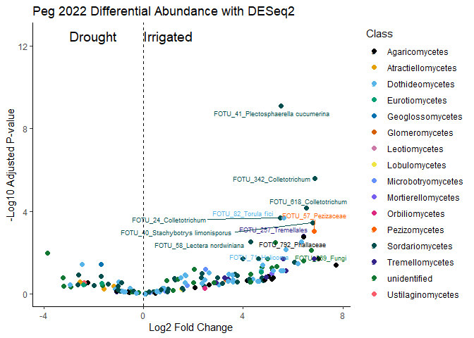<!-- -->

``` r
# Save the plot
ggsave("Plots/Diff_abundance_2022_peg.png",
       plot = deseq22_volcano,
             width = 12, height = 8, dpi = 400)
```

#### 2023 Peg Tissue

``` r
# Convert the phyloseq object to a DESeq2 object.
# Here, we use the "Treatment" column in your sample metadata as the design variable.
dds <- phyloseq_to_deseq2(diff_peg_2023, ~ Treatment)
```

```
## converting counts to integer mode
```

```
## Warning in DESeqDataSet(se, design = design, ignoreRank): some variables in
## design formula are characters, converting to factors
```

``` r
# Run the DESeq2 analysis using the Wald test and parametric fit.
dds <- DESeq(dds, test = "Wald", fitType = "parametric")
```

```
## estimating size factors
```

```
## estimating dispersions
```

```
## gene-wise dispersion estimates
```

```
## mean-dispersion relationship
```

```
## final dispersion estimates
```

```
## fitting model and testing
```

```
## -- replacing outliers and refitting for 352 genes
## -- DESeq argument 'minReplicatesForReplace' = 7 
## -- original counts are preserved in counts(dds)
```

```
## estimating dispersions
```

```
## fitting model and testing
```

``` r
# Extract the results.
# Here, cooksCutoff is set to FALSE to disable filtering based on Cook's distance.
res <- results(dds, cooksCutoff = FALSE)

# Set a significance threshold for the adjusted p-value.
alpha <- 1

# Filter to keep only significant taxa.
sigtab <- res[which(res$padj < alpha), ]

# Combine the DESeq2 results with the taxonomy data.
# This assumes that the row names of the DESeq2 result match the taxa in the phyloseq object.
sigtab <- cbind(as(sigtab, "data.frame"),
                as(tax_table(diff_peg_2023)[rownames(sigtab), ], "matrix"))

sigtab
```

```
##              baseMean log2FoldChange     lfcSE        stat       pvalue
## FOTU_2    1175.147605    -0.43060335 0.6443390 -0.66828698 5.039504e-01
## FOTU_200     2.752496     3.46107600 2.2779849  1.51935866 1.286722e-01
## FOTU_2001   45.820963    -4.72610891 0.9956081 -4.74695717 2.064997e-06
## FOTU_205    31.373697     6.48228631 1.4805398  4.37832635 1.195942e-05
## FOTU_207     8.012846     2.67988158 1.6917953  1.58404602 1.131832e-01
## FOTU_209     2.036272     1.77317007 1.8208026  0.97383982 3.301361e-01
## FOTU_21      2.624340     4.61978287 2.1214844  2.17761816 2.943448e-02
## FOTU_2119   17.348628     2.35113671 1.2206203  1.92618181 5.408168e-02
## FOTU_214     7.011986     0.71813937 1.2033313  0.59679274 5.506458e-01
## FOTU_22    217.367726     0.50435997 0.6357872  0.79328421 4.276123e-01
## FOTU_223    16.013677     4.02738454 1.1447059  3.51827002 4.343701e-04
## FOTU_225     7.420396     4.89053742 2.2149882  2.20792932 2.724920e-02
## FOTU_226     8.991202    -0.60005959 1.2695632 -0.47265043 6.364626e-01
## FOTU_23    234.316945    -3.49765014 0.7988260 -4.37848785 1.195056e-05
## FOTU_230     4.407244     1.07304146 1.0663789  1.00624781 3.142964e-01
## FOTU_2309    2.450222    -2.50915714 2.2024781 -1.13924273 2.546019e-01
## FOTU_235    31.366070    -0.32472902 1.0621085 -0.30573997 7.598026e-01
## FOTU_2376    2.198321     0.98135046 2.3255251  0.42199091 6.730317e-01
## FOTU_238     6.741744    -5.56662358 2.3229871 -2.39632133 1.656056e-02
## FOTU_239     2.605099    -1.51894710 1.8760277 -0.80966134 4.181348e-01
## FOTU_24    261.364422     7.99562363 1.2109116  6.60297903 4.029766e-11
## FOTU_2463    7.412554    -0.38280940 1.4127603 -0.27096556 7.864175e-01
## FOTU_251     3.512290     1.81677975 1.3961670  1.30126250 1.931686e-01
## FOTU_253     4.816913     0.85931508 1.4937178  0.57528609 5.650978e-01
## FOTU_254   127.527793     5.33457893 1.1615127  4.59278583 4.373679e-06
## FOTU_255     4.169782    -0.32457169 1.8599171 -0.17450869 8.614657e-01
## FOTU_26    134.097642     4.58426423 1.2709606  3.60692871 3.098427e-04
## FOTU_263     5.025491     1.78508606 1.9636121  0.90908285 3.633064e-01
## FOTU_268     1.804967     1.12520972 2.0493955  0.54904469 5.829748e-01
## FOTU_27   1596.963461     3.25109652 1.0485769  3.10048460 1.932043e-03
## FOTU_273     2.137835     2.60742422 2.5939394  1.00519860 3.148012e-01
## FOTU_28    274.958165     0.44981380 0.7677684  0.58587169 5.579617e-01
## FOTU_282    11.760032     0.78331049 1.4964592  0.52344261 6.006663e-01
## FOTU_283    11.220550     4.11118481 1.8182214  2.26110241 2.375292e-02
## FOTU_284    10.042779     1.27400204 1.5312169  0.83201930 4.053981e-01
## FOTU_2858    2.170072     0.76921869 1.5486991  0.49668699 6.194098e-01
## FOTU_286     7.438290    -2.88171532 1.1527144 -2.49993865 1.242148e-02
## FOTU_29     15.229196     1.24029635 0.8146395  1.52250943 1.278815e-01
## FOTU_291    56.266327     3.21156855 1.1544795  2.78183243 5.405294e-03
## FOTU_2930   73.018827    -1.68754762 0.6702093 -2.51794131 1.180430e-02
## FOTU_294    12.449277    -2.85468343 1.3246228 -2.15509155 3.115467e-02
## FOTU_2976    2.406737     1.81812887 2.4755712  0.73442803 4.626879e-01
## FOTU_3     278.699044    -1.21801311 0.6031990 -2.01925581 4.346064e-02
## FOTU_30    110.710021     3.29168029 2.0158170  1.63292615 1.024845e-01
## FOTU_308     4.950221     2.60213713 2.0522078  1.26796961 2.048088e-01
## FOTU_309    39.021237     2.84680739 1.4122624  2.01577801 4.382319e-02
## FOTU_32      2.230946     3.26509048 1.6601101  1.96679157 4.920725e-02
## FOTU_320     3.624633     5.91225125 2.0615195  2.86790944 4.131938e-03
## FOTU_3203    2.540036     2.61888278 2.1621454  1.21124265 2.258024e-01
## FOTU_3236    2.048751     0.57581069 1.3816260  0.41676306 6.768517e-01
## FOTU_328    23.462726     2.31086222 1.7235342  1.34076956 1.799953e-01
## FOTU_329     2.415776    -3.35964171 1.7639394 -1.90462421 5.682894e-02
## FOTU_33     11.543331     6.48119709 1.1570933  5.60127426 2.127818e-08
## FOTU_332     2.004891     4.36411338 2.0334792  2.14613130 3.186250e-02
## FOTU_336     3.009967     0.45832926 1.6620382  0.27576338 7.827298e-01
## FOTU_342    14.678878     2.56777432 1.7047370  1.50625832 1.320009e-01
## FOTU_35     13.689689    -0.21796906 2.1773543 -0.10010730 9.202591e-01
## FOTU_350     2.087602    -4.01532272 2.6907649 -1.49226070 1.356308e-01
## FOTU_36    220.383383     4.28952746 1.1150834  3.84682198 1.196598e-04
## FOTU_360    64.261789     2.38707544 1.0703901  2.23009853 2.574090e-02
## FOTU_3630    8.672768     7.05636052 2.9170066  2.41904168 1.556146e-02
## FOTU_365     9.943767     5.68046462 1.5422727  3.68317784 2.303443e-04
## FOTU_369     4.065982    -2.65315476 1.6903146 -1.56962182 1.165031e-01
## FOTU_37    273.154194     0.72200533 0.6464748  1.11683440 2.640651e-01
## FOTU_373     6.491070     4.39774821 2.1259640  2.06859014 3.858456e-02
## FOTU_375     8.264589     2.51063723 2.3453118  1.07049189 2.843980e-01
## FOTU_376     4.497248     3.15935665 1.2721474  2.48348314 1.301045e-02
## FOTU_378     2.560159     4.59473887 2.3550702  1.95099869 5.105720e-02
## FOTU_38      2.773904    -0.76412453 1.6874684 -0.45282301 6.506762e-01
## FOTU_386     2.286790     5.27073101 2.8458121  1.85210084 6.401134e-02
## FOTU_3887    3.471498    -4.74830923 1.5668148 -3.03054916 2.441094e-03
## FOTU_389     2.613938    -4.19209986 2.0908239 -2.00499899 4.496315e-02
## FOTU_39     56.814222     3.84791415 1.1432238  3.36584508 7.630955e-04
## FOTU_4    3480.954268    -1.81168701 0.4662528 -3.88563261 1.020638e-04
## FOTU_40    307.535065     4.52789911 0.7044598  6.42747667 1.297395e-10
## FOTU_403     3.175681    -1.07205764 1.2980346 -0.82590835 4.088561e-01
## FOTU_41    156.829407     3.25341103 0.9376361  3.46980127 5.208436e-04
## FOTU_414    12.041076     4.34345860 1.2871784  3.37440287 7.397602e-04
## FOTU_416     2.981932     4.10753123 2.2603352  1.81722220 6.918310e-02
## FOTU_42      4.813699     1.79519199 1.3521831  1.32762496 1.843020e-01
## FOTU_426     5.842957    -0.59280223 2.6419616 -0.22437958 8.224620e-01
## FOTU_4260    2.942584    -1.05059699 2.2352623 -0.47001060 6.383474e-01
## FOTU_428     7.268649     2.67071268 1.9771802  1.35076847 1.767696e-01
## FOTU_43      8.838663     2.20714889 1.0959115  2.01398458 4.401115e-02
## FOTU_433     6.075704     6.09919728 1.8536994  3.29028398 1.000863e-03
## FOTU_435     2.394592    -1.26917868 1.8872552 -0.67249977 5.012656e-01
## FOTU_44    132.611035     0.07473092 0.9628929  0.07761084 9.381376e-01
## FOTU_441     1.855508     4.93644677 2.6349122  1.87347678 6.100258e-02
## FOTU_4410    2.159480     4.37022433 2.3387182  1.86864086 6.167280e-02
## FOTU_445     2.189440    -3.22751527 1.5794304 -2.04346780 4.100615e-02
## FOTU_45      6.134213     5.27569355 1.8365018  2.87268623 4.069981e-03
## FOTU_458     3.717778     2.61954606 2.3396125  1.11964956 2.628631e-01
## FOTU_47     91.976911     2.82927025 1.0719102  2.63946578 8.303681e-03
## FOTU_472    10.353813     5.74929659 1.7966405  3.20002618 1.374151e-03
## FOTU_4738   19.673212    -5.62695795 1.7023750 -3.30535750 9.485532e-04
## FOTU_48      2.757936     5.28594510 1.9277830  2.74198143 6.106979e-03
## FOTU_484    43.789456    -1.94560200 0.7671579 -2.53611674 1.120894e-02
## FOTU_49     21.706558    -2.28816820 1.6293190 -1.40437095 1.602084e-01
## FOTU_499     3.644740     5.80030039 2.6807306  2.16370135 3.048728e-02
## FOTU_4990    6.447430     0.34885255 1.1000863  0.31711380 7.511573e-01
## FOTU_5     538.295782    -0.90574396 0.5319102 -1.70281360 8.860296e-02
## FOTU_50      4.289342     0.27811778 1.2177092  0.22839425 8.193398e-01
## FOTU_501     3.797815     5.04782411 2.5732233  1.96167359 4.980050e-02
## FOTU_508     4.695815     3.50732544 1.8032553  1.94499662 5.177539e-02
## FOTU_51     45.232997    -1.04986360 0.7460945 -1.40714553 1.593842e-01
## FOTU_515     5.461122    -0.81032237 1.6200299 -0.50018975 6.169415e-01
## FOTU_5156   16.613746     0.20020019 0.6093158  0.32856559 7.424841e-01
## FOTU_516    14.287833     1.84232146 1.3416464  1.37317959 1.696965e-01
## FOTU_52      2.748252    -1.85478338 1.3542664 -1.36958530 1.708164e-01
## FOTU_523     2.081305     1.72388602 2.0462590  0.84245738 3.995320e-01
## FOTU_532     2.424224     0.96162646 2.2069243  0.43573150 6.630315e-01
## FOTU_538     2.489648     5.39754058 2.4422744  2.21004676 2.710192e-02
## FOTU_54      8.819678     0.30569887 1.3303973  0.22978013 8.182626e-01
## FOTU_56    272.463726     2.99426576 0.8549934  3.50209211 4.616200e-04
## FOTU_560     2.142698     5.18667850 2.8347727  1.82966293 6.730036e-02
## FOTU_568    14.426565     7.93412714 1.7986576  4.41113821 1.028287e-05
## FOTU_578    11.670634     6.53636495 1.5937090  4.10135420 4.107393e-05
## FOTU_58    105.025158     2.88462662 1.2276051  2.34980018 1.878349e-02
## FOTU_59     88.078090    -3.86274256 1.1692118 -3.30371500 9.541278e-04
## FOTU_6     146.293818    -0.85381619 0.6823141 -1.25135356 2.108055e-01
## FOTU_61     80.906273     6.03295057 2.3142127  2.60691270 9.136265e-03
## FOTU_611     5.681257     6.58459963 2.7109213  2.42891585 1.514405e-02
## FOTU_615     8.808515     6.28351563 2.1666232  2.90014236 3.729932e-03
## FOTU_62    105.309728     4.03497813 0.8601136  4.69121551 2.715867e-06
## FOTU_623     2.564887    -2.26367589 0.8071849 -2.80440795 5.040908e-03
## FOTU_625     2.108454     1.78144833 2.2889465  0.77828306 4.364022e-01
## FOTU_63      6.473058     0.48947593 1.4327476  0.34163444 7.326260e-01
## FOTU_67     19.837421     0.20629148 0.9994904  0.20639666 8.364811e-01
## FOTU_679     2.526809     5.40446252 2.4623499  2.19483936 2.817512e-02
## FOTU_7    2292.203977     3.86691376 0.7091806  5.45265045 4.962456e-08
## FOTU_70    258.396816     0.65107610 0.6264143  1.03936982 2.986328e-01
## FOTU_702     2.877100     5.15308328 2.5019094  2.05966026 3.943103e-02
## FOTU_703     2.313148     5.11545041 2.8669001  1.78431414 7.437263e-02
## FOTU_72      9.934588    -1.80581672 1.3035802 -1.38527478 1.659685e-01
## FOTU_723     1.959682     3.64450302 1.8510228  1.96891312 4.896307e-02
## FOTU_760     2.030134     4.70735156 2.5033433  1.88042592 6.005005e-02
## FOTU_762     2.584487     1.03851637 1.7018511  0.61022753 5.417111e-01
## FOTU_77    140.986254     9.13346826 2.1633017  4.22200399 2.421398e-05
## FOTU_770     6.967386     5.70616786 1.5382375  3.70954923 2.076286e-04
## FOTU_78     34.051578     0.67707192 1.3197126  0.51304497 6.079199e-01
## FOTU_784    77.717640     1.00311916 0.4670059  2.14797962 3.171537e-02
## FOTU_8      23.182957     0.44526760 1.1344684  0.39249009 6.946961e-01
## FOTU_80    109.982489    -6.78971636 0.8583593 -7.91011016 2.571612e-15
## FOTU_82     12.462401     2.33561314 1.3230149  1.76537171 7.750131e-02
## FOTU_84     27.661751     4.03044925 1.7866960  2.25581137 2.408245e-02
## FOTU_845     2.156700    -4.05783213 2.1841093 -1.85788874 6.318482e-02
## FOTU_86      2.664000     5.12582019 1.6359897  3.13316168 1.729342e-03
## FOTU_87     20.462007    -3.39627882 0.9818104 -3.45920022 5.417820e-04
## FOTU_88     32.493082     5.29464550 1.3159564  4.02342011 5.735905e-05
## FOTU_89     90.915013     0.92142199 0.9487296  0.97121669 3.314404e-01
## FOTU_9     712.601911    -2.50911818 0.7338219 -3.41924694 6.279471e-04
## FOTU_90    152.614656     4.71764906 2.3117985  2.04068350 4.128230e-02
## FOTU_912     3.755146     1.11360158 1.1998828  0.92809199 3.533599e-01
## FOTU_94    148.091472    -2.68472031 1.0698043 -2.50954350 1.208873e-02
## FOTU_965    10.755976     0.75281626 1.1404504  0.66010434 5.091869e-01
## FOTU_981     2.455753     5.37841049 2.2717821  2.36748515 1.790944e-02
##                   padj    OTU_ID Kingdom            Phylum
## FOTU_2    6.239386e-01    FOTU_2   Fungi     Basidiomycota
## FOTU_200  2.181834e-01  FOTU_200   Fungi     Basidiomycota
## FOTU_2001 5.368991e-05 FOTU_2001   Fungi      unidentified
## FOTU_205  1.696063e-04  FOTU_205   Fungi        Ascomycota
## FOTU_207  1.983886e-01  FOTU_207   Fungi        Ascomycota
## FOTU_209  4.496061e-01  FOTU_209   Fungi     Basidiomycota
## FOTU_21   7.916859e-02   FOTU_21   Fungi     Basidiomycota
## FOTU_2119 1.110098e-01 FOTU_2119   Fungi        Ascomycota
## FOTU_214  6.658972e-01  FOTU_214   Fungi        Ascomycota
## FOTU_22   5.467829e-01   FOTU_22   Fungi      unidentified
## FOTU_223  3.388087e-03  FOTU_223   Fungi      unidentified
## FOTU_225  7.590849e-02  FOTU_225   Fungi        Ascomycota
## FOTU_226  7.216102e-01  FOTU_226   Fungi        Ascomycota
## FOTU_23   1.696063e-04   FOTU_23   Fungi        Ascomycota
## FOTU_230  4.345928e-01  FOTU_230   Fungi        Ascomycota
## FOTU_2309 3.711953e-01 FOTU_2309   Fungi        Ascomycota
## FOTU_235  8.063212e-01  FOTU_235   Fungi      unidentified
## FOTU_2376 7.435836e-01 FOTU_2376   Fungi      unidentified
## FOTU_238  5.272343e-02  FOTU_238   Fungi     Basidiomycota
## FOTU_239  5.390829e-01  FOTU_239   Fungi        Ascomycota
## FOTU_24   3.143217e-09   FOTU_24   Fungi        Ascomycota
## FOTU_2463 8.233633e-01 FOTU_2463   Fungi        Ascomycota
## FOTU_251  2.925661e-01  FOTU_251   Fungi        Ascomycota
## FOTU_253  6.729409e-01  FOTU_253   Fungi        Ascomycota
## FOTU_254  8.528673e-05  FOTU_254   Fungi        Ascomycota
## FOTU_255  8.726536e-01  FOTU_255   Fungi        Ascomycota
## FOTU_26   2.543972e-03   FOTU_26   Fungi        Ascomycota
## FOTU_263  4.844085e-01  FOTU_263   Fungi        Ascomycota
## FOTU_268  6.889702e-01  FOTU_268   Fungi      unidentified
## FOTU_27   9.418708e-03   FOTU_27   Fungi        Ascomycota
## FOTU_273  4.345928e-01  FOTU_273   Fungi        Ascomycota
## FOTU_28   6.695541e-01   FOTU_28   Fungi        Ascomycota
## FOTU_282  7.045409e-01  FOTU_282   Fungi        Ascomycota
## FOTU_283  7.088418e-02  FOTU_283   Fungi      unidentified
## FOTU_284  5.314462e-01  FOTU_284   Fungi        Ascomycota
## FOTU_2858 7.104995e-01 FOTU_2858   Fungi        Ascomycota
## FOTU_286  4.306114e-02  FOTU_286   Fungi        Ascomycota
## FOTU_29   2.181834e-01   FOTU_29   Fungi        Ascomycota
## FOTU_291  2.219015e-02  FOTU_291   Fungi        Ascomycota
## FOTU_2930 4.282490e-02 FOTU_2930   Fungi        Ascomycota
## FOTU_294  8.017017e-02  FOTU_294   Fungi        Ascomycota
## FOTU_2976 5.820912e-01 FOTU_2976   Fungi        Ascomycota
## FOTU_3    9.950347e-02    FOTU_3   Fungi        Ascomycota
## FOTU_30   1.816771e-01   FOTU_30   Fungi     Basidiomycota
## FOTU_308  3.072132e-01  FOTU_308   Fungi        Ascomycota
## FOTU_309  9.950347e-02  FOTU_309   Fungi        Ascomycota
## FOTU_32   1.064230e-01   FOTU_32   Fungi     Basidiomycota
## FOTU_320  1.790506e-02  FOTU_320   Fungi     Basidiomycota
## FOTU_3203 3.323130e-01 FOTU_3203   Fungi        Ascomycota
## FOTU_3236 7.435836e-01 FOTU_3236   Fungi        Ascomycota
## FOTU_328  2.780125e-01  FOTU_328   Fungi     Basidiomycota
## FOTU_329  1.151340e-01  FOTU_329   Fungi        Ascomycota
## FOTU_33   8.298489e-07   FOTU_33   Fungi        Ascomycota
## FOTU_332  8.017017e-02  FOTU_332   Fungi     Basidiomycota
## FOTU_336  8.233633e-01  FOTU_336   Fungi      unidentified
## FOTU_342  2.214208e-01  FOTU_342   Fungi        Ascomycota
## FOTU_35   9.261963e-01   FOTU_35   Fungi        Ascomycota
## FOTU_350  2.250894e-01  FOTU_350   Fungi        Ascomycota
## FOTU_36   1.166684e-03   FOTU_36   Fungi        Ascomycota
## FOTU_360  7.436261e-02  FOTU_360   Fungi        Ascomycota
## FOTU_3630 5.057473e-02 FOTU_3630   Fungi     Basidiomycota
## FOTU_365  1.996318e-03  FOTU_365   Fungi        Ascomycota
## FOTU_369  2.019387e-01  FOTU_369   Fungi        Ascomycota
## FOTU_37   3.779281e-01   FOTU_37   Fungi        Ascomycota
## FOTU_373  9.554273e-02  FOTU_373   Fungi     Basidiomycota
## FOTU_375  4.033280e-01  FOTU_375   Fungi        Ascomycota
## FOTU_376  4.412239e-02  FOTU_376   Fungi        Ascomycota
## FOTU_378  1.076341e-01  FOTU_378   Fungi     Basidiomycota
## FOTU_38   7.302553e-01   FOTU_38   Fungi        Ascomycota
## FOTU_386  1.217777e-01  FOTU_386   Fungi        Ascomycota
## FOTU_3887 1.153972e-02 FOTU_3887   Fungi        Ascomycota
## FOTU_389  1.002036e-01  FOTU_389   Fungi        Ascomycota
## FOTU_39   4.578573e-03   FOTU_39   Fungi        Ascomycota
## FOTU_4    1.061463e-03    FOTU_4   Fungi        Ascomycota
## FOTU_40   6.746454e-09   FOTU_40   Fungi        Ascomycota
## FOTU_403  5.315129e-01  FOTU_403   Fungi        Ascomycota
## FOTU_41   3.674695e-03   FOTU_41   Fungi        Ascomycota
## FOTU_414  4.578573e-03  FOTU_414   Fungi        Ascomycota
## FOTU_416  1.284829e-01  FOTU_416   Fungi        Ascomycota
## FOTU_42   2.818737e-01   FOTU_42   Fungi     Basidiomycota
## FOTU_426  8.441057e-01  FOTU_426   Fungi        Ascomycota
## FOTU_4260 7.216102e-01 FOTU_4260   Fungi        Ascomycota
## FOTU_428  2.757606e-01  FOTU_428   Fungi        Ascomycota
## FOTU_43   9.950347e-02   FOTU_43   Fungi        Ascomycota
## FOTU_433  5.383954e-03  FOTU_433   Fungi        Ascomycota
## FOTU_435  6.239386e-01  FOTU_435   Fungi        Ascomycota
## FOTU_44   9.381376e-01   FOTU_44   Fungi        Ascomycota
## FOTU_441  1.202620e-01  FOTU_441   Fungi        Ascomycota
## FOTU_4410 1.202620e-01 FOTU_4410   Fungi        Ascomycota
## FOTU_445  9.757634e-02  FOTU_445   Fungi        Ascomycota
## FOTU_45   1.790506e-02   FOTU_45   Fungi     Basidiomycota
## FOTU_458  3.779281e-01  FOTU_458   Fungi     Basidiomycota
## FOTU_47   3.238435e-02   FOTU_47   Fungi        Ascomycota
## FOTU_472  7.145586e-03  FOTU_472   Fungi        Ascomycota
## FOTU_4738 5.315855e-03 FOTU_4738   Fungi     Basidiomycota
## FOTU_48   2.442792e-02   FOTU_48   Fungi        Ascomycota
## FOTU_484  4.163319e-02  FOTU_484   Fungi        Ascomycota
## FOTU_49   2.603387e-01   FOTU_49   Fungi        Ascomycota
## FOTU_499  8.017017e-02  FOTU_499   Fungi        Ascomycota
## FOTU_4990 8.026064e-01 FOTU_4990   Fungi     Basidiomycota
## FOTU_5    1.588743e-01    FOTU_5   Fungi      unidentified
## FOTU_50   8.441057e-01   FOTU_50   Fungi        Ascomycota
## FOTU_501  1.064230e-01  FOTU_501   Fungi   Chytridiomycota
## FOTU_508  1.076928e-01  FOTU_508   Fungi        Ascomycota
## FOTU_51   2.603387e-01   FOTU_51   Fungi        Ascomycota
## FOTU_515  7.104995e-01  FOTU_515   Fungi        Ascomycota
## FOTU_5156 7.988104e-01 FOTU_5156   Fungi      unidentified
## FOTU_516  2.691652e-01  FOTU_516   Fungi        Ascomycota
## FOTU_52   2.691652e-01   FOTU_52   Fungi        Ascomycota
## FOTU_523  5.281948e-01  FOTU_523   Fungi        Ascomycota
## FOTU_532  7.388066e-01  FOTU_532   Fungi        Ascomycota
## FOTU_538  7.590849e-02  FOTU_538   Fungi        Ascomycota
## FOTU_54   8.441057e-01   FOTU_54   Fungi        Ascomycota
## FOTU_56   3.429177e-03   FOTU_56   Fungi        Ascomycota
## FOTU_560  1.264922e-01  FOTU_560   Fungi        Ascomycota
## FOTU_568  1.696063e-04  FOTU_568   Fungi     Rozellomycota
## FOTU_578  4.928871e-04  FOTU_578   Fungi        Ascomycota
## FOTU_58   5.745539e-02   FOTU_58   Fungi        Ascomycota
## FOTU_59   5.315855e-03   FOTU_59   Fungi      unidentified
## FOTU_6    3.131968e-01    FOTU_6   Fungi        Ascomycota
## FOTU_61   3.476237e-02   FOTU_61   Fungi     Basidiomycota
## FOTU_611  5.026535e-02  FOTU_611   Fungi        Ascomycota
## FOTU_615  1.711381e-02  FOTU_615   Fungi        Ascomycota
## FOTU_62   6.052504e-05   FOTU_62   Fungi        Ascomycota
## FOTU_623  2.125356e-02  FOTU_623   Fungi        Ascomycota
## FOTU_625  5.534857e-01  FOTU_625   Fungi      unidentified
## FOTU_63   7.936782e-01   FOTU_63   Fungi Mortierellomycota
## FOTU_67   8.528827e-01   FOTU_67   Fungi        Ascomycota
## FOTU_679  7.711086e-02  FOTU_679   Fungi     Rozellomycota
## FOTU_7    1.548286e-06    FOTU_7   Fungi        Ascomycota
## FOTU_70   4.197001e-01   FOTU_70   Fungi        Ascomycota
## FOTU_702  9.611314e-02  FOTU_702   Fungi        Ascomycota
## FOTU_703  1.364957e-01  FOTU_703   Fungi     Basidiomycota
## FOTU_72   2.669184e-01   FOTU_72   Fungi        Ascomycota
## FOTU_723  1.064230e-01  FOTU_723   Fungi        Ascomycota
## FOTU_760  1.201001e-01  FOTU_760   Fungi        Ascomycota
## FOTU_762  6.602104e-01  FOTU_762   Fungi        Ascomycota
## FOTU_77   3.147818e-04   FOTU_77   Fungi     Basidiomycota
## FOTU_770  1.905298e-03  FOTU_770   Fungi     Basidiomycota
## FOTU_78   7.077276e-01   FOTU_78   Fungi        Ascomycota
## FOTU_784  8.017017e-02  FOTU_784   Fungi      unidentified
## FOTU_8    7.578503e-01    FOTU_8   Fungi        Ascomycota
## FOTU_80   4.011715e-13   FOTU_80   Fungi        Ascomycota
## FOTU_82   1.405838e-01   FOTU_82   Fungi        Ascomycota
## FOTU_84   7.088418e-02   FOTU_84   Fungi        Ascomycota
## FOTU_845  1.216893e-01  FOTU_845   Fungi        Ascomycota
## FOTU_86   8.702493e-03   FOTU_86   Fungi        Ascomycota
## FOTU_87   3.674695e-03   FOTU_87   Fungi        Ascomycota
## FOTU_88   6.391437e-04   FOTU_88   Fungi        Ascomycota
## FOTU_89   4.496061e-01   FOTU_89   Fungi      unidentified
## FOTU_9    4.081656e-03    FOTU_9   Fungi      unidentified
## FOTU_90   9.757634e-02   FOTU_90   Fungi     Basidiomycota
## FOTU_912  4.752081e-01  FOTU_912   Fungi        Ascomycota
## FOTU_94   4.286005e-02   FOTU_94   Fungi        Ascomycota
## FOTU_965  6.254579e-01  FOTU_965   Fungi        Ascomycota
## FOTU_981  5.587745e-02  FOTU_981   Fungi     Rozellomycota
##                           Class             Order                Family
## FOTU_2       Atractiellomycetes    Atractiellales    Hoehnelomycetaceae
## FOTU_200         Agaricomycetes    Auriculariales          unidentified
## FOTU_2001          unidentified      unidentified          unidentified
## FOTU_205        Sordariomycetes       Hypocreales      Stachybotryaceae
## FOTU_207        Dothideomycetes      Pleosporales     Phaeosphaeriaceae
## FOTU_209     Microbotryomycetes   Sporidiobolales      Sporidiobolaceae
## FOTU_21          Agaricomycetes    Cantharellales     Ceratobasidiaceae
## FOTU_2119       Dothideomycetes      unidentified          unidentified
## FOTU_214        Sordariomycetes          Branch06          unidentified
## FOTU_22            unidentified      unidentified          unidentified
## FOTU_223           unidentified      unidentified          unidentified
## FOTU_225        Sordariomycetes     Glomerellales  Plectosphaerellaceae
## FOTU_226        Dothideomycetes      Pleosporales  Tetraplosphaeriaceae
## FOTU_23         Sordariomycetes       Hypocreales        Bionectriaceae
## FOTU_230        Dothideomycetes       Venturiales     Sympoventuriaceae
## FOTU_2309       Dothideomycetes      Pleosporales          unidentified
## FOTU_235           unidentified      unidentified          unidentified
## FOTU_2376          unidentified      unidentified          unidentified
## FOTU_238         Agaricomycetes    Cantharellales     Ceratobasidiaceae
## FOTU_239        Sordariomycetes       Hypocreales          Hypocreaceae
## FOTU_24         Sordariomycetes     Glomerellales        Glomerellaceae
## FOTU_2463       Sordariomycetes       Sordariales     Lasiosphaeriaceae
## FOTU_251           unidentified      unidentified          unidentified
## FOTU_253         Eurotiomycetes   Chaetothyriales   Herpotrichiellaceae
## FOTU_254        Dothideomycetes      Pleosporales Pyrenochaetopsidaceae
## FOTU_255        Sordariomycetes       Hypocreales           Nectriaceae
## FOTU_26         Sordariomycetes       Hypocreales          unidentified
## FOTU_263        Dothideomycetes      Pleosporales         Pleosporaceae
## FOTU_268           unidentified      unidentified          unidentified
## FOTU_27         Dothideomycetes    Muyocopronales       Muyocopronaceae
## FOTU_273         Eurotiomycetes   Chaetothyriales   Herpotrichiellaceae
## FOTU_28         Dothideomycetes Mycosphaerellales    Mycosphaerellaceae
## FOTU_282        Dothideomycetes      Pleosporales          unidentified
## FOTU_283           unidentified      unidentified          unidentified
## FOTU_284        Sordariomycetes       Hypocreales       Cordycipitaceae
## FOTU_2858       Dothideomycetes      Pleosporales         Massarinaceae
## FOTU_286        Sordariomycetes       Hypocreales        Sarocladiaceae
## FOTU_29         Dothideomycetes Botryosphaeriales    Botryosphaeriaceae
## FOTU_291        Sordariomycetes      Diaporthales         Diaporthaceae
## FOTU_2930       Sordariomycetes       Hypocreales           Nectriaceae
## FOTU_294        Dothideomycetes      Pleosporales         Pleosporaceae
## FOTU_2976       Sordariomycetes      unidentified          unidentified
## FOTU_3          Dothideomycetes    Cladosporiales       Cladosporiaceae
## FOTU_30          Agaricomycetes    Cantharellales     Ceratobasidiaceae
## FOTU_308        Sordariomycetes       Hypocreales      Stachybotryaceae
## FOTU_309        Dothideomycetes      unidentified  Pseudorobillardaceae
## FOTU_32          Agaricomycetes        Agaricales          unidentified
## FOTU_320        Tremellomycetes       Tremellales    Bulleribasidiaceae
## FOTU_3203       Dothideomycetes      Pleosporales            Torulaceae
## FOTU_3236       Dothideomycetes      Pleosporales     Phaeosphaeriaceae
## FOTU_328         Agaricomycetes       Sebacinales          unidentified
## FOTU_329        Sordariomycetes     Glomerellales  Plectosphaerellaceae
## FOTU_33         Dothideomycetes Mycosphaerellales    Mycosphaerellaceae
## FOTU_332        Tremellomycetes       Tremellales    Bulleribasidiaceae
## FOTU_336           unidentified      unidentified          unidentified
## FOTU_342        Sordariomycetes     Glomerellales        Glomerellaceae
## FOTU_35         Dothideomycetes      Pleosporales       Melanommataceae
## FOTU_350        Sordariomycetes       Hypocreales          unidentified
## FOTU_36         Sordariomycetes        Xylariales       Microdochiaceae
## FOTU_360        Dothideomycetes      Pleosporales Pyrenochaetopsidaceae
## FOTU_3630        Agaricomycetes    Cantharellales     Ceratobasidiaceae
## FOTU_365           unidentified      unidentified          unidentified
## FOTU_369        Sordariomycetes       Hypocreales        Bionectriaceae
## FOTU_37         Dothideomycetes      Pleosporales         Pleosporaceae
## FOTU_373        Tremellomycetes       Tremellales     Cuniculitremaceae
## FOTU_375        Sordariomycetes       Sordariales     Lasiosphaeriaceae
## FOTU_376        Dothideomycetes       Venturiales     Sympoventuriaceae
## FOTU_378        Tremellomycetes       Tremellales   Trimorphomycetaceae
## FOTU_38         Sordariomycetes          Branch06          unidentified
## FOTU_386        Dothideomycetes      unidentified          unidentified
## FOTU_3887       Sordariomycetes       Hypocreales       Tilachlidiaceae
## FOTU_389        Sordariomycetes       Hypocreales        Bionectriaceae
## FOTU_39         Sordariomycetes       Hypocreales      Stachybotryaceae
## FOTU_4          Sordariomycetes       Hypocreales           Nectriaceae
## FOTU_40         Sordariomycetes       Hypocreales      Stachybotryaceae
## FOTU_403         Eurotiomycetes   Chaetothyriales     Cyphellophoraceae
## FOTU_41         Sordariomycetes     Glomerellales  Plectosphaerellaceae
## FOTU_414        Sordariomycetes       Hypocreales      Stachybotryaceae
## FOTU_416        Sordariomycetes       Hypocreales          Hypocreaceae
## FOTU_42          Agaricomycetes        Agaricales          Marasmiaceae
## FOTU_426        Sordariomycetes       Hypocreales          unidentified
## FOTU_4260       Sordariomycetes      Diaporthales         Diaporthaceae
## FOTU_428        Sordariomycetes       Hypocreales      Stachybotryaceae
## FOTU_43         Sordariomycetes       Sordariales         Chaetomiaceae
## FOTU_433        Sordariomycetes       Hypocreales       Cordycipitaceae
## FOTU_435           unidentified      unidentified          unidentified
## FOTU_44         Sordariomycetes      Diaporthales         Diaporthaceae
## FOTU_441         Eurotiomycetes        Eurotiales        Thermoascaceae
## FOTU_4410       Sordariomycetes  Amphisphaeriales         Apiosporaceae
## FOTU_445        Sordariomycetes       Hypocreales        Bionectriaceae
## FOTU_45          Agaricomycetes    Cantharellales     Ceratobasidiaceae
## FOTU_458         Agaricomycetes       Polyporales          unidentified
## FOTU_47         Dothideomycetes      Pleosporales     Phaeosphaeriaceae
## FOTU_472          Leotiomycetes        Helotiales          unidentified
## FOTU_4738     Ustilaginomycetes     Ustilaginales        Ustilaginaceae
## FOTU_48         Sordariomycetes      Diaporthales     Melanconiellaceae
## FOTU_484        Sordariomycetes       Hypocreales           Nectriaceae
## FOTU_49         Dothideomycetes      Pleosporales         Pleosporaceae
## FOTU_499        Sordariomycetes       Hypocreales           Nectriaceae
## FOTU_4990    Atractiellomycetes    Atractiellales    Hoehnelomycetaceae
## FOTU_5             unidentified      unidentified          unidentified
## FOTU_50         Sordariomycetes       Hypocreales           Nectriaceae
## FOTU_501  Rhizophlyctidomycetes Rhizophlyctidales          unidentified
## FOTU_508        Dothideomycetes      Pleosporales         Pleosporaceae
## FOTU_51         Sordariomycetes        Xylariales        Hansfordiaceae
## FOTU_515        Dothideomycetes      Pleosporales  Tetraplosphaeriaceae
## FOTU_5156          unidentified      unidentified          unidentified
## FOTU_516         Eurotiomycetes   Chaetothyriales     Cyphellophoraceae
## FOTU_52         Sordariomycetes       Hypocreales  Myrotheciomycetaceae
## FOTU_523           unidentified      unidentified          unidentified
## FOTU_532        Dothideomycetes      Pleosporales     Phaeosphaeriaceae
## FOTU_538         Orbiliomycetes        Orbiliales          unidentified
## FOTU_54         Sordariomycetes     Glomerellales  Plectosphaerellaceae
## FOTU_56         Dothideomycetes      Pleosporales         Massarinaceae
## FOTU_560        Lecanoromycetes        Ostropales          Stictidaceae
## FOTU_568           unidentified      unidentified          unidentified
## FOTU_578        Sordariomycetes       Hypocreales      Stachybotryaceae
## FOTU_58         Sordariomycetes     Glomerellales  Plectosphaerellaceae
## FOTU_59            unidentified      unidentified          unidentified
## FOTU_6          Sordariomycetes Chaetosphaeriales    Chaetosphaeriaceae
## FOTU_61          Agaricomycetes    Cantharellales     Ceratobasidiaceae
## FOTU_611        Sordariomycetes       Hypocreales        Bionectriaceae
## FOTU_615          Leotiomycetes        Helotiales          unidentified
## FOTU_62         Sordariomycetes       Sordariales     Lasiosphaeriaceae
## FOTU_623        Sordariomycetes       Hypocreales           Nectriaceae
## FOTU_625           unidentified      unidentified          unidentified
## FOTU_63      Mortierellomycetes    Mortierellales       Mortierellaceae
## FOTU_67          Eurotiomycetes   Chaetothyriales   Herpotrichiellaceae
## FOTU_679           unidentified          Branch02          unidentified
## FOTU_7          Sordariomycetes       Hypocreales      Stachybotryaceae
## FOTU_70         Dothideomycetes      Pleosporales         Pleosporaceae
## FOTU_702        Dothideomycetes      Pleosporales       Coniothyriaceae
## FOTU_703        Tremellomycetes       Tremellales    Bulleribasidiaceae
## FOTU_72         Dothideomycetes      Pleosporales          unidentified
## FOTU_723        Sordariomycetes  Amphisphaeriales         Sporocadaceae
## FOTU_760        Dothideomycetes Botryosphaeriales      Phyllostictaceae
## FOTU_762        Dothideomycetes       Venturiales     Sympoventuriaceae
## FOTU_77          Agaricomycetes      unidentified          unidentified
## FOTU_770         Agaricomycetes    Cantharellales     Ceratobasidiaceae
## FOTU_78         Dothideomycetes      Pleosporales          unidentified
## FOTU_784           unidentified      unidentified          unidentified
## FOTU_8          Dothideomycetes      Pleosporales     Phaeosphaeriaceae
## FOTU_80         Sordariomycetes       Hypocreales       Tilachlidiaceae
## FOTU_82         Dothideomycetes      Pleosporales            Torulaceae
## FOTU_84         Sordariomycetes       Hypocreales          Hypocreaceae
## FOTU_845        Dothideomycetes      Pleosporales         Didymellaceae
## FOTU_86         Dothideomycetes  Minutisphaerales     Minutisphaeraceae
## FOTU_87        Geoglossomycetes      Geoglossales         Geoglossaceae
## FOTU_88         Sordariomycetes  Amphisphaeriales       Hyponectriaceae
## FOTU_89            unidentified      unidentified          unidentified
## FOTU_9             unidentified      unidentified          unidentified
## FOTU_90          Agaricomycetes    Cantharellales     Ceratobasidiaceae
## FOTU_912        Dothideomycetes       Venturiales     Sympoventuriaceae
## FOTU_94           Leotiomycetes        Helotiales           Helotiaceae
## FOTU_965        Sordariomycetes  Amphisphaeriales         Apiosporaceae
## FOTU_981           unidentified      unidentified          unidentified
##                       Genus                       Species
## FOTU_2          Atractiella       Atractiella rhizophila 
## FOTU_200       unidentified                  unidentified
## FOTU_2001      unidentified                  unidentified
## FOTU_205    Striaticonidium                  unidentified
## FOTU_207          Setophoma                  unidentified
## FOTU_209     Sporobolomyces                  unidentified
## FOTU_21        unidentified                  unidentified
## FOTU_2119      unidentified                  unidentified
## FOTU_214       unidentified                  unidentified
## FOTU_22        unidentified                  unidentified
## FOTU_223       unidentified                  unidentified
## FOTU_225    Furcasterigmium     Furcasterigmium furcatum 
## FOTU_226          Tetraploa                  unidentified
## FOTU_23          Acremonium       Acremonium fusidioides 
## FOTU_230    Scolecobasidium                  unidentified
## FOTU_2309      unidentified                  unidentified
## FOTU_235       unidentified                  unidentified
## FOTU_2376      unidentified                  unidentified
## FOTU_238        Rhizoctonia                  unidentified
## FOTU_239        Trichoderma                  unidentified
## FOTU_24      Colletotrichum                  unidentified
## FOTU_2463      unidentified                  unidentified
## FOTU_251       unidentified                  unidentified
## FOTU_253          Exophiala                  unidentified
## FOTU_254   Pyrenochaetopsis                  unidentified
## FOTU_255       unidentified                  unidentified
## FOTU_26        unidentified                  unidentified
## FOTU_263         Curvularia                  unidentified
## FOTU_268       unidentified                  unidentified
## FOTU_27            Arxiella            Arxiella celtidis 
## FOTU_273   Cladophialophora                  unidentified
## FOTU_28          Cercospora                  unidentified
## FOTU_282       unidentified                  unidentified
## FOTU_283       unidentified                  unidentified
## FOTU_284     Leptobacillium                  unidentified
## FOTU_2858      Stagonospora                  unidentified
## FOTU_286        Sarocladium          Sarocladium glaucum 
## FOTU_29        Macrophomina      Macrophomina phaseolina 
## FOTU_291          Diaporthe           Diaporthe goulteri 
## FOTU_2930          Fusarium  Fusarium neocosmosporiellum 
## FOTU_294       unidentified                  unidentified
## FOTU_2976      unidentified                  unidentified
## FOTU_3         Cladosporium Cladosporium cladosporioides 
## FOTU_30        unidentified                  unidentified
## FOTU_308       unidentified                  unidentified
## FOTU_309   Pseudorobillarda                  unidentified
## FOTU_32        unidentified                  unidentified
## FOTU_320          Hannaella                  unidentified
## FOTU_3203            Torula                  Torula fici 
## FOTU_3236     Phaeosphaeria          Phaeosphaeria musae 
## FOTU_328       unidentified                  unidentified
## FOTU_329       Stachylidium         Stachylidium bicolor 
## FOTU_33      Nothopassalora     Nothopassalora personata 
## FOTU_332          Hannaella                  unidentified
## FOTU_336       unidentified                  unidentified
## FOTU_342     Colletotrichum                  unidentified
## FOTU_35           Tumularia                  unidentified
## FOTU_350       unidentified                  unidentified
## FOTU_36        Microdochium                  unidentified
## FOTU_360   Pyrenochaetopsis                  unidentified
## FOTU_3630    Ceratobasidium                  unidentified
## FOTU_365       unidentified                  unidentified
## FOTU_369       unidentified                  unidentified
## FOTU_37        unidentified                  unidentified
## FOTU_373        Kockovaella         Kockovaella ischaemi 
## FOTU_375       unidentified                  unidentified
## FOTU_376    Scolecobasidium  Scolecobasidium constrictum 
## FOTU_378          Saitozyma              Saitozyma flava 
## FOTU_38        unidentified                  unidentified
## FOTU_386       unidentified                  unidentified
## FOTU_3887      Tilachlidium      Tilachlidium brachiatum 
## FOTU_389         Acremonium                  unidentified
## FOTU_39         Myrothecium        Myrothecium inundatum 
## FOTU_4             Fusarium                  unidentified
## FOTU_40        Stachybotrys    Stachybotrys limonisporus 
## FOTU_403      Cyphellophora    Cyphellophora fusarioides 
## FOTU_41    Plectosphaerella  Plectosphaerella cucumerina 
## FOTU_414       unidentified                  unidentified
## FOTU_416        Trichoderma      Trichoderma stromaticum 
## FOTU_42           Marasmius                  unidentified
## FOTU_426       unidentified                  unidentified
## FOTU_4260         Diaporthe                  unidentified
## FOTU_428            Alfaria                  unidentified
## FOTU_43            Humicola                  unidentified
## FOTU_433      Simplicillium                  unidentified
## FOTU_435       unidentified                  unidentified
## FOTU_44           Diaporthe           Diaporthe miriciae 
## FOTU_441       Paecilomyces    Paecilomyces penicillatus 
## FOTU_4410        Nigrospora                  unidentified
## FOTU_445         Acremonium        Acremonium hyalinulum 
## FOTU_45         Rhizoctonia           Rhizoctonia solani 
## FOTU_458       unidentified                  unidentified
## FOTU_47        unidentified                  unidentified
## FOTU_472       unidentified                  unidentified
## FOTU_4738      Moesziomyces         Moesziomyces aphidis 
## FOTU_48     Sphaeronaemella                  unidentified
## FOTU_484           Fusarium  Fusarium neocosmosporiellum 
## FOTU_49          Alternaria        Alternaria tenuissima 
## FOTU_499        Sarcopodium                  unidentified
## FOTU_4990       Atractiella       Atractiella rhizophila 
## FOTU_5         unidentified                  unidentified
## FOTU_50        Penicillifer Penicillifer diparietisporus 
## FOTU_501       unidentified                  unidentified
## FOTU_508         Curvularia                  unidentified
## FOTU_51          Hansfordia         Hansfordia pulvinata 
## FOTU_515          Tetraploa     Tetraploa pseudoaristata 
## FOTU_5156      unidentified                  unidentified
## FOTU_516      Cyphellophora                  unidentified
## FOTU_52      Emericellopsis                  unidentified
## FOTU_523       unidentified                  unidentified
## FOTU_532       unidentified                  unidentified
## FOTU_538       unidentified                  unidentified
## FOTU_54        unidentified                  unidentified
## FOTU_56        Stagonospora Stagonospora trichophoricola 
## FOTU_560       unidentified                  unidentified
## FOTU_568       unidentified                  unidentified
## FOTU_578            Alfaria                  unidentified
## FOTU_58             Lectera          Lectera nordwiniana 
## FOTU_59        unidentified                  unidentified
## FOTU_6             Codinaea                  unidentified
## FOTU_61         Rhizoctonia                  unidentified
## FOTU_611         Nectriella                  unidentified
## FOTU_615       unidentified                  unidentified
## FOTU_62        unidentified                  unidentified
## FOTU_623           Fusarium                  unidentified
## FOTU_625       unidentified                  unidentified
## FOTU_63         Mortierella                  unidentified
## FOTU_67           Exophiala                  unidentified
## FOTU_679       unidentified                  unidentified
## FOTU_7         unidentified                  unidentified
## FOTU_70          Curvularia                  unidentified
## FOTU_702  Ochrocladosporium                  unidentified
## FOTU_703          Hannaella               Hannaella zeae 
## FOTU_72        unidentified                  unidentified
## FOTU_723     Pestalotiopsis                  unidentified
## FOTU_760       unidentified                  unidentified
## FOTU_762    Scolecobasidium     Scolecobasidium cordanae 
## FOTU_77        unidentified                  unidentified
## FOTU_770        Rhizoctonia           Rhizoctonia solani 
## FOTU_78        unidentified                  unidentified
## FOTU_784       unidentified                  unidentified
## FOTU_8            Paraphoma           Paraphoma radicina 
## FOTU_80        Tilachlidium      Tilachlidium brachiatum 
## FOTU_82              Torula                  Torula fici 
## FOTU_84         Trichoderma   Trichoderma brevicompactum 
## FOTU_845       Neoascochyta                  unidentified
## FOTU_86       Minutisphaera                  unidentified
## FOTU_87      Glutinoglossum     Glutinoglossum persoonii 
## FOTU_88       Monographella                  unidentified
## FOTU_89        unidentified                  unidentified
## FOTU_9         unidentified                  unidentified
## FOTU_90        unidentified                  unidentified
## FOTU_912         Ochroconis             Ochroconis musae 
## FOTU_94         Scytalidium       Scytalidium circinatum 
## FOTU_965         Nigrospora                  unidentified
## FOTU_981       unidentified                  unidentified
##                                                                                                                                 High_level_taxonomy
## FOTU_2                                                                                                                                 unidentified
## FOTU_200                                                                                                                               unidentified
## FOTU_2001                    Fungi-CCHF49C,p__Ascomycota,c__Eurotiomycetes,o__Eurotiales,f__Aspergillaceae,g__Talaromyces,s__Talaromyces_domesticus
## FOTU_205                       Fungi-CCHF44,p__Ascomycota,c__Sordariomycetes,o__Hypocreales,f__Bionectriaceae,g__Clonostachys,s__Clonostachys_rosea
## FOTU_207                                                                              Fungi-ZANF81,p__Ascomycota,c__Dothideomycetes,o__Pleosporales
## FOTU_209                               Fungi-ZANF11,p__Basidiomycota,c__Microbotryomycetes,o__Sporidiobolales,f__Sporidiobolaceae,g__Sporobolomyces
## FOTU_21                                                      Fungi-ZANF59,p__Basidiomycota,c__Agaricomycetes,o__Cantharellales,f__Ceratobasidiaceae
## FOTU_2119                                              Fungi-ZANF71,p__Ascomycota,c__Dothideomycetes,o__Pleosporales,f__Pleosporaceae,g__Alternaria
## FOTU_214                                                                                                                               unidentified
## FOTU_22                                                                                                                                unidentified
## FOTU_223                                                                                                                               unidentified
## FOTU_225                                    Fungi-CCHF3B,p__Ascomycota,c__Sordariomycetes,o__Glomerellales,f__Plectosphaerellaceae,g__Gibellulopsis
## FOTU_226                                                                                                                               unidentified
## FOTU_23                                                                                                                                unidentified
## FOTU_230                                                                                                                               unidentified
## FOTU_2309                                                                                                                              unidentified
## FOTU_235                                        Fungi-ZANF76,p__Ascomycota,c__Sordariomycetes,o__Hypocreales,f__,g__Sarocladium,s__Sarocladium_zeae
## FOTU_2376                                              Fungi-ZANF71,p__Ascomycota,c__Dothideomycetes,o__Pleosporales,f__Pleosporaceae,g__Alternaria
## FOTU_238                                                     Fungi-ZANF52,p__Basidiomycota,c__Agaricomycetes,o__Cantharellales,f__Ceratobasidiaceae
## FOTU_239                                                Fungi-ZANF80,p__Ascomycota,c__Sordariomycetes,o__Hypocreales,f__Hypocreaceae,g__Trichoderma
## FOTU_24                                          Fungi-ZANF36,p__Ascomycota,c__Sordariomycetes,o__Glomerellales,f__Glomerellaceae,g__Colletotrichum
## FOTU_2463                                                                                                                              unidentified
## FOTU_251                                                                                                                               unidentified
## FOTU_253                                        Fungi-ZANF58,p__Ascomycota,c__Eurotiomycetes,o__Chaetothyriales,f__Herpotrichiellaceae,g__Exophiala
## FOTU_254  Fungi-CCHF45,p__Ascomycota,c__Dothideomycetes,o__Pleosporales,f__Cucurbitariaceae,g__Pyrenochaetopsis,s__Pyrenochaetopsis_tabarestanensis
## FOTU_255                                                    Fungi-ZANF62,p__Ascomycota,c__Sordariomycetes,o__Hypocreales,f__Nectriaceae,g__Fusarium
## FOTU_26                                                                                                                                unidentified
## FOTU_263               Fungi-CHH16,p__Ascomycota,c__Dothideomycetes,o__Pleosporales,f__Pleosporaceae,g__Curvularia,s__Curvularia_xishuangbannaensis
## FOTU_268                                                                                                                               unidentified
## FOTU_27                                                                                                                                unidentified
## FOTU_273                                        Fungi-ZANF58,p__Ascomycota,c__Eurotiomycetes,o__Chaetothyriales,f__Herpotrichiellaceae,g__Exophiala
## FOTU_28                                    Fungi-ZANF21,p__Ascomycota,c__Dothideomycetes,o__Mycosphaerellales,f__Mycosphaerellaceae,g__Zymoseptoria
## FOTU_282  Fungi-CCHF45,p__Ascomycota,c__Dothideomycetes,o__Pleosporales,f__Cucurbitariaceae,g__Pyrenochaetopsis,s__Pyrenochaetopsis_tabarestanensis
## FOTU_283                                                                                                                               unidentified
## FOTU_284                                                                                                                               unidentified
## FOTU_2858                                                                                                                              unidentified
## FOTU_286                                        Fungi-ZANF38,p__Ascomycota,c__Sordariomycetes,o__Hypocreales,f__,g__Sarocladium,s__Sarocladium_zeae
## FOTU_29         Fungi-ZANF51,p__Ascomycota,c__Dothideomycetes,o__Botryosphaeriales,f__Botryosphaeriaceae,g__Macrophomina,s__Macrophomina_phaseolina
## FOTU_291                                                                                                                               unidentified
## FOTU_2930                    Fungi-ZANF69,p__Ascomycota,c__Sordariomycetes,o__Hypocreales,f__Nectriaceae,g__Fusarium,s__Fusarium_neocosmosporiellum
## FOTU_294                                                                                                                               unidentified
## FOTU_2976                                                   Fungi-ZANF62,p__Ascomycota,c__Sordariomycetes,o__Hypocreales,f__Nectriaceae,g__Fusarium
## FOTU_3                                              Fungi-ZANF35,p__Ascomycota,c__Dothideomycetes,o__Capnodiales,f__Cladosporiaceae,g__Cladosporium
## FOTU_30                                                      Fungi-ZANF59,p__Basidiomycota,c__Agaricomycetes,o__Cantharellales,f__Ceratobasidiaceae
## FOTU_308                       Fungi-CCHF44,p__Ascomycota,c__Sordariomycetes,o__Hypocreales,f__Bionectriaceae,g__Clonostachys,s__Clonostachys_rosea
## FOTU_309                                                                                                                               unidentified
## FOTU_32                                                                                                                                unidentified
## FOTU_320                                                                             Fungi-EMMF7,p__Basidiomycota,c__Tremellomycetes,o__Tremellales
## FOTU_3203                                                                                                                              unidentified
## FOTU_3236                                                                             Fungi-ZANF81,p__Ascomycota,c__Dothideomycetes,o__Pleosporales
## FOTU_328                                                                                                                               unidentified
## FOTU_329              Fungi-CHH4,p__Ascomycota,c__Sordariomycetes,o__Glomerellales,f__Plectosphaerellaceae,g__Gibellulopsis,s__Gibellulopsis_piscis
## FOTU_33                                    Fungi-ZANF21,p__Ascomycota,c__Dothideomycetes,o__Mycosphaerellales,f__Mycosphaerellaceae,g__Zymoseptoria
## FOTU_332                                  Fungi-CCHF69,p__Mucoromycota,c__Mucoromycetes,o__Mucorales,f__Mucoraceae,g__Mucor,s__Mucor_circinelloides
## FOTU_336                                                                                                                               unidentified
## FOTU_342                                         Fungi-ZANF36,p__Ascomycota,c__Sordariomycetes,o__Glomerellales,f__Glomerellaceae,g__Colletotrichum
## FOTU_35                                                                                                                                unidentified
## FOTU_350                       Fungi-CCHF44,p__Ascomycota,c__Sordariomycetes,o__Hypocreales,f__Bionectriaceae,g__Clonostachys,s__Clonostachys_rosea
## FOTU_36                                                                                                                                unidentified
## FOTU_360  Fungi-CCHF45,p__Ascomycota,c__Dothideomycetes,o__Pleosporales,f__Cucurbitariaceae,g__Pyrenochaetopsis,s__Pyrenochaetopsis_tabarestanensis
## FOTU_3630                                  Fungi-ZANF45,p__Basidiomycota,c__Agaricomycetes,o__Cantharellales,f__Ceratobasidiaceae,g__Ceratobasidium
## FOTU_365                                                                                                                               unidentified
## FOTU_369                                                                                                                               unidentified
## FOTU_37                Fungi-CHH16,p__Ascomycota,c__Dothideomycetes,o__Pleosporales,f__Pleosporaceae,g__Curvularia,s__Curvularia_xishuangbannaensis
## FOTU_373                                                                                                                               unidentified
## FOTU_375                  Fungi-ZANF68,p__Ascomycota,c__Sordariomycetes,o__Sordariales,f__Chaetomiaceae,g__Pseudothielavia,s__Pseudothielavia_arxii
## FOTU_376                                                                                                                               unidentified
## FOTU_378                                        Fungi-CCHF63,p__Basidiomycota,c__Tremellomycetes,o__Tremellales,f__Trimorphomycetaceae,g__Saitozyma
## FOTU_38                                                                                                                                unidentified
## FOTU_386                                                                                                                               unidentified
## FOTU_3887                                                                                                                              unidentified
## FOTU_389                                                          Fungi-CCHF65,p__Ascomycota,c__Sordariomycetes,o__Hypocreales,f__,g__Sesquicillium
## FOTU_39                                                           Fungi-CCHF65,p__Ascomycota,c__Sordariomycetes,o__Hypocreales,f__,g__Sesquicillium
## FOTU_4                                                      Fungi-CCHF67,p__Ascomycota,c__Sordariomycetes,o__Hypocreales,f__Nectriaceae,g__Fusarium
## FOTU_40                                         Fungi-ZANF38,p__Ascomycota,c__Sordariomycetes,o__Hypocreales,f__,g__Sarocladium,s__Sarocladium_zeae
## FOTU_403                                                                                                                               unidentified
## FOTU_41                                  Fungi-CCHF41,p__Ascomycota,c__Sordariomycetes,o__Glomerellales,f__Plectosphaerellaceae,g__Plectosphaerella
## FOTU_414                       Fungi-CCHF44,p__Ascomycota,c__Sordariomycetes,o__Hypocreales,f__Bionectriaceae,g__Clonostachys,s__Clonostachys_rosea
## FOTU_416                                                Fungi-ZANF64,p__Ascomycota,c__Sordariomycetes,o__Hypocreales,f__Hypocreaceae,g__Trichoderma
## FOTU_42                                                                                                                                unidentified
## FOTU_426                                                                                                                               unidentified
## FOTU_4260                                                                                                                              unidentified
## FOTU_428                                                                                                                               unidentified
## FOTU_43                             Fungi-CCHF66,p__Ascomycota,c__Sordariomycetes,o__Sordariales,f__Chaetomiaceae,g__Humicola,s__Humicola_sardiniae
## FOTU_433                                                                                                                               unidentified
## FOTU_435                                                                                                                               unidentified
## FOTU_44                                                                                                                                unidentified
## FOTU_441                                                          Fungi-CCHF65,p__Ascomycota,c__Sordariomycetes,o__Hypocreales,f__,g__Sesquicillium
## FOTU_4410                                                         Fungi-CCHF65,p__Ascomycota,c__Sordariomycetes,o__Hypocreales,f__,g__Sesquicillium
## FOTU_445                                                                                                                               unidentified
## FOTU_45                                                                                                                                unidentified
## FOTU_458                                                                                                                               unidentified
## FOTU_47                Fungi-CHH16,p__Ascomycota,c__Dothideomycetes,o__Pleosporales,f__Pleosporaceae,g__Curvularia,s__Curvularia_xishuangbannaensis
## FOTU_472                                                                                                                               unidentified
## FOTU_4738                                                                                                                              unidentified
## FOTU_48                                                                                                                                unidentified
## FOTU_484                     Fungi-ZANF69,p__Ascomycota,c__Sordariomycetes,o__Hypocreales,f__Nectriaceae,g__Fusarium,s__Fusarium_neocosmosporiellum
## FOTU_49                                                Fungi-ZANF71,p__Ascomycota,c__Dothideomycetes,o__Pleosporales,f__Pleosporaceae,g__Alternaria
## FOTU_499                                                          Fungi-CCHF65,p__Ascomycota,c__Sordariomycetes,o__Hypocreales,f__,g__Sesquicillium
## FOTU_4990                                                                                                                              unidentified
## FOTU_5                                                      Fungi-ZANF50,p__Ascomycota,c__Sordariomycetes,o__Hypocreales,f__Nectriaceae,g__Fusarium
## FOTU_50                      Fungi-ZANF69,p__Ascomycota,c__Sordariomycetes,o__Hypocreales,f__Nectriaceae,g__Fusarium,s__Fusarium_neocosmosporiellum
## FOTU_501                                                                                                                               unidentified
## FOTU_508               Fungi-CHH16,p__Ascomycota,c__Dothideomycetes,o__Pleosporales,f__Pleosporaceae,g__Curvularia,s__Curvularia_xishuangbannaensis
## FOTU_51                                                                                                                                unidentified
## FOTU_515                                                                                                                               unidentified
## FOTU_5156 Fungi-CCHF45,p__Ascomycota,c__Dothideomycetes,o__Pleosporales,f__Cucurbitariaceae,g__Pyrenochaetopsis,s__Pyrenochaetopsis_tabarestanensis
## FOTU_516                                                                                                                               unidentified
## FOTU_52                                                                                                                                unidentified
## FOTU_523                                                                                                                               unidentified
## FOTU_532                                                                              Fungi-ZANF81,p__Ascomycota,c__Dothideomycetes,o__Pleosporales
## FOTU_538                                                                                                                               unidentified
## FOTU_54             Fungi-CHH3_A,p__Ascomycota,c__Sordariomycetes,o__Glomerellales,f__Plectosphaerellaceae,g__Gibellulopsis,s__Gibellulopsis_piscis
## FOTU_56                                                                                                                                unidentified
## FOTU_560                                                                                                                               unidentified
## FOTU_568                                                                                                                               unidentified
## FOTU_578                                        Fungi-ZANF76,p__Ascomycota,c__Sordariomycetes,o__Hypocreales,f__,g__Sarocladium,s__Sarocladium_zeae
## FOTU_58             Fungi-CHH3_A,p__Ascomycota,c__Sordariomycetes,o__Glomerellales,f__Plectosphaerellaceae,g__Gibellulopsis,s__Gibellulopsis_piscis
## FOTU_59                        Fungi-CCHF44,p__Ascomycota,c__Sordariomycetes,o__Hypocreales,f__Bionectriaceae,g__Clonostachys,s__Clonostachys_rosea
## FOTU_6                    Fungi-ZANF68,p__Ascomycota,c__Sordariomycetes,o__Sordariales,f__Chaetomiaceae,g__Pseudothielavia,s__Pseudothielavia_arxii
## FOTU_61                                    Fungi-ZANF45,p__Basidiomycota,c__Agaricomycetes,o__Cantharellales,f__Ceratobasidiaceae,g__Ceratobasidium
## FOTU_611                                                 Fungi-CHH22,p__Ascomycota,c__Sordariomycetes,o__Hypocreales,f__Hypocreaceae,g__Trichoderma
## FOTU_615                                                                                                                               unidentified
## FOTU_62                                                                                                                                unidentified
## FOTU_623                                                    Fungi-CCHF67,p__Ascomycota,c__Sordariomycetes,o__Hypocreales,f__Nectriaceae,g__Fusarium
## FOTU_625      Fungi-OEO_O302,p__Mortierellomycota,c__Mortierellomycetes,o__Mortierellales,f__Mortierellaceae,g__Linnemannia,s__Linnemannia_elongata
## FOTU_63       Fungi-OEO_O203,p__Mortierellomycota,c__Mortierellomycetes,o__Mortierellales,f__Mortierellaceae,g__Linnemannia,s__Linnemannia_elongata
## FOTU_67                                         Fungi-ZANF58,p__Ascomycota,c__Eurotiomycetes,o__Chaetothyriales,f__Herpotrichiellaceae,g__Exophiala
## FOTU_679                                                                                                                               unidentified
## FOTU_7                         Fungi-CCHF44,p__Ascomycota,c__Sordariomycetes,o__Hypocreales,f__Bionectriaceae,g__Clonostachys,s__Clonostachys_rosea
## FOTU_70                Fungi-CHH16,p__Ascomycota,c__Dothideomycetes,o__Pleosporales,f__Pleosporaceae,g__Curvularia,s__Curvularia_xishuangbannaensis
## FOTU_702                                               Fungi-ZANF71,p__Ascomycota,c__Dothideomycetes,o__Pleosporales,f__Pleosporaceae,g__Alternaria
## FOTU_703                                  Fungi-CCHF69,p__Mucoromycota,c__Mucoromycetes,o__Mucorales,f__Mucoraceae,g__Mucor,s__Mucor_circinelloides
## FOTU_72                                                                                                                                unidentified
## FOTU_723                                                                                                                               unidentified
## FOTU_760                                                                                                                               unidentified
## FOTU_762                                                                                                                               unidentified
## FOTU_77                                    Fungi-ZANF45,p__Basidiomycota,c__Agaricomycetes,o__Cantharellales,f__Ceratobasidiaceae,g__Ceratobasidium
## FOTU_770                                                                                                                               unidentified
## FOTU_78                                                                                                                                unidentified
## FOTU_784  Fungi-CCHF45,p__Ascomycota,c__Dothideomycetes,o__Pleosporales,f__Cucurbitariaceae,g__Pyrenochaetopsis,s__Pyrenochaetopsis_tabarestanensis
## FOTU_8                                                                                                                                 unidentified
## FOTU_80                                                                                                                                unidentified
## FOTU_82                                                                                                                                unidentified
## FOTU_84                       Fungi-CHH1,p__Ascomycota,c__Sordariomycetes,o__Hypocreales,f__Hypocreaceae,g__Trichoderma,s__Trichoderma_turrialbense
## FOTU_845                                               Fungi-ZANF71,p__Ascomycota,c__Dothideomycetes,o__Pleosporales,f__Pleosporaceae,g__Alternaria
## FOTU_86                                                                                                                                unidentified
## FOTU_87                                                                                                                                unidentified
## FOTU_88                                                           Fungi-CCHF65,p__Ascomycota,c__Sordariomycetes,o__Hypocreales,f__,g__Sesquicillium
## FOTU_89                                                                                                                                unidentified
## FOTU_9                       Fungi-CCHF49C,p__Ascomycota,c__Eurotiomycetes,o__Eurotiales,f__Aspergillaceae,g__Talaromyces,s__Talaromyces_domesticus
## FOTU_90                                    Fungi-ZANF45,p__Basidiomycota,c__Agaricomycetes,o__Cantharellales,f__Ceratobasidiaceae,g__Ceratobasidium
## FOTU_912                                                                                                                               unidentified
## FOTU_94                                                           Fungi-CCHF65,p__Ascomycota,c__Sordariomycetes,o__Hypocreales,f__,g__Sesquicillium
## FOTU_965                                                          Fungi-CCHF65,p__Ascomycota,c__Sordariomycetes,o__Hypocreales,f__,g__Sesquicillium
## FOTU_981                                                                                                                               unidentified
##           HL_hit_percent_id HL_hit_query_cover         Lowest_Taxonomic_Rank
## FOTU_2                0.000                  0       Atractiella rhizophila 
## FOTU_200              0.000                  0                Auriculariales
## FOTU_2001            98.636                100                         Fungi
## FOTU_205             84.821                100               Striaticonidium
## FOTU_207             87.958                 84                     Setophoma
## FOTU_209            100.000                100                Sporobolomyces
## FOTU_21              81.172                100             Ceratobasidiaceae
## FOTU_2119            85.789                 84               Dothideomycetes
## FOTU_214              0.000                  0                      Branch06
## FOTU_22               0.000                  0                         Fungi
## FOTU_223              0.000                  0                         Fungi
## FOTU_225             93.694                100     Furcasterigmium furcatum 
## FOTU_226              0.000                  0                     Tetraploa
## FOTU_23               0.000                  0       Acremonium fusidioides 
## FOTU_230              0.000                  0               Scolecobasidium
## FOTU_2309             0.000                  0                  Pleosporales
## FOTU_235             94.570                100                         Fungi
## FOTU_2376            88.830                 85                         Fungi
## FOTU_238            100.000                100                   Rhizoctonia
## FOTU_239            100.000                100                   Trichoderma
## FOTU_24              84.649                100                Colletotrichum
## FOTU_2463             0.000                  0             Lasiosphaeriaceae
## FOTU_251              0.000                  0                    Ascomycota
## FOTU_253             83.260                100                     Exophiala
## FOTU_254             96.364                100              Pyrenochaetopsis
## FOTU_255             85.268                100                   Nectriaceae
## FOTU_26               0.000                  0                   Hypocreales
## FOTU_263             96.335                 87                    Curvularia
## FOTU_268              0.000                  0                         Fungi
## FOTU_27               0.000                  0            Arxiella celtidis 
## FOTU_273             78.509                100              Cladophialophora
## FOTU_28              87.946                100                    Cercospora
## FOTU_282             90.426                 85                  Pleosporales
## FOTU_283              0.000                  0                         Fungi
## FOTU_284              0.000                  0                Leptobacillium
## FOTU_2858             0.000                  0                  Stagonospora
## FOTU_286             89.238                100          Sarocladium glaucum 
## FOTU_29              99.545                100      Macrophomina phaseolina 
## FOTU_291              0.000                  0           Diaporthe goulteri 
## FOTU_2930            98.182                100  Fusarium neocosmosporiellum 
## FOTU_294              0.000                  0                 Pleosporaceae
## FOTU_2976            80.088                100               Sordariomycetes
## FOTU_3              100.000                100 Cladosporium cladosporioides 
## FOTU_30              84.519                100             Ceratobasidiaceae
## FOTU_308             80.531                100              Stachybotryaceae
## FOTU_309              0.000                  0               Dothideomycetes
## FOTU_32               0.000                  0                    Agaricales
## FOTU_320             90.526                 85                     Hannaella
## FOTU_3203             0.000                  0                  Torula fici 
## FOTU_3236            90.500                 90          Phaeosphaeria musae 
## FOTU_328              0.000                  0                   Sebacinales
## FOTU_329             87.336                100         Stachylidium bicolor 
## FOTU_33              85.149                 91     Nothopassalora personata 
## FOTU_332             98.636                100                     Hannaella
## FOTU_336              0.000                  0                         Fungi
## FOTU_342             84.681                100                Colletotrichum
## FOTU_35               0.000                  0                     Tumularia
## FOTU_350             81.991                 94                   Hypocreales
## FOTU_36               0.000                  0                  Microdochium
## FOTU_360             99.545                100              Pyrenochaetopsis
## FOTU_3630            98.148                 98                Ceratobasidium
## FOTU_365              0.000                  0                    Ascomycota
## FOTU_369              0.000                  0                Bionectriaceae
## FOTU_37             100.000                100                 Pleosporaceae
## FOTU_373              0.000                  0         Kockovaella ischaemi 
## FOTU_375             80.851                100             Lasiosphaeriaceae
## FOTU_376              0.000                  0  Scolecobasidium constrictum 
## FOTU_378             88.393                100              Saitozyma flava 
## FOTU_38               0.000                  0                      Branch06
## FOTU_386              0.000                  0               Dothideomycetes
## FOTU_3887             0.000                  0      Tilachlidium brachiatum 
## FOTU_389             77.928                100                    Acremonium
## FOTU_39              82.353                100        Myrothecium inundatum 
## FOTU_4              100.000                100                      Fusarium
## FOTU_40              79.070                 94    Stachybotrys limonisporus 
## FOTU_403              0.000                  0    Cyphellophora fusarioides 
## FOTU_41              99.095                100  Plectosphaerella cucumerina 
## FOTU_414             81.778                100              Stachybotryaceae
## FOTU_416             94.118                100      Trichoderma stromaticum 
## FOTU_42               0.000                  0                     Marasmius
## FOTU_426              0.000                  0                   Hypocreales
## FOTU_4260             0.000                  0                     Diaporthe
## FOTU_428              0.000                  0                       Alfaria
## FOTU_43              98.636                100                      Humicola
## FOTU_433              0.000                  0                 Simplicillium
## FOTU_435              0.000                  0                    Ascomycota
## FOTU_44               0.000                  0           Diaporthe miriciae 
## FOTU_441             82.710                 96    Paecilomyces penicillatus 
## FOTU_4410            80.263                100                    Nigrospora
## FOTU_445              0.000                  0        Acremonium hyalinulum 
## FOTU_45               0.000                  0           Rhizoctonia solani 
## FOTU_458              0.000                  0                   Polyporales
## FOTU_47              83.523                 78             Phaeosphaeriaceae
## FOTU_472              0.000                  0                    Helotiales
## FOTU_4738             0.000                  0         Moesziomyces aphidis 
## FOTU_48               0.000                  0               Sphaeronaemella
## FOTU_484             98.636                100  Fusarium neocosmosporiellum 
## FOTU_49             100.000                100        Alternaria tenuissima 
## FOTU_499             81.166                100                   Sarcopodium
## FOTU_4990             0.000                  0       Atractiella rhizophila 
## FOTU_5              100.000                100                         Fungi
## FOTU_50              81.513                100 Penicillifer diparietisporus 
## FOTU_501              0.000                  0             Rhizophlyctidales
## FOTU_508             95.732                 75                    Curvularia
## FOTU_51               0.000                  0         Hansfordia pulvinata 
## FOTU_515              0.000                  0     Tetraploa pseudoaristata 
## FOTU_5156            85.714                 85                         Fungi
## FOTU_516              0.000                  0                 Cyphellophora
## FOTU_52               0.000                  0                Emericellopsis
## FOTU_523              0.000                  0                    Ascomycota
## FOTU_532             95.522                 90             Phaeosphaeriaceae
## FOTU_538              0.000                  0                    Orbiliales
## FOTU_54              96.818                100          Plectosphaerellaceae
## FOTU_56               0.000                  0 Stagonospora trichophoricola 
## FOTU_560              0.000                  0                  Stictidaceae
## FOTU_568              0.000                  0                 Rozellomycota
## FOTU_578             78.241                 93                       Alfaria
## FOTU_58              87.013                100          Lectera nordwiniana 
## FOTU_59              84.163                100                         Fungi
## FOTU_6               76.889                100                      Codinaea
## FOTU_61              83.772                100                   Rhizoctonia
## FOTU_611             80.162                100                    Nectriella
## FOTU_615              0.000                  0                    Helotiales
## FOTU_62               0.000                  0             Lasiosphaeriaceae
## FOTU_623             95.475                100                      Fusarium
## FOTU_625             95.475                100                         Fungi
## FOTU_63              97.273                100                   Mortierella
## FOTU_67              96.364                100                     Exophiala
## FOTU_679              0.000                  0                 Rozellomycota
## FOTU_7               80.973                100              Stachybotryaceae
## FOTU_70              95.876                 88                    Curvularia
## FOTU_702             84.746                 80             Ochrocladosporium
## FOTU_703             94.545                100               Hannaella zeae 
## FOTU_72               0.000                  0                  Pleosporales
## FOTU_723              0.000                  0                Pestalotiopsis
## FOTU_760              0.000                  0              Phyllostictaceae
## FOTU_762              0.000                  0     Scolecobasidium cordanae 
## FOTU_77              92.793                100                Agaricomycetes
## FOTU_770              0.000                  0           Rhizoctonia solani 
## FOTU_78               0.000                  0                  Pleosporales
## FOTU_784             86.772                 85                         Fungi
## FOTU_8                0.000                  0           Paraphoma radicina 
## FOTU_80               0.000                  0      Tilachlidium brachiatum 
## FOTU_82               0.000                  0                  Torula fici 
## FOTU_84             100.000                100   Trichoderma brevicompactum 
## FOTU_845             88.235                 84                  Neoascochyta
## FOTU_86               0.000                  0                 Minutisphaera
## FOTU_87               0.000                  0     Glutinoglossum persoonii 
## FOTU_88              79.130                100                 Monographella
## FOTU_89               0.000                  0                         Fungi
## FOTU_9               98.198                100                         Fungi
## FOTU_90              86.463                100             Ceratobasidiaceae
## FOTU_912              0.000                  0             Ochroconis musae 
## FOTU_94              83.784                100       Scytalidium circinatum 
## FOTU_965             81.223                100                    Nigrospora
## FOTU_981              0.000                  0                 Rozellomycota
##                                            Label
## FOTU_2            FOTU_2_Atractiella rhizophila 
## FOTU_200                 FOTU_200_Auriculariales
## FOTU_2001                        FOTU_2001_Fungi
## FOTU_205                FOTU_205_Striaticonidium
## FOTU_207                      FOTU_207_Setophoma
## FOTU_209                 FOTU_209_Sporobolomyces
## FOTU_21                FOTU_21_Ceratobasidiaceae
## FOTU_2119              FOTU_2119_Dothideomycetes
## FOTU_214                       FOTU_214_Branch06
## FOTU_22                            FOTU_22_Fungi
## FOTU_223                          FOTU_223_Fungi
## FOTU_225      FOTU_225_Furcasterigmium furcatum 
## FOTU_226                      FOTU_226_Tetraploa
## FOTU_23          FOTU_23_Acremonium fusidioides 
## FOTU_230                FOTU_230_Scolecobasidium
## FOTU_2309                 FOTU_2309_Pleosporales
## FOTU_235                          FOTU_235_Fungi
## FOTU_2376                        FOTU_2376_Fungi
## FOTU_238                    FOTU_238_Rhizoctonia
## FOTU_239                    FOTU_239_Trichoderma
## FOTU_24                   FOTU_24_Colletotrichum
## FOTU_2463            FOTU_2463_Lasiosphaeriaceae
## FOTU_251                     FOTU_251_Ascomycota
## FOTU_253                      FOTU_253_Exophiala
## FOTU_254               FOTU_254_Pyrenochaetopsis
## FOTU_255                    FOTU_255_Nectriaceae
## FOTU_26                      FOTU_26_Hypocreales
## FOTU_263                     FOTU_263_Curvularia
## FOTU_268                          FOTU_268_Fungi
## FOTU_27               FOTU_27_Arxiella celtidis 
## FOTU_273               FOTU_273_Cladophialophora
## FOTU_28                       FOTU_28_Cercospora
## FOTU_282                   FOTU_282_Pleosporales
## FOTU_283                          FOTU_283_Fungi
## FOTU_284                 FOTU_284_Leptobacillium
## FOTU_2858                 FOTU_2858_Stagonospora
## FOTU_286           FOTU_286_Sarocladium glaucum 
## FOTU_29         FOTU_29_Macrophomina phaseolina 
## FOTU_291            FOTU_291_Diaporthe goulteri 
## FOTU_2930 FOTU_2930_Fusarium neocosmosporiellum 
## FOTU_294                  FOTU_294_Pleosporaceae
## FOTU_2976              FOTU_2976_Sordariomycetes
## FOTU_3      FOTU_3_Cladosporium cladosporioides 
## FOTU_30                FOTU_30_Ceratobasidiaceae
## FOTU_308               FOTU_308_Stachybotryaceae
## FOTU_309                FOTU_309_Dothideomycetes
## FOTU_32                       FOTU_32_Agaricales
## FOTU_320                      FOTU_320_Hannaella
## FOTU_3203                 FOTU_3203_Torula fici 
## FOTU_3236         FOTU_3236_Phaeosphaeria musae 
## FOTU_328                    FOTU_328_Sebacinales
## FOTU_329          FOTU_329_Stachylidium bicolor 
## FOTU_33        FOTU_33_Nothopassalora personata 
## FOTU_332                      FOTU_332_Hannaella
## FOTU_336                          FOTU_336_Fungi
## FOTU_342                 FOTU_342_Colletotrichum
## FOTU_35                        FOTU_35_Tumularia
## FOTU_350                    FOTU_350_Hypocreales
## FOTU_36                     FOTU_36_Microdochium
## FOTU_360               FOTU_360_Pyrenochaetopsis
## FOTU_3630               FOTU_3630_Ceratobasidium
## FOTU_365                     FOTU_365_Ascomycota
## FOTU_369                 FOTU_369_Bionectriaceae
## FOTU_37                    FOTU_37_Pleosporaceae
## FOTU_373          FOTU_373_Kockovaella ischaemi 
## FOTU_375              FOTU_375_Lasiosphaeriaceae
## FOTU_376   FOTU_376_Scolecobasidium constrictum 
## FOTU_378               FOTU_378_Saitozyma flava 
## FOTU_38                         FOTU_38_Branch06
## FOTU_386                FOTU_386_Dothideomycetes
## FOTU_3887     FOTU_3887_Tilachlidium brachiatum 
## FOTU_389                     FOTU_389_Acremonium
## FOTU_39           FOTU_39_Myrothecium inundatum 
## FOTU_4                           FOTU_4_Fusarium
## FOTU_40       FOTU_40_Stachybotrys limonisporus 
## FOTU_403     FOTU_403_Cyphellophora fusarioides 
## FOTU_41     FOTU_41_Plectosphaerella cucumerina 
## FOTU_414               FOTU_414_Stachybotryaceae
## FOTU_416       FOTU_416_Trichoderma stromaticum 
## FOTU_42                        FOTU_42_Marasmius
## FOTU_426                    FOTU_426_Hypocreales
## FOTU_4260                    FOTU_4260_Diaporthe
## FOTU_428                        FOTU_428_Alfaria
## FOTU_43                         FOTU_43_Humicola
## FOTU_433                  FOTU_433_Simplicillium
## FOTU_435                     FOTU_435_Ascomycota
## FOTU_44              FOTU_44_Diaporthe miriciae 
## FOTU_441     FOTU_441_Paecilomyces penicillatus 
## FOTU_4410                   FOTU_4410_Nigrospora
## FOTU_445         FOTU_445_Acremonium hyalinulum 
## FOTU_45              FOTU_45_Rhizoctonia solani 
## FOTU_458                    FOTU_458_Polyporales
## FOTU_47                FOTU_47_Phaeosphaeriaceae
## FOTU_472                     FOTU_472_Helotiales
## FOTU_4738        FOTU_4738_Moesziomyces aphidis 
## FOTU_48                  FOTU_48_Sphaeronaemella
## FOTU_484   FOTU_484_Fusarium neocosmosporiellum 
## FOTU_49           FOTU_49_Alternaria tenuissima 
## FOTU_499                    FOTU_499_Sarcopodium
## FOTU_4990      FOTU_4990_Atractiella rhizophila 
## FOTU_5                              FOTU_5_Fungi
## FOTU_50    FOTU_50_Penicillifer diparietisporus 
## FOTU_501              FOTU_501_Rhizophlyctidales
## FOTU_508                     FOTU_508_Curvularia
## FOTU_51            FOTU_51_Hansfordia pulvinata 
## FOTU_515      FOTU_515_Tetraploa pseudoaristata 
## FOTU_5156                        FOTU_5156_Fungi
## FOTU_516                  FOTU_516_Cyphellophora
## FOTU_52                   FOTU_52_Emericellopsis
## FOTU_523                     FOTU_523_Ascomycota
## FOTU_532              FOTU_532_Phaeosphaeriaceae
## FOTU_538                     FOTU_538_Orbiliales
## FOTU_54             FOTU_54_Plectosphaerellaceae
## FOTU_56    FOTU_56_Stagonospora trichophoricola 
## FOTU_560                   FOTU_560_Stictidaceae
## FOTU_568                  FOTU_568_Rozellomycota
## FOTU_578                        FOTU_578_Alfaria
## FOTU_58             FOTU_58_Lectera nordwiniana 
## FOTU_59                            FOTU_59_Fungi
## FOTU_6                           FOTU_6_Codinaea
## FOTU_61                      FOTU_61_Rhizoctonia
## FOTU_611                     FOTU_611_Nectriella
## FOTU_615                     FOTU_615_Helotiales
## FOTU_62                FOTU_62_Lasiosphaeriaceae
## FOTU_623                       FOTU_623_Fusarium
## FOTU_625                          FOTU_625_Fungi
## FOTU_63                      FOTU_63_Mortierella
## FOTU_67                        FOTU_67_Exophiala
## FOTU_679                  FOTU_679_Rozellomycota
## FOTU_7                   FOTU_7_Stachybotryaceae
## FOTU_70                       FOTU_70_Curvularia
## FOTU_702              FOTU_702_Ochrocladosporium
## FOTU_703                FOTU_703_Hannaella zeae 
## FOTU_72                     FOTU_72_Pleosporales
## FOTU_723                 FOTU_723_Pestalotiopsis
## FOTU_760               FOTU_760_Phyllostictaceae
## FOTU_762      FOTU_762_Scolecobasidium cordanae 
## FOTU_77                   FOTU_77_Agaricomycetes
## FOTU_770            FOTU_770_Rhizoctonia solani 
## FOTU_78                     FOTU_78_Pleosporales
## FOTU_784                          FOTU_784_Fungi
## FOTU_8                FOTU_8_Paraphoma radicina 
## FOTU_80         FOTU_80_Tilachlidium brachiatum 
## FOTU_82                     FOTU_82_Torula fici 
## FOTU_84      FOTU_84_Trichoderma brevicompactum 
## FOTU_845                   FOTU_845_Neoascochyta
## FOTU_86                    FOTU_86_Minutisphaera
## FOTU_87        FOTU_87_Glutinoglossum persoonii 
## FOTU_88                    FOTU_88_Monographella
## FOTU_89                            FOTU_89_Fungi
## FOTU_9                              FOTU_9_Fungi
## FOTU_90                FOTU_90_Ceratobasidiaceae
## FOTU_912              FOTU_912_Ochroconis musae 
## FOTU_94          FOTU_94_Scytalidium circinatum 
## FOTU_965                     FOTU_965_Nigrospora
## FOTU_981                  FOTU_981_Rozellomycota
```

``` r
# Create the volcano plot object from the sigtab data frame.
set.seed(1001)

deseq23_volcano <- ggplot(sigtab, aes(x = log2FoldChange, y = -log10(padj), color = Class)) +
  # Add data points for each OTU using their log2 fold change and significance
  geom_point(size = 2, alpha = 1) +
  # Add non-overlapping labels for significant OTUs (padj <= 0.01) from the 'Label' column
  geom_text_repel(data = sigtab[sigtab$padj <= 0.01, ],
                  aes(label = Label), size = 2.5) +
  theme_classic() +
  labs(title = "Peg 2023 Differential Abundance with DESeq2",
       x = "Log2 Fold Change",
       y = "-Log10 Adjusted P-value") +
  # Manually set the color scale using custom palettes and name the legend "Class"
  scale_color_manual(values = c(cbbPalette, ibm.cbb, tol.cbb), name = "Class") +
  # Manually set the shapes for the points and label the legend as "p ≤ 0.05"
  scale_shape_manual(values = c(20, 24), name = "p ≤ 0.05") +
  # Add a vertical dashed line at x = 0 (representing no fold change)
  geom_vline(xintercept = 0, linetype = "dashed", color = "black") +
  # Annotate the plot with text "Irrigated" at the coordinate (1, 7)
  annotate("text", x = 1, y = 12.5, label = "Irrigated", color = "black", size = 5) +
  # Annotate the plot with text "Drought" at the coordinate (-2, 7)
  annotate("text", x = -2, y = 12.5, label = "Drought", color = "black", size = 5)


deseq23_volcano
```

```
## Warning: ggrepel: 14 unlabeled data points (too many overlaps). Consider
## increasing max.overlaps
```

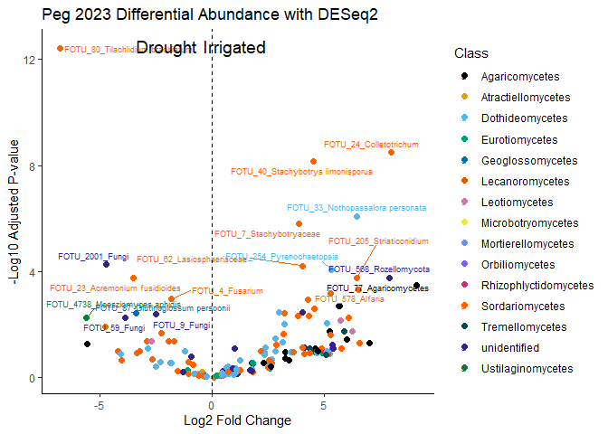<!-- -->

``` r
# Save the plot
ggsave("Plots/Diff_abundance_2023_peg.png",
       plot = deseq23_volcano,
             width = 12, height = 8, dpi = 400)
```

```
## Warning: ggrepel: 5 unlabeled data points (too many overlaps). Consider
## increasing max.overlaps
```

#### 2024 Peg Tissue

``` r
# Convert the phyloseq object to a DESeq2 object.
# Here, we use the "Treatment" column in your sample metadata as the design variable.
dds <- phyloseq_to_deseq2(diff_peg_2024, ~ Treatment)
```

```
## converting counts to integer mode
```

```
## Warning in DESeqDataSet(se, design = design, ignoreRank): some variables in
## design formula are characters, converting to factors
```

``` r
# Run the DESeq2 analysis using the Wald test and parametric fit.
dds <- DESeq(dds, test = "Wald", fitType = "parametric")
```

```
## estimating size factors
```

```
## estimating dispersions
```

```
## gene-wise dispersion estimates
```

```
## mean-dispersion relationship
```

```
## final dispersion estimates
```

```
## fitting model and testing
```

```
## -- replacing outliers and refitting for 176 genes
## -- DESeq argument 'minReplicatesForReplace' = 7 
## -- original counts are preserved in counts(dds)
```

```
## estimating dispersions
```

```
## fitting model and testing
```

``` r
# Extract the results.
# Here, cooksCutoff is set to FALSE to disable filtering based on Cook's distance.
res <- results(dds, cooksCutoff = FALSE)

# Set a significance threshold for the adjusted p-value.
alpha <- 1

# Filter to keep only significant taxa.
sigtab <- res[which(res$padj < alpha), ]

# Combine the DESeq2 results with the taxonomy data.
# This assumes that the row names of the DESeq2 result match the taxa in the phyloseq object.
sigtab <- cbind(as(sigtab, "data.frame"),
                as(tax_table(diff_peg_2024)[rownames(sigtab), ], "matrix"))

sigtab
```

```
##               baseMean log2FoldChange     lfcSE        stat       pvalue
## FOTU_2      41.5698641    -1.11733981 0.7434548 -1.50290221 1.328643e-01
## FOTU_20      8.1561647    -4.73230837 1.4471865 -3.27000579 1.075453e-03
## FOTU_2001    1.1573766    -1.17813065 1.0591617 -1.11232369 2.659990e-01
## FOTU_207     0.7640985    -0.54591695 1.2355680 -0.44183479 6.586088e-01
## FOTU_208     1.4593380    -0.60550528 0.7207773 -0.84007268 4.008676e-01
## FOTU_209     3.0146074     2.92846486 0.6527121  4.48661060 7.236516e-06
## FOTU_2119   35.7520466    -0.25836495 0.7156173 -0.36103790 7.180711e-01
## FOTU_215    11.6645217     4.62183707 0.7081153  6.52695575 6.711987e-11
## FOTU_218     0.7036777    -0.86697267 1.2281619 -0.70591074 4.802436e-01
## FOTU_22    269.7852585    -0.36986199 0.4064399 -0.91000418 3.628203e-01
## FOTU_2215    1.4987840     3.00084970 1.2488748  2.40284267 1.626818e-02
## FOTU_222     0.8040472     1.14083919 1.2983394  0.87869105 3.795688e-01
## FOTU_223    21.9542182    -0.08227487 0.5163972 -0.15932479 8.734130e-01
## FOTU_225     1.8788604     0.69729938 1.0914399  0.63888024 5.229008e-01
## FOTU_226     1.3842070    -2.22346052 1.1311386 -1.96568358 4.933517e-02
## FOTU_23    188.2171062    -2.98808405 0.5899579 -5.06491074 4.085917e-07
## FOTU_230     4.9226261     0.15674427 0.4794651  0.32691488 7.437323e-01
## FOTU_235     2.8546454     0.36081538 0.7211571  0.50032842 6.168438e-01
## FOTU_2365    0.9750803     3.12914875 2.3565943  1.32782669 1.842354e-01
## FOTU_237     1.0049709    -2.77649416 2.0169446 -1.37658427 1.686408e-01
## FOTU_2376   10.0792059     0.85880699 0.4329313  1.98370271 4.728899e-02
## FOTU_239     1.4653431     1.37577949 1.2689693  1.08417081 2.782891e-01
## FOTU_24    713.5352162    -0.58607403 0.4030069 -1.45425306 1.458762e-01
## FOTU_241     1.7046440     2.59527653 1.9303060  1.34448968 1.787901e-01
## FOTU_244     2.1831690    -1.29835287 1.0935806 -1.18724935 2.351293e-01
## FOTU_2463    2.5682971     0.63380115 1.5199241  0.41699526 6.766819e-01
## FOTU_248     3.6637698    -0.09227876 1.6830409 -0.05482859 9.562750e-01
## FOTU_2492    9.6488241     0.35909372 0.5600345  0.64119929 5.213932e-01
## FOTU_25      9.9432952     0.50876777 0.6443192  0.78962073 4.297493e-01
## FOTU_253    13.9676453    -0.30759411 0.7827103 -0.39298588 6.943299e-01
## FOTU_254     0.6515882    -0.11233034 1.2678326 -0.08860029 9.293996e-01
## FOTU_257     4.5258160     2.08297564 0.9144813  2.27776723 2.274045e-02
## FOTU_26    238.6213928    -1.13583194 0.7907918 -1.43632237 1.509106e-01
## FOTU_262     2.4685826     2.92159429 0.8067664  3.62136320 2.930548e-04
## FOTU_263     4.1062429     0.30351771 0.5530578  0.54879923 5.831432e-01
## FOTU_265     1.2646638     2.23027166 1.3649557  1.63395171 1.022690e-01
## FOTU_268     2.4307995    -1.58363332 1.7054209 -0.92858797 3.531027e-01
## FOTU_269     2.3459087    -1.27768950 0.9470362 -1.34914534 1.772903e-01
## FOTU_27    266.0541422    -1.68612117 0.6819918 -2.47234831 1.342287e-02
## FOTU_277     1.9932328     1.29556219 0.7893704  1.64126012 1.007434e-01
## FOTU_28    189.0050984     0.15749041 0.6480568  0.24301945 8.079903e-01
## FOTU_282    14.1387613    -2.55761016 0.9413892 -2.71684679 6.590711e-03
## FOTU_284     1.4091108     0.70132502 1.4143973  0.49584724 6.200022e-01
## FOTU_285     5.0365164     0.04416035 1.1897927  0.03711601 9.703925e-01
## FOTU_286     6.7874253    -1.72586175 0.6819871 -2.53063701 1.138556e-02
## FOTU_29      2.6339999     1.61956860 0.7862582  2.05984318 3.941354e-02
## FOTU_2930   72.3040609    -1.17118144 0.6593697 -1.77621374 7.569770e-02
## FOTU_294     6.9025612     0.20244948 0.4927219  0.41087977 6.811607e-01
## FOTU_296    15.0714768     8.41805198 2.7985829  3.00796950 2.629995e-03
## FOTU_3     339.6016213    -0.35964982 0.3129287 -1.14930260 2.504312e-01
## FOTU_305     0.6522429     0.47388984 2.4549870  0.19303151 8.469343e-01
## FOTU_3067    1.1871244    -0.61326308 0.7953440 -0.77106649 4.406675e-01
## FOTU_307     0.8441369     0.39511643 1.4632665  0.27002356 7.871421e-01
## FOTU_309     4.9106990     0.88220369 0.7486219  1.17843699 2.386224e-01
## FOTU_31      1.1160046     1.04419836 1.0785085  0.96818739 3.329508e-01
## FOTU_311     3.8429475    -0.30818219 1.0144985 -0.30377787 7.612971e-01
## FOTU_320    17.1788507     0.96718786 0.6862448  1.40939190 1.587193e-01
## FOTU_3203   14.3047288     0.01642872 0.5615296  0.02925709 9.766595e-01
## FOTU_322     3.4132534    -0.21265761 0.8984939 -0.23668232 8.129032e-01
## FOTU_3236    2.0509033     0.15243407 0.8632012  0.17659159 8.598292e-01
## FOTU_327     2.1562962     3.73274047 1.7809535  2.09592242 3.608907e-02
## FOTU_328     1.2153068    -2.06095306 2.3297617 -0.88461969 3.763618e-01
## FOTU_329     1.8694514    -1.65642848 1.6319000 -1.01503064 3.100912e-01
## FOTU_33    194.6916724     2.13102238 0.6676156  3.19199029 1.412961e-03
## FOTU_332    17.4662626     2.02382265 0.6335533  3.19439990 1.401219e-03
## FOTU_335     0.6939697    -1.03274932 2.2035240 -0.46868077 6.392978e-01
## FOTU_337     0.6690409     1.10295127 1.2001964  0.91897563 3.581083e-01
## FOTU_342    27.6272125     1.70758228 0.6696669  2.54989814 1.077544e-02
## FOTU_3434    0.9189680     3.37800135 2.3874016  1.41492802 1.570896e-01
## FOTU_35      7.2319934     0.89804846 1.5718185  0.57134362 5.677667e-01
## FOTU_3563    1.2013435    -3.08207048 0.8554340 -3.60293201 3.146479e-04
## FOTU_358     1.7932624     0.39174370 0.9595565  0.40825495 6.830865e-01
## FOTU_36    250.9302839     0.26249255 0.5648975  0.46467287 6.421657e-01
## FOTU_360     1.1073119     2.21736049 1.3434537  1.65049267 9.884221e-02
## FOTU_367     0.7079525     2.35862682 1.4310352  1.64819627 9.931240e-02
## FOTU_3696   11.1806897     6.31747881 2.8136389  2.24530547 2.474853e-02
## FOTU_37     29.9513100    -0.17803634 0.4866899 -0.36581062 7.145064e-01
## FOTU_374     1.0298318    -0.53404022 1.2087245 -0.44182130 6.586185e-01
## FOTU_376     3.1233426    -0.12429357 0.6207731 -0.20022383 8.413055e-01
## FOTU_3784    1.3906653    -0.17681589 0.7139177 -0.24766986 8.043899e-01
## FOTU_38      2.8739128    -0.08136801 1.3889714 -0.05858149 9.532855e-01
## FOTU_386     2.3621682    -0.46264534 0.7991734 -0.57890485 5.626534e-01
## FOTU_39    534.2938931    -1.30502243 0.7134247 -1.82923642 6.736420e-02
## FOTU_3908    1.5527364     2.30583882 0.7985192  2.88764348 3.881395e-03
## FOTU_4    1674.7070628    -1.07796987 0.5128845 -2.10177888 3.557265e-02
## FOTU_40      4.6610253     0.09341815 0.5226103  0.17875298 8.581317e-01
## FOTU_403     2.2770403    -0.89127787 0.8520780 -1.04600499 2.955587e-01
## FOTU_405     1.2118847     3.66995268 1.4459469  2.53809646 1.114573e-02
## FOTU_41    196.5877599     1.01459178 0.3980814  2.54870418 1.081240e-02
## FOTU_410     1.9206247     3.29072137 0.8438120  3.89982761 9.626120e-05
## FOTU_414     1.7756651     0.72922021 1.0118274  0.72069628 4.710964e-01
## FOTU_422     6.4781818    -0.21554745 0.7466574 -0.28868320 7.728238e-01
## FOTU_4222    1.2172755    -2.92322258 1.3508791 -2.16394094 3.046888e-02
## FOTU_4260    8.0926598    -1.67694751 0.9132476 -1.83624619 6.632125e-02
## FOTU_427     6.3767830     0.23847452 1.0072845  0.23674992 8.128508e-01
## FOTU_4292    0.8367892    -0.52069804 1.2459917 -0.41789847 6.760213e-01
## FOTU_43      1.8487776     0.23898394 0.9479482  0.25210654 8.009587e-01
## FOTU_430     3.9605603     0.31611257 0.6393520  0.49442653 6.210050e-01
## FOTU_431     1.9542438    -2.43904792 1.3067950 -1.86643506 6.198052e-02
## FOTU_433     0.7703961     2.47570196 1.7496195  1.41499448 1.570701e-01
## FOTU_435     2.8462260    -0.55908646 1.4830571 -0.37698243 7.061867e-01
## FOTU_44    288.5158017    -0.20965809 0.5373758 -0.39015173 6.964244e-01
## FOTU_455     0.6952948    -1.10649093 1.2806399 -0.86401410 3.875801e-01
## FOTU_46     10.4661463     2.71004805 1.2796181  2.11785686 3.418719e-02
## FOTU_467     7.7067031     2.19969368 1.1814979  1.86178382 6.263357e-02
## FOTU_47    586.2470353     2.47788764 0.7606569  3.25756270 1.123734e-03
## FOTU_473     7.0881452    -0.69621289 0.6923915 -1.00551909 3.146470e-01
## FOTU_4738    1.3370564    -2.37051372 0.9821806 -2.41352132 1.579920e-02
## FOTU_476     1.5002556     2.97759243 1.4930368  1.99431956 4.611714e-02
## FOTU_4760    0.6440987    -1.84180590 1.4868393 -1.23873903 2.154422e-01
## FOTU_477     2.6023022     3.86012652 1.1318072  3.41058654 6.482331e-04
## FOTU_478     6.0581193    -1.17147561 1.3482057 -0.86891462 3.848938e-01
## FOTU_479     4.4700886    -0.87436112 1.0443198 -0.83725415 4.024497e-01
## FOTU_48     23.1775436     6.53147070 1.0800998  6.04709928 1.474769e-09
## FOTU_484    45.0166762    -0.06670849 0.6868948 -0.09711602 9.226343e-01
## FOTU_49      9.2515916    -0.04150829 0.5205391 -0.07974095 9.364433e-01
## FOTU_492     2.1623781     3.82707836 2.3617733  1.62042578 1.051408e-01
## FOTU_5     229.0217335     0.42166046 0.5898631  0.71484460 4.747051e-01
## FOTU_50      1.2299536    -0.20651852 0.9244372 -0.22339918 8.232248e-01
## FOTU_502     0.6320814    -1.54636034 1.6177506 -0.95587066 3.391376e-01
## FOTU_51     32.5430959     0.18250512 0.7633333  0.23908970 8.110360e-01
## FOTU_5156    6.2058551    -0.54436967 0.5603667 -0.97145265 3.313229e-01
## FOTU_516    12.7084010     0.01836624 0.5854726  0.03136993 9.749745e-01
## FOTU_517     2.1321741     1.37476388 0.9271397  1.48280124 1.381272e-01
## FOTU_52      2.9426510     0.20770116 0.8331332  0.24930126 8.031278e-01
## FOTU_5227    1.8799479     3.13193159 0.7890580  3.96920341 7.211330e-05
## FOTU_523     3.6825277    -3.00635959 0.9618493 -3.12560341 1.774407e-03
## FOTU_5284    0.7299133     0.71894880 0.9213705  0.78030369 4.352121e-01
## FOTU_530     0.9759910     3.20160065 0.9939284  3.22115826 1.276736e-03
## FOTU_532     1.6105266     1.60516972 0.8355678  1.92105274 5.472506e-02
## FOTU_538     6.3145281     4.18487118 1.0874818  3.84822166 1.189784e-04
## FOTU_54    241.7355539     1.22694897 0.5372156  2.28390409 2.237717e-02
## FOTU_5576    0.8672004    -0.03022816 1.0210442 -0.02960515 9.763820e-01
## FOTU_563     2.0472457     2.33940840 2.1813383  1.07246474 2.835113e-01
## FOTU_564     0.6214653     0.06677616 2.9056517  0.02298147 9.816651e-01
## FOTU_569     0.6853867    -1.63243213 2.0170485 -0.80931725 4.183327e-01
## FOTU_57    166.7927506     0.88195327 0.6019023  1.46527650 1.428455e-01
## FOTU_5771    0.6687651    -1.96929085 1.9653341 -1.00201329 3.163372e-01
## FOTU_5772    2.3622139    -0.98829361 0.8474198 -1.16623856 2.435180e-01
## FOTU_58    199.4437659     3.71787888 0.5513463  6.74327402 1.548568e-11
## FOTU_586     6.4968885     0.52911181 1.2605334  0.41975232 6.746664e-01
## FOTU_59      3.5561127    -2.14402020 0.9455309 -2.26753051 2.335784e-02
## FOTU_6      25.2268631    -0.12159941 0.6379089 -0.19062191 8.488218e-01
## FOTU_618     1.2430689    -0.09565587 0.8061510 -0.11865751 9.055467e-01
## FOTU_622     4.7265955     2.22121740 0.7365793  3.01558506 2.564840e-03
## FOTU_623     2.0472769    -0.78779206 0.8996139 -0.87570018 3.811930e-01
## FOTU_625     1.0398456     1.25092058 1.1282690  1.10870771 2.675563e-01
## FOTU_631     1.7211058     4.06089983 1.4247627  2.85022889 4.368778e-03
## FOTU_64      1.1088575    -2.45632977 1.5454075 -1.58943823 1.119615e-01
## FOTU_654     2.3833905    -1.05821404 1.2860085 -0.82286707 4.105836e-01
## FOTU_67      1.6449981    -0.81305770 1.1228417 -0.72410713 4.690000e-01
## FOTU_679     1.5790879     4.40043014 2.7844467  1.58036069 1.140243e-01
## FOTU_688     0.7258665     3.15726531 1.5281529  2.06606642 3.882221e-02
## FOTU_7     795.5337227    -0.89600947 0.4039111 -2.21833355 2.653210e-02
## FOTU_70     75.0604156    -0.25435022 0.2873622 -0.88512080 3.760915e-01
## FOTU_702     0.7657098    -0.21217656 1.5279138 -0.13886684 8.895554e-01
## FOTU_703     1.8000479     3.88183642 1.2063030  3.21796143 1.291052e-03
## FOTU_72     14.9067721    -1.01631201 0.8202033 -1.23909767 2.153093e-01
## FOTU_723     1.3381818     1.33221306 0.8013196  1.66252404 9.640775e-02
## FOTU_729     0.9790377     0.34216279 1.2086871  0.28308632 7.771107e-01
## FOTU_745     2.8759723    -2.28089767 1.0725353 -2.12664115 3.344991e-02
## FOTU_75      1.4312571    -0.06387193 1.0037130 -0.06363565 9.492603e-01
## FOTU_760     2.9900168     0.61440379 0.7134740  0.86114390 3.891588e-01
## FOTU_762     1.0986348    -0.06523387 0.7429452 -0.08780442 9.300321e-01
## FOTU_77      7.6793934     5.97611571 1.6250089  3.67758944 2.354485e-04
## FOTU_778     0.6129855    -1.88726219 1.2903483 -1.46259904 1.435771e-01
## FOTU_78     24.2439149    -1.49968736 0.5613967 -2.67135036 7.554675e-03
## FOTU_784    70.5254413     0.43005735 0.4446473  0.96718753 3.334503e-01
## FOTU_785     0.8412687    -2.07639129 1.4801473 -1.40282746 1.606683e-01
## FOTU_79     13.7795820    -0.94649278 0.7109452 -1.33131606 1.830850e-01
## FOTU_792     1.0333564     2.60785966 1.0376329  2.51327766 1.196152e-02
## FOTU_8     700.6901338    -0.95546926 0.4643790 -2.05752027 3.963621e-02
## FOTU_80      5.2008428    -1.92798301 0.7588335 -2.54071955 1.106246e-02
## FOTU_813     1.1951265    -0.65787246 1.3358961 -0.49245782 6.223957e-01
## FOTU_82     45.9193870     0.27417230 0.4660201  0.58832725 5.563127e-01
## FOTU_83    180.5332330     0.85388452 0.4569738  1.86856328 6.168360e-02
## FOTU_832     1.2182353     0.28884413 1.1310806  0.25537006 7.984373e-01
## FOTU_834     1.3768376    -0.59097240 0.9986628 -0.59176370 5.540088e-01
## FOTU_838     2.3158224     1.17412917 1.6494691  0.71182247 4.765747e-01
## FOTU_854     1.4666188     3.67234330 1.4222916  2.58199036 9.823233e-03
## FOTU_86      1.3914969     0.24928035 0.8388392  0.29717300 7.663344e-01
## FOTU_87      8.2981482    -1.86492271 0.7935226 -2.35018222 1.876422e-02
## FOTU_872     0.6323165     1.86963008 2.1819643  0.85685640 3.915243e-01
## FOTU_88     44.4359511    -0.26389283 0.5113106 -0.51611065 6.057771e-01
## FOTU_89     10.0142676     0.49270722 0.7786538  0.63276802 5.268851e-01
## FOTU_9     120.5392423    -0.73164995 0.7188136 -1.01785775 3.087456e-01
## FOTU_906     0.7094962     1.19258414 1.6408739  0.72679817 4.673496e-01
## FOTU_91      1.3703427    -1.71974490 1.3587457 -1.26568566 2.056256e-01
## FOTU_912     1.4924040    -0.60342590 0.8136575 -0.74162153 4.583167e-01
## FOTU_926     1.0309015     0.86254237 1.1009844  0.78342833 4.333756e-01
## FOTU_929     0.7221385     0.26981183 1.9593325  0.13770600 8.904728e-01
## FOTU_93    203.5754886    -1.02805072 0.6003672 -1.71236987 8.682853e-02
## FOTU_94      4.5881605    -3.35231360 1.1832824 -2.83306295 4.610431e-03
## FOTU_96      2.1319206     1.71636791 0.8963095  1.91492765 5.550173e-02
## FOTU_962     1.7381994     3.14527778 1.9136339  1.64361524 1.002557e-01
## FOTU_965     1.8356953     1.13082157 0.5190351  2.17869951 2.935400e-02
## FOTU_99      0.9259013    -2.53099904 1.6518929 -1.53218106 1.254778e-01
## FOTU_996     3.7025251     3.05214783 0.9654256  3.16145314 1.569841e-03
##                   padj    OTU_ID Kingdom            Phylum              Class
## FOTU_2    3.507617e-01    FOTU_2   Fungi     Basidiomycota Atractiellomycetes
## FOTU_20   1.554257e-02   FOTU_20   Fungi     Basidiomycota     Agaricomycetes
## FOTU_2001 5.405729e-01 FOTU_2001   Fungi      unidentified       unidentified
## FOTU_207  8.579373e-01  FOTU_207   Fungi        Ascomycota    Dothideomycetes
## FOTU_208  6.531561e-01  FOTU_208   Fungi        Ascomycota    Dothideomycetes
## FOTU_209  2.865660e-04  FOTU_209   Fungi     Basidiomycota Microbotryomycetes
## FOTU_2119 8.776425e-01 FOTU_2119   Fungi        Ascomycota    Dothideomycetes
## FOTU_215  6.644867e-09  FOTU_215   Fungi     Basidiomycota Microbotryomycetes
## FOTU_218  7.043573e-01  FOTU_218   Fungi        Ascomycota    Dothideomycetes
## FOTU_22   6.414145e-01   FOTU_22   Fungi      unidentified       unidentified
## FOTU_2215 8.705677e-02 FOTU_2215   Fungi        Ascomycota    Sordariomycetes
## FOTU_222  6.460150e-01  FOTU_222   Fungi        Ascomycota    Sordariomycetes
## FOTU_223  9.450042e-01  FOTU_223   Fungi      unidentified       unidentified
## FOTU_225  7.557253e-01  FOTU_225   Fungi        Ascomycota    Sordariomycetes
## FOTU_226  1.776066e-01  FOTU_226   Fungi        Ascomycota    Dothideomycetes
## FOTU_23   2.022529e-05   FOTU_23   Fungi        Ascomycota    Sordariomycetes
## FOTU_230  9.034294e-01  FOTU_230   Fungi        Ascomycota    Dothideomycetes
## FOTU_235  8.326646e-01  FOTU_235   Fungi      unidentified       unidentified
## FOTU_2365 4.098719e-01 FOTU_2365   Fungi      unidentified       unidentified
## FOTU_237  3.928339e-01  FOTU_237   Fungi Mortierellomycota Mortierellomycetes
## FOTU_2376 1.733930e-01 FOTU_2376   Fungi      unidentified       unidentified
## FOTU_239  5.565781e-01  FOTU_239   Fungi        Ascomycota    Sordariomycetes
## FOTU_24   3.656137e-01   FOTU_24   Fungi        Ascomycota    Sordariomycetes
## FOTU_241  4.069016e-01  FOTU_241   Fungi        Ascomycota      Pezizomycetes
## FOTU_244  5.005978e-01  FOTU_244   Fungi        Ascomycota    Sordariomycetes
## FOTU_2463 8.614722e-01 FOTU_2463   Fungi        Ascomycota    Sordariomycetes
## FOTU_248  9.810490e-01  FOTU_248   Fungi        Ascomycota    Dothideomycetes
## FOTU_2492 7.557253e-01 FOTU_2492   Fungi      unidentified       unidentified
## FOTU_25   6.785197e-01   FOTU_25   Fungi      unidentified       unidentified
## FOTU_253  8.672454e-01  FOTU_253   Fungi        Ascomycota     Eurotiomycetes
## FOTU_254  9.743194e-01  FOTU_254   Fungi        Ascomycota    Dothideomycetes
## FOTU_257  1.125652e-01  FOTU_257   Fungi     Basidiomycota    Tremellomycetes
## FOTU_26   3.735038e-01   FOTU_26   Fungi        Ascomycota    Sordariomycetes
## FOTU_262  5.663661e-03  FOTU_262   Fungi     Basidiomycota    Tremellomycetes
## FOTU_263  8.074291e-01  FOTU_263   Fungi        Ascomycota    Dothideomycetes
## FOTU_265  2.892751e-01  FOTU_265   Fungi        Ascomycota    Dothideomycetes
## FOTU_268  6.355848e-01  FOTU_268   Fungi      unidentified       unidentified
## FOTU_269  4.069016e-01  FOTU_269   Fungi      unidentified       unidentified
## FOTU_27   7.593507e-02   FOTU_27   Fungi        Ascomycota    Dothideomycetes
## FOTU_277  2.890898e-01  FOTU_277   Fungi        Ascomycota    Sordariomycetes
## FOTU_28   9.145162e-01   FOTU_28   Fungi        Ascomycota    Dothideomycetes
## FOTU_282  5.019080e-02  FOTU_282   Fungi        Ascomycota    Dothideomycetes
## FOTU_284  8.326646e-01  FOTU_284   Fungi        Ascomycota    Sordariomycetes
## FOTU_285  9.816172e-01  FOTU_285   Fungi        Ascomycota    Dothideomycetes
## FOTU_286  6.831337e-02  FOTU_286   Fungi        Ascomycota    Sordariomycetes
## FOTU_29   1.509225e-01   FOTU_29   Fungi        Ascomycota    Dothideomycetes
## FOTU_2930 2.379070e-01 FOTU_2930   Fungi        Ascomycota    Sordariomycetes
## FOTU_294  8.614722e-01  FOTU_294   Fungi        Ascomycota    Dothideomycetes
## FOTU_296  2.366996e-02  FOTU_296   Fungi     Basidiomycota     Agaricomycetes
## FOTU_3    5.165144e-01    FOTU_3   Fungi        Ascomycota    Dothideomycetes
## FOTU_305  9.337040e-01  FOTU_305   Fungi        Ascomycota    Dothideomycetes
## FOTU_3067 6.816576e-01 FOTU_3067   Fungi        Ascomycota       unidentified
## FOTU_307  9.145162e-01  FOTU_307   Fungi        Ascomycota    Sordariomycetes
## FOTU_309  5.026302e-01  FOTU_309   Fungi        Ascomycota    Dothideomycetes
## FOTU_31   6.113255e-01   FOTU_31   Fungi        Ascomycota    Sordariomycetes
## FOTU_311  9.145162e-01  FOTU_311   Fungi        Ascomycota    Sordariomycetes
## FOTU_320  3.786316e-01  FOTU_320   Fungi     Basidiomycota    Tremellomycetes
## FOTU_3203 9.816172e-01 FOTU_3203   Fungi        Ascomycota    Dothideomycetes
## FOTU_322  9.145162e-01  FOTU_322   Fungi        Ascomycota    Dothideomycetes
## FOTU_3236 9.354186e-01 FOTU_3236   Fungi        Ascomycota    Dothideomycetes
## FOTU_327  1.458293e-01  FOTU_327   Fungi        Ascomycota    Dothideomycetes
## FOTU_328  6.460150e-01  FOTU_328   Fungi     Basidiomycota     Agaricomycetes
## FOTU_329  5.960977e-01  FOTU_329   Fungi        Ascomycota    Sordariomycetes
## FOTU_33   1.554257e-02   FOTU_33   Fungi        Ascomycota    Dothideomycetes
## FOTU_332  1.554257e-02  FOTU_332   Fungi     Basidiomycota    Tremellomycetes
## FOTU_335  8.476588e-01  FOTU_335   Fungi        Ascomycota      Leotiomycetes
## FOTU_337  6.387878e-01  FOTU_337   Fungi        Ascomycota    Dothideomycetes
## FOTU_342  6.831337e-02  FOTU_342   Fungi        Ascomycota    Sordariomycetes
## FOTU_3434 3.786316e-01 FOTU_3434   Fungi      unidentified       unidentified
## FOTU_35   7.916747e-01   FOTU_35   Fungi        Ascomycota    Dothideomycetes
## FOTU_3563 5.663661e-03 FOTU_3563   Fungi        Ascomycota    Sordariomycetes
## FOTU_358  8.614722e-01  FOTU_358   Fungi        Ascomycota    Dothideomycetes
## FOTU_36   8.476588e-01   FOTU_36   Fungi        Ascomycota    Sordariomycetes
## FOTU_360  2.890898e-01  FOTU_360   Fungi        Ascomycota    Dothideomycetes
## FOTU_367  2.890898e-01  FOTU_367   Fungi        Ascomycota    Sordariomycetes
## FOTU_3696 1.166716e-01 FOTU_3696   Fungi     Basidiomycota     Agaricomycetes
## FOTU_37   8.776425e-01   FOTU_37   Fungi        Ascomycota    Dothideomycetes
## FOTU_374  8.579373e-01  FOTU_374   Fungi      unidentified       unidentified
## FOTU_376  9.337040e-01  FOTU_376   Fungi        Ascomycota    Dothideomycetes
## FOTU_3784 9.145162e-01 FOTU_3784   Fungi      unidentified       unidentified
## FOTU_38   9.810490e-01   FOTU_38   Fungi        Ascomycota    Sordariomycetes
## FOTU_386  7.901090e-01  FOTU_386   Fungi        Ascomycota    Dothideomycetes
## FOTU_39   2.151308e-01   FOTU_39   Fungi        Ascomycota    Sordariomycetes
## FOTU_3908 3.341375e-02 FOTU_3908   Fungi     Basidiomycota    Tremellomycetes
## FOTU_4    1.458293e-01    FOTU_4   Fungi        Ascomycota    Sordariomycetes
## FOTU_40   9.354186e-01   FOTU_40   Fungi        Ascomycota    Sordariomycetes
## FOTU_403  5.794122e-01  FOTU_403   Fungi        Ascomycota     Eurotiomycetes
## FOTU_405  6.831337e-02  FOTU_405   Fungi     Rozellomycota       unidentified
## FOTU_41   6.831337e-02   FOTU_41   Fungi        Ascomycota    Sordariomycetes
## FOTU_410  2.722817e-03  FOTU_410   Fungi        Ascomycota    Dothideomycetes
## FOTU_414  7.041925e-01  FOTU_414   Fungi        Ascomycota    Sordariomycetes
## FOTU_422  9.145162e-01  FOTU_422   Fungi        Ascomycota       unidentified
## FOTU_4222 1.340631e-01 FOTU_4222   Fungi        Ascomycota    Dothideomycetes
## FOTU_4260 2.151308e-01 FOTU_4260   Fungi        Ascomycota    Sordariomycetes
## FOTU_427  9.145162e-01  FOTU_427   Fungi        Ascomycota    Sordariomycetes
## FOTU_4292 8.614722e-01 FOTU_4292   Fungi        Ascomycota    Dothideomycetes
## FOTU_43   9.145162e-01   FOTU_43   Fungi        Ascomycota    Sordariomycetes
## FOTU_430  8.326646e-01  FOTU_430   Fungi        Ascomycota    Dothideomycetes
## FOTU_431  2.066908e-01  FOTU_431   Fungi        Ascomycota     Eurotiomycetes
## FOTU_433  3.786316e-01  FOTU_433   Fungi        Ascomycota    Sordariomycetes
## FOTU_435  8.739060e-01  FOTU_435   Fungi        Ascomycota       unidentified
## FOTU_44   8.672454e-01   FOTU_44   Fungi        Ascomycota    Sordariomycetes
## FOTU_455  6.460150e-01  FOTU_455   Fungi        Ascomycota    Dothideomycetes
## FOTU_46   1.440226e-01   FOTU_46   Fungi      unidentified       unidentified
## FOTU_467  2.066908e-01  FOTU_467   Fungi        Ascomycota    Dothideomycetes
## FOTU_47   1.554257e-02   FOTU_47   Fungi        Ascomycota    Dothideomycetes
## FOTU_473  5.965215e-01  FOTU_473   Fungi        Ascomycota    Sordariomycetes
## FOTU_4738 8.689562e-02 FOTU_4738   Fungi     Basidiomycota  Ustilaginomycetes
## FOTU_476  1.722867e-01  FOTU_476   Fungi        Ascomycota    Sordariomycetes
## FOTU_4760 4.636690e-01 FOTU_4760   Fungi      unidentified       unidentified
## FOTU_477  1.069585e-02  FOTU_477   Fungi        Ascomycota    Dothideomycetes
## FOTU_478  6.460150e-01  FOTU_478   Fungi        Ascomycota    Dothideomycetes
## FOTU_479  6.531561e-01  FOTU_479   Fungi        Ascomycota    Dothideomycetes
## FOTU_48   9.733474e-08   FOTU_48   Fungi        Ascomycota    Sordariomycetes
## FOTU_484  9.743194e-01  FOTU_484   Fungi        Ascomycota    Sordariomycetes
## FOTU_49   9.758725e-01   FOTU_49   Fungi        Ascomycota    Dothideomycetes
## FOTU_492  2.932097e-01  FOTU_492   Fungi        Ascomycota    Sordariomycetes
## FOTU_5    7.041925e-01    FOTU_5   Fungi      unidentified       unidentified
## FOTU_50   9.208956e-01   FOTU_50   Fungi        Ascomycota    Sordariomycetes
## FOTU_502  6.160481e-01  FOTU_502   Fungi        Ascomycota Laboulbeniomycetes
## FOTU_51   9.145162e-01   FOTU_51   Fungi        Ascomycota    Sordariomycetes
## FOTU_5156 6.113255e-01 FOTU_5156   Fungi      unidentified       unidentified
## FOTU_516  9.816172e-01  FOTU_516   Fungi        Ascomycota     Eurotiomycetes
## FOTU_517  3.598578e-01  FOTU_517   Fungi        Ascomycota    Dothideomycetes
## FOTU_52   9.145162e-01   FOTU_52   Fungi        Ascomycota    Sordariomycetes
## FOTU_5227 2.379739e-03 FOTU_5227   Fungi        Ascomycota    Dothideomycetes
## FOTU_523  1.756663e-02  FOTU_523   Fungi        Ascomycota       unidentified
## FOTU_5284 6.785197e-01 FOTU_5284   Fungi        Ascomycota    Sordariomycetes
## FOTU_530  1.554257e-02  FOTU_530   Fungi        Ascomycota    Dothideomycetes
## FOTU_532  1.927955e-01  FOTU_532   Fungi        Ascomycota    Dothideomycetes
## FOTU_538  2.944715e-03  FOTU_538   Fungi        Ascomycota     Orbiliomycetes
## FOTU_54   1.125652e-01   FOTU_54   Fungi        Ascomycota    Sordariomycetes
## FOTU_5576 9.816172e-01 FOTU_5576   Fungi        Ascomycota    Sordariomycetes
## FOTU_563  5.613525e-01  FOTU_563   Fungi     Basidiomycota     Agaricomycetes
## FOTU_564  9.816651e-01  FOTU_564   Fungi     Basidiomycota     Agaricomycetes
## FOTU_569  6.679828e-01  FOTU_569   Fungi        Ascomycota    Sordariomycetes
## FOTU_57   3.644650e-01   FOTU_57   Fungi        Ascomycota      Pezizomycetes
## FOTU_5771 5.965215e-01 FOTU_5771   Fungi     Basidiomycota     Agaricomycetes
## FOTU_5772 5.075428e-01 FOTU_5772   Fungi        Ascomycota    Dothideomycetes
## FOTU_58   3.066164e-09   FOTU_58   Fungi        Ascomycota    Sordariomycetes
## FOTU_586  8.614722e-01  FOTU_586   Fungi        Ascomycota     Orbiliomycetes
## FOTU_59   1.128013e-01   FOTU_59   Fungi      unidentified       unidentified
## FOTU_6    9.337040e-01    FOTU_6   Fungi        Ascomycota    Sordariomycetes
## FOTU_618  9.639691e-01  FOTU_618   Fungi        Ascomycota    Sordariomycetes
## FOTU_622  2.366996e-02  FOTU_622   Fungi     Basidiomycota    Tremellomycetes
## FOTU_623  6.460150e-01  FOTU_623   Fungi        Ascomycota    Sordariomycetes
## FOTU_625  5.405729e-01  FOTU_625   Fungi      unidentified       unidentified
## FOTU_631  3.604242e-02  FOTU_631   Fungi        Ascomycota      Pezizomycetes
## FOTU_64   3.078941e-01   FOTU_64   Fungi        Ascomycota     Eurotiomycetes
## FOTU_654  6.609394e-01  FOTU_654   Fungi        Ascomycota    Sordariomycetes
## FOTU_67   7.041925e-01   FOTU_67   Fungi        Ascomycota     Eurotiomycetes
## FOTU_679  3.092714e-01  FOTU_679   Fungi     Rozellomycota       unidentified
## FOTU_688  1.509225e-01  FOTU_688   Fungi        Ascomycota    Dothideomycetes
## FOTU_7    1.221711e-01    FOTU_7   Fungi        Ascomycota    Sordariomycetes
## FOTU_70   6.460150e-01   FOTU_70   Fungi        Ascomycota    Dothideomycetes
## FOTU_702  9.530465e-01  FOTU_702   Fungi        Ascomycota    Dothideomycetes
## FOTU_703  1.554257e-02  FOTU_703   Fungi     Basidiomycota    Tremellomycetes
## FOTU_72   4.636690e-01   FOTU_72   Fungi        Ascomycota    Dothideomycetes
## FOTU_723  2.890898e-01  FOTU_723   Fungi        Ascomycota    Sordariomycetes
## FOTU_729  9.145162e-01  FOTU_729   Fungi        Ascomycota    Dothideomycetes
## FOTU_745  1.439800e-01  FOTU_745   Fungi     Basidiomycota    Tremellomycetes
## FOTU_75   9.810490e-01   FOTU_75   Fungi        Ascomycota    Sordariomycetes
## FOTU_760  6.460150e-01  FOTU_760   Fungi        Ascomycota    Dothideomycetes
## FOTU_762  9.743194e-01  FOTU_762   Fungi        Ascomycota    Dothideomycetes
## FOTU_77   5.179868e-03   FOTU_77   Fungi     Basidiomycota     Agaricomycetes
## FOTU_778  3.644650e-01  FOTU_778   Fungi        Ascomycota     Eurotiomycetes
## FOTU_78   5.540095e-02   FOTU_78   Fungi        Ascomycota    Dothideomycetes
## FOTU_784  6.113255e-01  FOTU_784   Fungi      unidentified       unidentified
## FOTU_785  3.787181e-01  FOTU_785   Fungi        Ascomycota    Sordariomycetes
## FOTU_79   4.098719e-01   FOTU_79   Fungi        Ascomycota    Dothideomycetes
## FOTU_792  6.965823e-02  FOTU_792   Fungi     Basidiomycota     Agaricomycetes
## FOTU_8    1.509225e-01    FOTU_8   Fungi        Ascomycota    Dothideomycetes
## FOTU_80   6.831337e-02   FOTU_80   Fungi        Ascomycota    Sordariomycetes
## FOTU_813  8.326646e-01  FOTU_813   Fungi        Ascomycota    Dothideomycetes
## FOTU_82   7.867850e-01   FOTU_82   Fungi        Ascomycota    Dothideomycetes
## FOTU_83   2.066908e-01   FOTU_83   Fungi      unidentified       unidentified
## FOTU_832  9.145162e-01  FOTU_832   Fungi     Basidiomycota    Tremellomycetes
## FOTU_834  7.867850e-01  FOTU_834   Fungi        Ascomycota    Dothideomycetes
## FOTU_838  7.041925e-01  FOTU_838   Fungi        Ascomycota     Orbiliomycetes
## FOTU_854  6.831337e-02  FOTU_854   Fungi        Ascomycota    Dothideomycetes
## FOTU_86   9.145162e-01   FOTU_86   Fungi        Ascomycota    Dothideomycetes
## FOTU_87   9.777148e-02   FOTU_87   Fungi        Ascomycota   Geoglossomycetes
## FOTU_872  6.460150e-01  FOTU_872   Fungi        Ascomycota     Orbiliomycetes
## FOTU_88   8.326646e-01   FOTU_88   Fungi        Ascomycota    Sordariomycetes
## FOTU_89   7.559656e-01   FOTU_89   Fungi      unidentified       unidentified
## FOTU_9    5.960977e-01    FOTU_9   Fungi      unidentified       unidentified
## FOTU_906  7.041925e-01  FOTU_906   Fungi        Ascomycota    Sordariomycetes
## FOTU_91   4.523764e-01   FOTU_91   Fungi        Ascomycota    Sordariomycetes
## FOTU_912  7.034628e-01  FOTU_912   Fungi        Ascomycota    Dothideomycetes
## FOTU_926  6.785197e-01  FOTU_926   Fungi      unidentified       unidentified
## FOTU_929  9.530465e-01  FOTU_929   Fungi        Ascomycota    Sordariomycetes
## FOTU_93   2.686258e-01   FOTU_93   Fungi        Ascomycota    Sordariomycetes
## FOTU_94   3.651461e-02   FOTU_94   Fungi        Ascomycota      Leotiomycetes
## FOTU_96   1.927955e-01   FOTU_96   Fungi      unidentified       unidentified
## FOTU_962  2.890898e-01  FOTU_962   Fungi        Ascomycota       unidentified
## FOTU_965  1.320930e-01  FOTU_965   Fungi        Ascomycota    Sordariomycetes
## FOTU_99   3.357378e-01   FOTU_99   Fungi        Ascomycota    Sordariomycetes
## FOTU_996  1.635939e-02  FOTU_996   Fungi     Basidiomycota    Tremellomycetes
##                       Order                Family             Genus
## FOTU_2       Atractiellales    Hoehnelomycetaceae       Atractiella
## FOTU_20      Cantharellales     Ceratobasidiaceae      unidentified
## FOTU_2001      unidentified          unidentified      unidentified
## FOTU_207       Pleosporales     Phaeosphaeriaceae         Setophoma
## FOTU_208       Pleosporales         Massarinaceae      Stagonospora
## FOTU_209    Sporidiobolales      Sporidiobolaceae    Sporobolomyces
## FOTU_2119      unidentified          unidentified      unidentified
## FOTU_215       unidentified          unidentified      unidentified
## FOTU_218  Botryosphaeriales    Botryosphaeriaceae     Lasiodiplodia
## FOTU_22        unidentified          unidentified      unidentified
## FOTU_2215     Glomerellales  Plectosphaerellaceae      unidentified
## FOTU_222        Hypocreales       Clavicipitaceae     Metacordyceps
## FOTU_223       unidentified          unidentified      unidentified
## FOTU_225      Glomerellales  Plectosphaerellaceae   Furcasterigmium
## FOTU_226       Pleosporales  Tetraplosphaeriaceae         Tetraploa
## FOTU_23         Hypocreales        Bionectriaceae        Acremonium
## FOTU_230        Venturiales     Sympoventuriaceae   Scolecobasidium
## FOTU_235       unidentified          unidentified      unidentified
## FOTU_2365      unidentified          unidentified      unidentified
## FOTU_237     Mortierellales       Mortierellaceae       Mortierella
## FOTU_2376      unidentified          unidentified      unidentified
## FOTU_239        Hypocreales          Hypocreaceae       Trichoderma
## FOTU_24       Glomerellales        Glomerellaceae    Colletotrichum
## FOTU_241          Pezizales            Pezizaceae            Peziza
## FOTU_244      Glomerellales  Plectosphaerellaceae           Lectera
## FOTU_2463       Sordariales     Lasiosphaeriaceae      unidentified
## FOTU_248       Pleosporales       Lentitheciaceae       Poaceascoma
## FOTU_2492      unidentified          unidentified      unidentified
## FOTU_25        unidentified          unidentified      unidentified
## FOTU_253    Chaetothyriales   Herpotrichiellaceae         Exophiala
## FOTU_254       Pleosporales Pyrenochaetopsidaceae  Pyrenochaetopsis
## FOTU_257        Tremellales          unidentified      unidentified
## FOTU_26         Hypocreales          unidentified      unidentified
## FOTU_262        Tremellales           Bulleraceae           Bullera
## FOTU_263       Pleosporales         Pleosporaceae        Curvularia
## FOTU_265       Pleosporales          unidentified      unidentified
## FOTU_268       unidentified          unidentified      unidentified
## FOTU_269       unidentified          unidentified      unidentified
## FOTU_27      Muyocopronales       Muyocopronaceae          Arxiella
## FOTU_277      Glomerellales  Plectosphaerellaceae      unidentified
## FOTU_28   Mycosphaerellales    Mycosphaerellaceae        Cercospora
## FOTU_282       Pleosporales          unidentified      unidentified
## FOTU_284        Hypocreales       Cordycipitaceae    Leptobacillium
## FOTU_285       Pleosporales     Phaeosphaeriaceae            Edenia
## FOTU_286        Hypocreales        Sarocladiaceae       Sarocladium
## FOTU_29   Botryosphaeriales    Botryosphaeriaceae      Macrophomina
## FOTU_2930       Hypocreales           Nectriaceae          Fusarium
## FOTU_294       Pleosporales         Pleosporaceae      unidentified
## FOTU_296     Cantharellales     Ceratobasidiaceae       Rhizoctonia
## FOTU_3       Cladosporiales       Cladosporiaceae      Cladosporium
## FOTU_305       Pleosporales  Tetraplosphaeriaceae         Tetraploa
## FOTU_3067      unidentified          unidentified      unidentified
## FOTU_307        Hypocreales       Cordycipitaceae      unidentified
## FOTU_309       unidentified  Pseudorobillardaceae  Pseudorobillarda
## FOTU_31            Branch06          unidentified      unidentified
## FOTU_311        Hypocreales        Bionectriaceae        Fusariella
## FOTU_320        Tremellales    Bulleribasidiaceae         Hannaella
## FOTU_3203      Pleosporales            Torulaceae            Torula
## FOTU_322       Pleosporales     Phaeosphaeriaceae        Leptospora
## FOTU_3236      Pleosporales     Phaeosphaeriaceae     Phaeosphaeria
## FOTU_327       Pleosporales           Latoruaceae        Polyschema
## FOTU_328        Sebacinales          unidentified      unidentified
## FOTU_329      Glomerellales  Plectosphaerellaceae      Stachylidium
## FOTU_33   Mycosphaerellales    Mycosphaerellaceae    Nothopassalora
## FOTU_332        Tremellales    Bulleribasidiaceae         Hannaella
## FOTU_335      Rhytismatales          unidentified      unidentified
## FOTU_337       Pleosporales         Periconiaceae         Periconia
## FOTU_342      Glomerellales        Glomerellaceae    Colletotrichum
## FOTU_3434      unidentified          unidentified      unidentified
## FOTU_35        Pleosporales       Melanommataceae         Tumularia
## FOTU_3563       Hypocreales        Bionectriaceae        Acremonium
## FOTU_358       Pleosporales      Dictyosporiaceae  Neodendryphiella
## FOTU_36          Xylariales       Microdochiaceae      Microdochium
## FOTU_360       Pleosporales Pyrenochaetopsidaceae  Pyrenochaetopsis
## FOTU_367        Hypocreales           Nectriaceae          Fusarium
## FOTU_3696    Cantharellales     Ceratobasidiaceae       Rhizoctonia
## FOTU_37        Pleosporales         Pleosporaceae      unidentified
## FOTU_374       unidentified          unidentified      unidentified
## FOTU_376        Venturiales     Sympoventuriaceae   Scolecobasidium
## FOTU_3784      unidentified          unidentified      unidentified
## FOTU_38            Branch06          unidentified      unidentified
## FOTU_386       unidentified          unidentified      unidentified
## FOTU_39         Hypocreales      Stachybotryaceae       Myrothecium
## FOTU_3908       Tremellales    Bulleribasidiaceae         Hannaella
## FOTU_4          Hypocreales           Nectriaceae          Fusarium
## FOTU_40         Hypocreales      Stachybotryaceae      Stachybotrys
## FOTU_403    Chaetothyriales     Cyphellophoraceae     Cyphellophora
## FOTU_405       unidentified          unidentified      unidentified
## FOTU_41       Glomerellales  Plectosphaerellaceae  Plectosphaerella
## FOTU_410       Pleosporales      Dictyosporiaceae  Neodendryphiella
## FOTU_414        Hypocreales      Stachybotryaceae      unidentified
## FOTU_422       unidentified          unidentified      unidentified
## FOTU_4222      Pleosporales          Dacampiaceae       Aaosphaeria
## FOTU_4260      Diaporthales         Diaporthaceae         Diaporthe
## FOTU_427       unidentified          unidentified      unidentified
## FOTU_4292      Pleosporales         Pleosporaceae        Curvularia
## FOTU_43         Sordariales         Chaetomiaceae          Humicola
## FOTU_430       Pleosporales     Phaeosphaeriaceae        Leptospora
## FOTU_431         Eurotiales        Trichocomaceae       Talaromyces
## FOTU_433        Hypocreales       Cordycipitaceae     Simplicillium
## FOTU_435       unidentified          unidentified      unidentified
## FOTU_44        Diaporthales         Diaporthaceae         Diaporthe
## FOTU_455       Pleosporales  Astrosphaeriellaceae        Pithomyces
## FOTU_46        unidentified          unidentified      unidentified
## FOTU_467       Pleosporales          unidentified      unidentified
## FOTU_47        Pleosporales     Phaeosphaeriaceae      unidentified
## FOTU_473       Diaporthales         Diaporthaceae         Diaporthe
## FOTU_4738     Ustilaginales        Ustilaginaceae      Moesziomyces
## FOTU_476       unidentified          unidentified      unidentified
## FOTU_4760      unidentified          unidentified      unidentified
## FOTU_477       Pleosporales            Torulaceae            Torula
## FOTU_478       Pleosporales     Phaeosphaeriaceae         Paraphoma
## FOTU_479       Pleosporales     Phaeosphaeriaceae      unidentified
## FOTU_48        Diaporthales     Melanconiellaceae   Sphaeronaemella
## FOTU_484        Hypocreales           Nectriaceae          Fusarium
## FOTU_49        Pleosporales         Pleosporaceae        Alternaria
## FOTU_492        Hypocreales          unidentified      unidentified
## FOTU_5         unidentified          unidentified      unidentified
## FOTU_50         Hypocreales           Nectriaceae      Penicillifer
## FOTU_502    Pyxidiophorales          unidentified      unidentified
## FOTU_51          Xylariales        Hansfordiaceae        Hansfordia
## FOTU_5156      unidentified          unidentified      unidentified
## FOTU_516    Chaetothyriales     Cyphellophoraceae     Cyphellophora
## FOTU_517       Pleosporales         Pleosporaceae        Curvularia
## FOTU_52         Hypocreales  Myrotheciomycetaceae    Emericellopsis
## FOTU_5227      Pleosporales      Dictyosporiaceae  Neodendryphiella
## FOTU_523       unidentified          unidentified      unidentified
## FOTU_5284       Hypocreales        Bionectriaceae      unidentified
## FOTU_530       Pleosporales      Dictyosporiaceae     Dendryphiella
## FOTU_532       Pleosporales     Phaeosphaeriaceae      unidentified
## FOTU_538         Orbiliales          unidentified      unidentified
## FOTU_54       Glomerellales  Plectosphaerellaceae      unidentified
## FOTU_5576       Hypocreales           Nectriaceae          Fusarium
## FOTU_563       unidentified          unidentified      unidentified
## FOTU_564       unidentified          unidentified      unidentified
## FOTU_569        Hypocreales       Cordycipitaceae     Lecanicillium
## FOTU_57           Pezizales            Pezizaceae      unidentified
## FOTU_5771    Cantharellales     Ceratobasidiaceae       Rhizoctonia
## FOTU_5772      Pleosporales            Torulaceae            Torula
## FOTU_58       Glomerellales  Plectosphaerellaceae           Lectera
## FOTU_586         Orbiliales           Orbiliaceae        Gamsylella
## FOTU_59        unidentified          unidentified      unidentified
## FOTU_6    Chaetosphaeriales    Chaetosphaeriaceae          Codinaea
## FOTU_618      Glomerellales        Glomerellaceae    Colletotrichum
## FOTU_622        Tremellales          unidentified      unidentified
## FOTU_623        Hypocreales           Nectriaceae          Fusarium
## FOTU_625       unidentified          unidentified      unidentified
## FOTU_631          Pezizales            Pezizaceae            Peziza
## FOTU_64          Eurotiales        Aspergillaceae       Penicillium
## FOTU_654        Hypocreales           Nectriaceae      Bisifusarium
## FOTU_67     Chaetothyriales   Herpotrichiellaceae         Exophiala
## FOTU_679           Branch02          unidentified      unidentified
## FOTU_688       Pleosporales      Dictyosporiaceae  Neodendryphiella
## FOTU_7          Hypocreales      Stachybotryaceae      unidentified
## FOTU_70        Pleosporales         Pleosporaceae        Curvularia
## FOTU_702       Pleosporales       Coniothyriaceae Ochrocladosporium
## FOTU_703        Tremellales    Bulleribasidiaceae         Hannaella
## FOTU_72        Pleosporales          unidentified      unidentified
## FOTU_723   Amphisphaeriales         Sporocadaceae    Pestalotiopsis
## FOTU_729       Pleosporales     Lophiostomataceae Pseudolophiostoma
## FOTU_745        Tremellales          unidentified      unidentified
## FOTU_75         Hypocreales           Nectriaceae         Fusicolla
## FOTU_760  Botryosphaeriales      Phyllostictaceae      unidentified
## FOTU_762        Venturiales     Sympoventuriaceae   Scolecobasidium
## FOTU_77        unidentified          unidentified      unidentified
## FOTU_778         Eurotiales        Aspergillaceae       Penicillium
## FOTU_78        Pleosporales          unidentified      unidentified
## FOTU_784       unidentified          unidentified      unidentified
## FOTU_785        Hypocreales       Cordycipitaceae     Lecanicillium
## FOTU_79        Pleosporales            Torulaceae            Torula
## FOTU_792          Phallales            Phallaceae      unidentified
## FOTU_8         Pleosporales     Phaeosphaeriaceae         Paraphoma
## FOTU_80         Hypocreales       Tilachlidiaceae      Tilachlidium
## FOTU_813       Pleosporales          unidentified      unidentified
## FOTU_82        Pleosporales            Torulaceae            Torula
## FOTU_83        unidentified          unidentified      unidentified
## FOTU_832        Tremellales    Bulleribasidiaceae     Vishniacozyma
## FOTU_834       Pleosporales     Phaeosphaeriaceae   Ophiosphaerella
## FOTU_838         Orbiliales          unidentified      unidentified
## FOTU_854       Pleosporales     Phaeosphaeriaceae      unidentified
## FOTU_86    Minutisphaerales     Minutisphaeraceae     Minutisphaera
## FOTU_87        Geoglossales         Geoglossaceae    Glutinoglossum
## FOTU_872         Orbiliales          unidentified      unidentified
## FOTU_88    Amphisphaeriales       Hyponectriaceae     Monographella
## FOTU_89        unidentified          unidentified      unidentified
## FOTU_9         unidentified          unidentified      unidentified
## FOTU_906        Hypocreales        Bionectriaceae      unidentified
## FOTU_91         Sordariales         Chaetomiaceae        Chaetomium
## FOTU_912        Venturiales     Sympoventuriaceae        Ochroconis
## FOTU_926       unidentified          unidentified      unidentified
## FOTU_929        Hypocreales          unidentified      unidentified
## FOTU_93        Diaporthales         Diaporthaceae         Diaporthe
## FOTU_94          Helotiales           Helotiaceae       Scytalidium
## FOTU_96        unidentified          unidentified      unidentified
## FOTU_962       unidentified          unidentified      unidentified
## FOTU_965   Amphisphaeriales         Apiosporaceae        Nigrospora
## FOTU_99            Branch06          unidentified      unidentified
## FOTU_996        Tremellales   Rhynchogastremaceae      Papiliotrema
##                                   Species
## FOTU_2            Atractiella rhizophila 
## FOTU_20                      unidentified
## FOTU_2001                    unidentified
## FOTU_207                     unidentified
## FOTU_208        Stagonospora heteroderae 
## FOTU_209                     unidentified
## FOTU_2119                    unidentified
## FOTU_215                     unidentified
## FOTU_218                     unidentified
## FOTU_22                      unidentified
## FOTU_2215                    unidentified
## FOTU_222    Metacordyceps chlamydosporia 
## FOTU_223                     unidentified
## FOTU_225        Furcasterigmium furcatum 
## FOTU_226                     unidentified
## FOTU_23           Acremonium fusidioides 
## FOTU_230                     unidentified
## FOTU_235                     unidentified
## FOTU_2365                    unidentified
## FOTU_237                     unidentified
## FOTU_2376                    unidentified
## FOTU_239                     unidentified
## FOTU_24                      unidentified
## FOTU_241                     unidentified
## FOTU_244                     unidentified
## FOTU_2463                    unidentified
## FOTU_248                     unidentified
## FOTU_2492                    unidentified
## FOTU_25                      unidentified
## FOTU_253                     unidentified
## FOTU_254                     unidentified
## FOTU_257                     unidentified
## FOTU_26                      unidentified
## FOTU_262                    Bullera alba 
## FOTU_263                     unidentified
## FOTU_265                     unidentified
## FOTU_268                     unidentified
## FOTU_269                     unidentified
## FOTU_27                Arxiella celtidis 
## FOTU_277                     unidentified
## FOTU_28                      unidentified
## FOTU_282                     unidentified
## FOTU_284                     unidentified
## FOTU_285              Edenia gomezpompae 
## FOTU_286             Sarocladium glaucum 
## FOTU_29          Macrophomina phaseolina 
## FOTU_2930    Fusarium neocosmosporiellum 
## FOTU_294                     unidentified
## FOTU_296              Rhizoctonia solani 
## FOTU_3      Cladosporium cladosporioides 
## FOTU_305                     unidentified
## FOTU_3067                    unidentified
## FOTU_307                     unidentified
## FOTU_309                     unidentified
## FOTU_31                      unidentified
## FOTU_311                     unidentified
## FOTU_320                     unidentified
## FOTU_3203                    Torula fici 
## FOTU_322           Leptospora macarangae 
## FOTU_3236            Phaeosphaeria musae 
## FOTU_327        Polyschema sclerotigenum 
## FOTU_328                     unidentified
## FOTU_329            Stachylidium bicolor 
## FOTU_33         Nothopassalora personata 
## FOTU_332                     unidentified
## FOTU_335                     unidentified
## FOTU_337    Periconia epilithographicola 
## FOTU_342                     unidentified
## FOTU_3434                    unidentified
## FOTU_35                      unidentified
## FOTU_3563         Acremonium fusidioides 
## FOTU_358                     unidentified
## FOTU_36                      unidentified
## FOTU_360                     unidentified
## FOTU_367                     unidentified
## FOTU_3696             Rhizoctonia solani 
## FOTU_37                      unidentified
## FOTU_374                     unidentified
## FOTU_376     Scolecobasidium constrictum 
## FOTU_3784                    unidentified
## FOTU_38                      unidentified
## FOTU_386                     unidentified
## FOTU_39            Myrothecium inundatum 
## FOTU_3908             Hannaella sinensis 
## FOTU_4                       unidentified
## FOTU_40        Stachybotrys limonisporus 
## FOTU_403       Cyphellophora fusarioides 
## FOTU_405                     unidentified
## FOTU_41      Plectosphaerella cucumerina 
## FOTU_410                     unidentified
## FOTU_414                     unidentified
## FOTU_422                     unidentified
## FOTU_4222              Aaosphaeria arxii 
## FOTU_4260                    unidentified
## FOTU_427                     unidentified
## FOTU_4292                    unidentified
## FOTU_43                      unidentified
## FOTU_430          Leptospora thailandica 
## FOTU_431      Talaromyces subaurantiacus 
## FOTU_433                     unidentified
## FOTU_435                     unidentified
## FOTU_44               Diaporthe miriciae 
## FOTU_455          Pithomyces graminicola 
## FOTU_46                      unidentified
## FOTU_467                     unidentified
## FOTU_47                      unidentified
## FOTU_473                     unidentified
## FOTU_4738           Moesziomyces aphidis 
## FOTU_476                     unidentified
## FOTU_4760                    unidentified
## FOTU_477                     unidentified
## FOTU_478                     unidentified
## FOTU_479                     unidentified
## FOTU_48                      unidentified
## FOTU_484     Fusarium neocosmosporiellum 
## FOTU_49            Alternaria tenuissima 
## FOTU_492                     unidentified
## FOTU_5                       unidentified
## FOTU_50     Penicillifer diparietisporus 
## FOTU_502                     unidentified
## FOTU_51             Hansfordia pulvinata 
## FOTU_5156                    unidentified
## FOTU_516                     unidentified
## FOTU_517                     unidentified
## FOTU_52                      unidentified
## FOTU_5227          Neodendryphiella mali 
## FOTU_523                     unidentified
## FOTU_5284                    unidentified
## FOTU_530                     unidentified
## FOTU_532                     unidentified
## FOTU_538                     unidentified
## FOTU_54                      unidentified
## FOTU_5576    Fusarium neocosmosporiellum 
## FOTU_563                     unidentified
## FOTU_564                     unidentified
## FOTU_569          Lecanicillium saksenae 
## FOTU_57                      unidentified
## FOTU_5771                    unidentified
## FOTU_5772                    Torula fici 
## FOTU_58              Lectera nordwiniana 
## FOTU_586          Gamsylella gephyropaga 
## FOTU_59                      unidentified
## FOTU_6                       unidentified
## FOTU_618                     unidentified
## FOTU_622                     unidentified
## FOTU_623                     unidentified
## FOTU_625                     unidentified
## FOTU_631                     unidentified
## FOTU_64                      unidentified
## FOTU_654                     unidentified
## FOTU_67                      unidentified
## FOTU_679                     unidentified
## FOTU_688  Neodendryphiella tarraconensis 
## FOTU_7                       unidentified
## FOTU_70                      unidentified
## FOTU_702                     unidentified
## FOTU_703                  Hannaella zeae 
## FOTU_72                      unidentified
## FOTU_723                     unidentified
## FOTU_729                     unidentified
## FOTU_745                     unidentified
## FOTU_75             Fusicolla acetilerea 
## FOTU_760                     unidentified
## FOTU_762        Scolecobasidium cordanae 
## FOTU_77                      unidentified
## FOTU_778            Penicillium oxalicum 
## FOTU_78                      unidentified
## FOTU_784                     unidentified
## FOTU_785                     unidentified
## FOTU_79                      unidentified
## FOTU_792                     unidentified
## FOTU_8                Paraphoma radicina 
## FOTU_80          Tilachlidium brachiatum 
## FOTU_813                     unidentified
## FOTU_82                      Torula fici 
## FOTU_83                      unidentified
## FOTU_832         Vishniacozyma insularis 
## FOTU_834      Ophiosphaerella agrostidis 
## FOTU_838                     unidentified
## FOTU_854                     unidentified
## FOTU_86                      unidentified
## FOTU_87         Glutinoglossum persoonii 
## FOTU_872                     unidentified
## FOTU_88                      unidentified
## FOTU_89                      unidentified
## FOTU_9                       unidentified
## FOTU_906                     unidentified
## FOTU_91                      unidentified
## FOTU_912                Ochroconis musae 
## FOTU_926                     unidentified
## FOTU_929                     unidentified
## FOTU_93                      unidentified
## FOTU_94           Scytalidium circinatum 
## FOTU_96                      unidentified
## FOTU_962                     unidentified
## FOTU_965                     unidentified
## FOTU_99                      unidentified
## FOTU_996          Papiliotrema plantarum 
##                                                                                                                                 High_level_taxonomy
## FOTU_2                                                                                                                                 unidentified
## FOTU_20                 Fungi-ZANF60,p__Basidiomycota,c__Agaricomycetes,o__Cantharellales,f__Ceratobasidiaceae,g__Rhizoctonia,s__Rhizoctonia_solani
## FOTU_2001                    Fungi-CCHF49C,p__Ascomycota,c__Eurotiomycetes,o__Eurotiales,f__Aspergillaceae,g__Talaromyces,s__Talaromyces_domesticus
## FOTU_207                                                                              Fungi-ZANF81,p__Ascomycota,c__Dothideomycetes,o__Pleosporales
## FOTU_208  Fungi-CCHF45,p__Ascomycota,c__Dothideomycetes,o__Pleosporales,f__Cucurbitariaceae,g__Pyrenochaetopsis,s__Pyrenochaetopsis_tabarestanensis
## FOTU_209                               Fungi-ZANF11,p__Basidiomycota,c__Microbotryomycetes,o__Sporidiobolales,f__Sporidiobolaceae,g__Sporobolomyces
## FOTU_2119                                              Fungi-ZANF71,p__Ascomycota,c__Dothideomycetes,o__Pleosporales,f__Pleosporaceae,g__Alternaria
## FOTU_215                                                                                                                               unidentified
## FOTU_218                                  Fungi-ZANF65,p__Ascomycota,c__Dothideomycetes,o__Botryosphaeriales,f__Botryosphaeriaceae,g__Lasiodiplodia
## FOTU_22                                                                                                                                unidentified
## FOTU_2215           Fungi-CHH3_A,p__Ascomycota,c__Sordariomycetes,o__Glomerellales,f__Plectosphaerellaceae,g__Gibellulopsis,s__Gibellulopsis_piscis
## FOTU_222                                                          Fungi-CCHF65,p__Ascomycota,c__Sordariomycetes,o__Hypocreales,f__,g__Sesquicillium
## FOTU_223                                                                                                                               unidentified
## FOTU_225                                    Fungi-CCHF3B,p__Ascomycota,c__Sordariomycetes,o__Glomerellales,f__Plectosphaerellaceae,g__Gibellulopsis
## FOTU_226                                                                                                                               unidentified
## FOTU_23                                                                                                                                unidentified
## FOTU_230                                                                                                                               unidentified
## FOTU_235                                        Fungi-ZANF76,p__Ascomycota,c__Sordariomycetes,o__Hypocreales,f__,g__Sarocladium,s__Sarocladium_zeae
## FOTU_2365                                                                                                                              unidentified
## FOTU_237                                                                                                                               unidentified
## FOTU_2376                                              Fungi-ZANF71,p__Ascomycota,c__Dothideomycetes,o__Pleosporales,f__Pleosporaceae,g__Alternaria
## FOTU_239                                                Fungi-ZANF80,p__Ascomycota,c__Sordariomycetes,o__Hypocreales,f__Hypocreaceae,g__Trichoderma
## FOTU_24                                          Fungi-ZANF36,p__Ascomycota,c__Sordariomycetes,o__Glomerellales,f__Glomerellaceae,g__Colletotrichum
## FOTU_241                                                                                                                               unidentified
## FOTU_244            Fungi-CHH3_A,p__Ascomycota,c__Sordariomycetes,o__Glomerellales,f__Plectosphaerellaceae,g__Gibellulopsis,s__Gibellulopsis_piscis
## FOTU_2463                                                                                                                              unidentified
## FOTU_248                                                                                                                               unidentified
## FOTU_2492                                              Fungi-ZANF71,p__Ascomycota,c__Dothideomycetes,o__Pleosporales,f__Pleosporaceae,g__Alternaria
## FOTU_25                                                     Fungi-CCHF67,p__Ascomycota,c__Sordariomycetes,o__Hypocreales,f__Nectriaceae,g__Fusarium
## FOTU_253                                        Fungi-ZANF58,p__Ascomycota,c__Eurotiomycetes,o__Chaetothyriales,f__Herpotrichiellaceae,g__Exophiala
## FOTU_254  Fungi-CCHF45,p__Ascomycota,c__Dothideomycetes,o__Pleosporales,f__Cucurbitariaceae,g__Pyrenochaetopsis,s__Pyrenochaetopsis_tabarestanensis
## FOTU_257                                                                            Fungi-EMMF39,p__Basidiomycota,c__Tremellomycetes,o__Tremellales
## FOTU_26                                                                                                                                unidentified
## FOTU_262                                  Fungi-EMMF94,p__Basidiomycota,c__Tremellomycetes,o__Tremellales,f__Bulleraceae,g__Bullera,s__Bullera_alba
## FOTU_263               Fungi-CHH16,p__Ascomycota,c__Dothideomycetes,o__Pleosporales,f__Pleosporaceae,g__Curvularia,s__Curvularia_xishuangbannaensis
## FOTU_265  Fungi-CCHF45,p__Ascomycota,c__Dothideomycetes,o__Pleosporales,f__Cucurbitariaceae,g__Pyrenochaetopsis,s__Pyrenochaetopsis_tabarestanensis
## FOTU_268                                                                                                                               unidentified
## FOTU_269               Fungi-CHH16,p__Ascomycota,c__Dothideomycetes,o__Pleosporales,f__Pleosporaceae,g__Curvularia,s__Curvularia_xishuangbannaensis
## FOTU_27                                                                                                                                unidentified
## FOTU_277                                    Fungi-CCHF3B,p__Ascomycota,c__Sordariomycetes,o__Glomerellales,f__Plectosphaerellaceae,g__Gibellulopsis
## FOTU_28                                    Fungi-ZANF21,p__Ascomycota,c__Dothideomycetes,o__Mycosphaerellales,f__Mycosphaerellaceae,g__Zymoseptoria
## FOTU_282  Fungi-CCHF45,p__Ascomycota,c__Dothideomycetes,o__Pleosporales,f__Cucurbitariaceae,g__Pyrenochaetopsis,s__Pyrenochaetopsis_tabarestanensis
## FOTU_284                                                                                                                               unidentified
## FOTU_285                                                                              Fungi-ZANF81,p__Ascomycota,c__Dothideomycetes,o__Pleosporales
## FOTU_286                                        Fungi-ZANF38,p__Ascomycota,c__Sordariomycetes,o__Hypocreales,f__,g__Sarocladium,s__Sarocladium_zeae
## FOTU_29         Fungi-ZANF51,p__Ascomycota,c__Dothideomycetes,o__Botryosphaeriales,f__Botryosphaeriaceae,g__Macrophomina,s__Macrophomina_phaseolina
## FOTU_2930                    Fungi-ZANF69,p__Ascomycota,c__Sordariomycetes,o__Hypocreales,f__Nectriaceae,g__Fusarium,s__Fusarium_neocosmosporiellum
## FOTU_294                                                                                                                               unidentified
## FOTU_296                Fungi-ZANF60,p__Basidiomycota,c__Agaricomycetes,o__Cantharellales,f__Ceratobasidiaceae,g__Rhizoctonia,s__Rhizoctonia_solani
## FOTU_3                                              Fungi-ZANF35,p__Ascomycota,c__Dothideomycetes,o__Capnodiales,f__Cladosporiaceae,g__Cladosporium
## FOTU_305                                                                                                                               unidentified
## FOTU_3067 Fungi-CCHF45,p__Ascomycota,c__Dothideomycetes,o__Pleosporales,f__Cucurbitariaceae,g__Pyrenochaetopsis,s__Pyrenochaetopsis_tabarestanensis
## FOTU_307                                                          Fungi-CCHF65,p__Ascomycota,c__Sordariomycetes,o__Hypocreales,f__,g__Sesquicillium
## FOTU_309                                                                                                                               unidentified
## FOTU_31                                                                                                                                unidentified
## FOTU_311                            Fungi-CCHF66,p__Ascomycota,c__Sordariomycetes,o__Sordariales,f__Chaetomiaceae,g__Humicola,s__Humicola_sardiniae
## FOTU_320                                                                             Fungi-EMMF7,p__Basidiomycota,c__Tremellomycetes,o__Tremellales
## FOTU_3203                                                                                                                              unidentified
## FOTU_322                                                                                                                               unidentified
## FOTU_3236                                                                             Fungi-ZANF81,p__Ascomycota,c__Dothideomycetes,o__Pleosporales
## FOTU_327                                                                                                                               unidentified
## FOTU_328                                                                                                                               unidentified
## FOTU_329              Fungi-CHH4,p__Ascomycota,c__Sordariomycetes,o__Glomerellales,f__Plectosphaerellaceae,g__Gibellulopsis,s__Gibellulopsis_piscis
## FOTU_33                                    Fungi-ZANF21,p__Ascomycota,c__Dothideomycetes,o__Mycosphaerellales,f__Mycosphaerellaceae,g__Zymoseptoria
## FOTU_332                                  Fungi-CCHF69,p__Mucoromycota,c__Mucoromycetes,o__Mucorales,f__Mucoraceae,g__Mucor,s__Mucor_circinelloides
## FOTU_335                                                                                                                               unidentified
## FOTU_337                                                                                                                               unidentified
## FOTU_342                                         Fungi-ZANF36,p__Ascomycota,c__Sordariomycetes,o__Glomerellales,f__Glomerellaceae,g__Colletotrichum
## FOTU_3434                                                                                                                              unidentified
## FOTU_35                                                                                                                                unidentified
## FOTU_3563                                                                                                                              unidentified
## FOTU_358                                                                                                                               unidentified
## FOTU_36                                                                                                                                unidentified
## FOTU_360  Fungi-CCHF45,p__Ascomycota,c__Dothideomycetes,o__Pleosporales,f__Cucurbitariaceae,g__Pyrenochaetopsis,s__Pyrenochaetopsis_tabarestanensis
## FOTU_367                                                    Fungi-ZANF62,p__Ascomycota,c__Sordariomycetes,o__Hypocreales,f__Nectriaceae,g__Fusarium
## FOTU_3696               Fungi-ZANF60,p__Basidiomycota,c__Agaricomycetes,o__Cantharellales,f__Ceratobasidiaceae,g__Rhizoctonia,s__Rhizoctonia_solani
## FOTU_37                Fungi-CHH16,p__Ascomycota,c__Dothideomycetes,o__Pleosporales,f__Pleosporaceae,g__Curvularia,s__Curvularia_xishuangbannaensis
## FOTU_374                                        Fungi-CCHF63,p__Basidiomycota,c__Tremellomycetes,o__Tremellales,f__Trimorphomycetaceae,g__Saitozyma
## FOTU_376                                                                                                                               unidentified
## FOTU_3784                                                   Fungi-ZANF62,p__Ascomycota,c__Sordariomycetes,o__Hypocreales,f__Nectriaceae,g__Fusarium
## FOTU_38                                                                                                                                unidentified
## FOTU_386                                                                                                                               unidentified
## FOTU_39                                                           Fungi-CCHF65,p__Ascomycota,c__Sordariomycetes,o__Hypocreales,f__,g__Sesquicillium
## FOTU_3908                                 Fungi-CCHF69,p__Mucoromycota,c__Mucoromycetes,o__Mucorales,f__Mucoraceae,g__Mucor,s__Mucor_circinelloides
## FOTU_4                                                      Fungi-CCHF67,p__Ascomycota,c__Sordariomycetes,o__Hypocreales,f__Nectriaceae,g__Fusarium
## FOTU_40                                         Fungi-ZANF38,p__Ascomycota,c__Sordariomycetes,o__Hypocreales,f__,g__Sarocladium,s__Sarocladium_zeae
## FOTU_403                                                                                                                               unidentified
## FOTU_405                                                                                                                               unidentified
## FOTU_41                                  Fungi-CCHF41,p__Ascomycota,c__Sordariomycetes,o__Glomerellales,f__Plectosphaerellaceae,g__Plectosphaerella
## FOTU_410                                                                                                                               unidentified
## FOTU_414                       Fungi-CCHF44,p__Ascomycota,c__Sordariomycetes,o__Hypocreales,f__Bionectriaceae,g__Clonostachys,s__Clonostachys_rosea
## FOTU_422                                                                                                                               unidentified
## FOTU_4222                                                                                                                              unidentified
## FOTU_4260                                                                                                                              unidentified
## FOTU_427                                                    Fungi-ZANF62,p__Ascomycota,c__Sordariomycetes,o__Hypocreales,f__Nectriaceae,g__Fusarium
## FOTU_4292              Fungi-CHH16,p__Ascomycota,c__Dothideomycetes,o__Pleosporales,f__Pleosporaceae,g__Curvularia,s__Curvularia_xishuangbannaensis
## FOTU_43                             Fungi-CCHF66,p__Ascomycota,c__Sordariomycetes,o__Sordariales,f__Chaetomiaceae,g__Humicola,s__Humicola_sardiniae
## FOTU_430                                                                                                                               unidentified
## FOTU_431                                               Fungi-CCHF49A,p__Ascomycota,c__Eurotiomycetes,o__Eurotiales,f__Aspergillaceae,g__Talaromyces
## FOTU_433                                                                                                                               unidentified
## FOTU_435                                                                                                                               unidentified
## FOTU_44                                                                                                                                unidentified
## FOTU_455                                                                                                                               unidentified
## FOTU_46                                                     Fungi-ZANF62,p__Ascomycota,c__Sordariomycetes,o__Hypocreales,f__Nectriaceae,g__Fusarium
## FOTU_467                                                                                                                               unidentified
## FOTU_47                Fungi-CHH16,p__Ascomycota,c__Dothideomycetes,o__Pleosporales,f__Pleosporaceae,g__Curvularia,s__Curvularia_xishuangbannaensis
## FOTU_473                                                                                                                               unidentified
## FOTU_4738                                                                                                                              unidentified
## FOTU_476                                                                                                                               unidentified
## FOTU_4760                                                   Fungi-ZANF50,p__Ascomycota,c__Sordariomycetes,o__Hypocreales,f__Nectriaceae,g__Fusarium
## FOTU_477                                                                                                                               unidentified
## FOTU_478                                                                                                                               unidentified
## FOTU_479                                                                                                                               unidentified
## FOTU_48                                                                                                                                unidentified
## FOTU_484                     Fungi-ZANF69,p__Ascomycota,c__Sordariomycetes,o__Hypocreales,f__Nectriaceae,g__Fusarium,s__Fusarium_neocosmosporiellum
## FOTU_49                                                Fungi-ZANF71,p__Ascomycota,c__Dothideomycetes,o__Pleosporales,f__Pleosporaceae,g__Alternaria
## FOTU_492                                                                                                                               unidentified
## FOTU_5                                                      Fungi-ZANF50,p__Ascomycota,c__Sordariomycetes,o__Hypocreales,f__Nectriaceae,g__Fusarium
## FOTU_50                      Fungi-ZANF69,p__Ascomycota,c__Sordariomycetes,o__Hypocreales,f__Nectriaceae,g__Fusarium,s__Fusarium_neocosmosporiellum
## FOTU_502                                                                                                                               unidentified
## FOTU_51                                                                                                                                unidentified
## FOTU_5156 Fungi-CCHF45,p__Ascomycota,c__Dothideomycetes,o__Pleosporales,f__Cucurbitariaceae,g__Pyrenochaetopsis,s__Pyrenochaetopsis_tabarestanensis
## FOTU_516                                                                                                                               unidentified
## FOTU_517               Fungi-CHH16,p__Ascomycota,c__Dothideomycetes,o__Pleosporales,f__Pleosporaceae,g__Curvularia,s__Curvularia_xishuangbannaensis
## FOTU_52                                                                                                                                unidentified
## FOTU_5227                                                                                                                              unidentified
## FOTU_523                                                                                                                               unidentified
## FOTU_5284                                                         Fungi-CCHF65,p__Ascomycota,c__Sordariomycetes,o__Hypocreales,f__,g__Sesquicillium
## FOTU_530                                                                                                                               unidentified
## FOTU_532                                                                              Fungi-ZANF81,p__Ascomycota,c__Dothideomycetes,o__Pleosporales
## FOTU_538                                                                                                                               unidentified
## FOTU_54             Fungi-CHH3_A,p__Ascomycota,c__Sordariomycetes,o__Glomerellales,f__Plectosphaerellaceae,g__Gibellulopsis,s__Gibellulopsis_piscis
## FOTU_5576                    Fungi-ZANF69,p__Ascomycota,c__Sordariomycetes,o__Hypocreales,f__Nectriaceae,g__Fusarium,s__Fusarium_neocosmosporiellum
## FOTU_563                                                                                                                               unidentified
## FOTU_564                                                                                                                               unidentified
## FOTU_569                                                                                                                               unidentified
## FOTU_57                                                                                                                                unidentified
## FOTU_5771                                                                                                                              unidentified
## FOTU_5772                                                                                                                              unidentified
## FOTU_58             Fungi-CHH3_A,p__Ascomycota,c__Sordariomycetes,o__Glomerellales,f__Plectosphaerellaceae,g__Gibellulopsis,s__Gibellulopsis_piscis
## FOTU_586                                                                                                                               unidentified
## FOTU_59                        Fungi-CCHF44,p__Ascomycota,c__Sordariomycetes,o__Hypocreales,f__Bionectriaceae,g__Clonostachys,s__Clonostachys_rosea
## FOTU_6                    Fungi-ZANF68,p__Ascomycota,c__Sordariomycetes,o__Sordariales,f__Chaetomiaceae,g__Pseudothielavia,s__Pseudothielavia_arxii
## FOTU_618                                         Fungi-ZANF36,p__Ascomycota,c__Sordariomycetes,o__Glomerellales,f__Glomerellaceae,g__Colletotrichum
## FOTU_622                                                                           Fungi-EMMF100,p__Basidiomycota,c__Tremellomycetes,o__Tremellales
## FOTU_623                                                    Fungi-CCHF67,p__Ascomycota,c__Sordariomycetes,o__Hypocreales,f__Nectriaceae,g__Fusarium
## FOTU_625      Fungi-OEO_O302,p__Mortierellomycota,c__Mortierellomycetes,o__Mortierellales,f__Mortierellaceae,g__Linnemannia,s__Linnemannia_elongata
## FOTU_631                                                                                                                               unidentified
## FOTU_64                                                Fungi-OEO_O50,p__Ascomycota,c__Eurotiomycetes,o__Eurotiales,f__Aspergillaceae,g__Penicillium
## FOTU_654                                                    Fungi-ZANF62,p__Ascomycota,c__Sordariomycetes,o__Hypocreales,f__Nectriaceae,g__Fusarium
## FOTU_67                                         Fungi-ZANF58,p__Ascomycota,c__Eurotiomycetes,o__Chaetothyriales,f__Herpotrichiellaceae,g__Exophiala
## FOTU_679                                                                                                                               unidentified
## FOTU_688                                                                                                                               unidentified
## FOTU_7                         Fungi-CCHF44,p__Ascomycota,c__Sordariomycetes,o__Hypocreales,f__Bionectriaceae,g__Clonostachys,s__Clonostachys_rosea
## FOTU_70                Fungi-CHH16,p__Ascomycota,c__Dothideomycetes,o__Pleosporales,f__Pleosporaceae,g__Curvularia,s__Curvularia_xishuangbannaensis
## FOTU_702                                               Fungi-ZANF71,p__Ascomycota,c__Dothideomycetes,o__Pleosporales,f__Pleosporaceae,g__Alternaria
## FOTU_703                                  Fungi-CCHF69,p__Mucoromycota,c__Mucoromycetes,o__Mucorales,f__Mucoraceae,g__Mucor,s__Mucor_circinelloides
## FOTU_72                                                                                                                                unidentified
## FOTU_723                                                                                                                               unidentified
## FOTU_729                                                                                                                               unidentified
## FOTU_745                                        Fungi-CCHF63,p__Basidiomycota,c__Tremellomycetes,o__Tremellales,f__Trimorphomycetaceae,g__Saitozyma
## FOTU_75                                                     Fungi-CCHF67,p__Ascomycota,c__Sordariomycetes,o__Hypocreales,f__Nectriaceae,g__Fusarium
## FOTU_760                                                                                                                               unidentified
## FOTU_762                                                                                                                               unidentified
## FOTU_77                                    Fungi-ZANF45,p__Basidiomycota,c__Agaricomycetes,o__Cantharellales,f__Ceratobasidiaceae,g__Ceratobasidium
## FOTU_778                                               Fungi-OEO_O50,p__Ascomycota,c__Eurotiomycetes,o__Eurotiales,f__Aspergillaceae,g__Penicillium
## FOTU_78                                                                                                                                unidentified
## FOTU_784  Fungi-CCHF45,p__Ascomycota,c__Dothideomycetes,o__Pleosporales,f__Cucurbitariaceae,g__Pyrenochaetopsis,s__Pyrenochaetopsis_tabarestanensis
## FOTU_785                                                                                                                               unidentified
## FOTU_79                                                                                                                                unidentified
## FOTU_792                                                                                                                               unidentified
## FOTU_8                                                                                                                                 unidentified
## FOTU_80                                                                                                                                unidentified
## FOTU_813  Fungi-CCHF45,p__Ascomycota,c__Dothideomycetes,o__Pleosporales,f__Cucurbitariaceae,g__Pyrenochaetopsis,s__Pyrenochaetopsis_tabarestanensis
## FOTU_82                                                                                                                                unidentified
## FOTU_83                                                                                                                                unidentified
## FOTU_832                                                                           Fungi-EMMF100,p__Basidiomycota,c__Tremellomycetes,o__Tremellales
## FOTU_834                                                                              Fungi-ZANF81,p__Ascomycota,c__Dothideomycetes,o__Pleosporales
## FOTU_838                                                                                                                               unidentified
## FOTU_854                                                                              Fungi-ZANF81,p__Ascomycota,c__Dothideomycetes,o__Pleosporales
## FOTU_86                                                                                                                                unidentified
## FOTU_87                                                                                                                                unidentified
## FOTU_872                                                                                                                               unidentified
## FOTU_88                                                           Fungi-CCHF65,p__Ascomycota,c__Sordariomycetes,o__Hypocreales,f__,g__Sesquicillium
## FOTU_89                                                                                                                                unidentified
## FOTU_9                       Fungi-CCHF49C,p__Ascomycota,c__Eurotiomycetes,o__Eurotiales,f__Aspergillaceae,g__Talaromyces,s__Talaromyces_domesticus
## FOTU_906                                                                                                                               unidentified
## FOTU_91                   Fungi-ZANF68,p__Ascomycota,c__Sordariomycetes,o__Sordariales,f__Chaetomiaceae,g__Pseudothielavia,s__Pseudothielavia_arxii
## FOTU_912                                                                                                                               unidentified
## FOTU_926                                                                                                                               unidentified
## FOTU_929                                                Fungi-AUSTINS,p__Ascomycota,c__Sordariomycetes,o__Hypocreales,f__Nectriaceae,g__Calonectria
## FOTU_93                                                                                                                                unidentified
## FOTU_94                                                           Fungi-CCHF65,p__Ascomycota,c__Sordariomycetes,o__Hypocreales,f__,g__Sesquicillium
## FOTU_96                                                                                                                                unidentified
## FOTU_962                                                                                                                               unidentified
## FOTU_965                                                          Fungi-CCHF65,p__Ascomycota,c__Sordariomycetes,o__Hypocreales,f__,g__Sesquicillium
## FOTU_99                                                                                                                                unidentified
## FOTU_996                                                                            Fungi-EMMF39,p__Basidiomycota,c__Tremellomycetes,o__Tremellales
##           HL_hit_percent_id HL_hit_query_cover           Lowest_Taxonomic_Rank
## FOTU_2                0.000                  0         Atractiella rhizophila 
## FOTU_20              80.992                100               Ceratobasidiaceae
## FOTU_2001            98.636                100                           Fungi
## FOTU_207             87.958                 84                       Setophoma
## FOTU_208             87.079                 81       Stagonospora heteroderae 
## FOTU_209            100.000                100                  Sporobolomyces
## FOTU_2119            85.789                 84                 Dothideomycetes
## FOTU_215              0.000                  0              Microbotryomycetes
## FOTU_218            100.000                100                   Lasiodiplodia
## FOTU_22               0.000                  0                           Fungi
## FOTU_2215            89.177                100            Plectosphaerellaceae
## FOTU_222             80.717                100   Metacordyceps chlamydosporia 
## FOTU_223              0.000                  0                           Fungi
## FOTU_225             93.694                100       Furcasterigmium furcatum 
## FOTU_226              0.000                  0                       Tetraploa
## FOTU_23               0.000                  0         Acremonium fusidioides 
## FOTU_230              0.000                  0                 Scolecobasidium
## FOTU_235             94.570                100                           Fungi
## FOTU_2365             0.000                  0                           Fungi
## FOTU_237              0.000                  0                     Mortierella
## FOTU_2376            88.830                 85                           Fungi
## FOTU_239            100.000                100                     Trichoderma
## FOTU_24              84.649                100                  Colletotrichum
## FOTU_241              0.000                  0                          Peziza
## FOTU_244             89.381                100                         Lectera
## FOTU_2463             0.000                  0               Lasiosphaeriaceae
## FOTU_248              0.000                  0                     Poaceascoma
## FOTU_2492            88.360                 85                           Fungi
## FOTU_25              84.071                100                           Fungi
## FOTU_253             83.260                100                       Exophiala
## FOTU_254             96.364                100                Pyrenochaetopsis
## FOTU_257             93.605                 78                     Tremellales
## FOTU_26               0.000                  0                     Hypocreales
## FOTU_262            100.000                100                   Bullera alba 
## FOTU_263             96.335                 87                      Curvularia
## FOTU_265             82.682                 79                    Pleosporales
## FOTU_268              0.000                  0                           Fungi
## FOTU_269             87.791                 77                           Fungi
## FOTU_27               0.000                  0              Arxiella celtidis 
## FOTU_277             93.694                100            Plectosphaerellaceae
## FOTU_28              87.946                100                      Cercospora
## FOTU_282             90.426                 85                    Pleosporales
## FOTU_284              0.000                  0                  Leptobacillium
## FOTU_285             86.979                 85             Edenia gomezpompae 
## FOTU_286             89.238                100            Sarocladium glaucum 
## FOTU_29              99.545                100        Macrophomina phaseolina 
## FOTU_2930            98.182                100    Fusarium neocosmosporiellum 
## FOTU_294              0.000                  0                   Pleosporaceae
## FOTU_296             97.748                100             Rhizoctonia solani 
## FOTU_3              100.000                100   Cladosporium cladosporioides 
## FOTU_305              0.000                  0                       Tetraploa
## FOTU_3067            87.500                 85                      Ascomycota
## FOTU_307             80.717                100                 Cordycipitaceae
## FOTU_309              0.000                  0                 Dothideomycetes
## FOTU_31               0.000                  0                        Branch06
## FOTU_311             77.727                 95                      Fusariella
## FOTU_320             90.526                 85                       Hannaella
## FOTU_3203             0.000                  0                    Torula fici 
## FOTU_322              0.000                  0          Leptospora macarangae 
## FOTU_3236            90.500                 90            Phaeosphaeria musae 
## FOTU_327              0.000                  0       Polyschema sclerotigenum 
## FOTU_328              0.000                  0                     Sebacinales
## FOTU_329             87.336                100           Stachylidium bicolor 
## FOTU_33              85.149                 91       Nothopassalora personata 
## FOTU_332             98.636                100                       Hannaella
## FOTU_335              0.000                  0                   Rhytismatales
## FOTU_337              0.000                  0   Periconia epilithographicola 
## FOTU_342             84.681                100                  Colletotrichum
## FOTU_3434             0.000                  0                           Fungi
## FOTU_35               0.000                  0                       Tumularia
## FOTU_3563             0.000                  0         Acremonium fusidioides 
## FOTU_358              0.000                  0                Neodendryphiella
## FOTU_36               0.000                  0                    Microdochium
## FOTU_360             99.545                100                Pyrenochaetopsis
## FOTU_367             94.545                100                        Fusarium
## FOTU_3696            97.738                100             Rhizoctonia solani 
## FOTU_37             100.000                100                   Pleosporaceae
## FOTU_374             94.022                 83                           Fungi
## FOTU_376              0.000                  0    Scolecobasidium constrictum 
## FOTU_3784            96.380                100                           Fungi
## FOTU_38               0.000                  0                        Branch06
## FOTU_386              0.000                  0                 Dothideomycetes
## FOTU_39              82.353                100          Myrothecium inundatum 
## FOTU_3908            97.312                 85             Hannaella sinensis 
## FOTU_4              100.000                100                        Fusarium
## FOTU_40              79.070                 94      Stachybotrys limonisporus 
## FOTU_403              0.000                  0      Cyphellophora fusarioides 
## FOTU_405              0.000                  0                   Rozellomycota
## FOTU_41              99.095                100    Plectosphaerella cucumerina 
## FOTU_410              0.000                  0                Neodendryphiella
## FOTU_414             81.778                100                Stachybotryaceae
## FOTU_422              0.000                  0                      Ascomycota
## FOTU_4222             0.000                  0              Aaosphaeria arxii 
## FOTU_4260             0.000                  0                       Diaporthe
## FOTU_427             80.786                100                 Sordariomycetes
## FOTU_4292            92.893                 89                      Curvularia
## FOTU_43              98.636                100                        Humicola
## FOTU_430              0.000                  0         Leptospora thailandica 
## FOTU_431             95.045                100     Talaromyces subaurantiacus 
## FOTU_433              0.000                  0                   Simplicillium
## FOTU_435              0.000                  0                      Ascomycota
## FOTU_44               0.000                  0             Diaporthe miriciae 
## FOTU_455              0.000                  0         Pithomyces graminicola 
## FOTU_46              94.595                100                           Fungi
## FOTU_467              0.000                  0                    Pleosporales
## FOTU_47              83.523                 78               Phaeosphaeriaceae
## FOTU_473              0.000                  0                       Diaporthe
## FOTU_4738             0.000                  0           Moesziomyces aphidis 
## FOTU_476              0.000                  0                 Sordariomycetes
## FOTU_4760            96.789                 99                           Fungi
## FOTU_477              0.000                  0                          Torula
## FOTU_478              0.000                  0                       Paraphoma
## FOTU_479              0.000                  0               Phaeosphaeriaceae
## FOTU_48               0.000                  0                 Sphaeronaemella
## FOTU_484             98.636                100    Fusarium neocosmosporiellum 
## FOTU_49             100.000                100          Alternaria tenuissima 
## FOTU_492              0.000                  0                     Hypocreales
## FOTU_5              100.000                100                           Fungi
## FOTU_50              81.513                100   Penicillifer diparietisporus 
## FOTU_502              0.000                  0                 Pyxidiophorales
## FOTU_51               0.000                  0           Hansfordia pulvinata 
## FOTU_5156            85.714                 85                           Fungi
## FOTU_516              0.000                  0                   Cyphellophora
## FOTU_517             93.684                 85                      Curvularia
## FOTU_52               0.000                  0                  Emericellopsis
## FOTU_5227             0.000                  0          Neodendryphiella mali 
## FOTU_523              0.000                  0                      Ascomycota
## FOTU_5284            83.111                100                  Bionectriaceae
## FOTU_530              0.000                  0                   Dendryphiella
## FOTU_532             95.522                 90               Phaeosphaeriaceae
## FOTU_538              0.000                  0                      Orbiliales
## FOTU_54              96.818                100            Plectosphaerellaceae
## FOTU_5576            97.273                100    Fusarium neocosmosporiellum 
## FOTU_563              0.000                  0                  Agaricomycetes
## FOTU_564              0.000                  0                  Agaricomycetes
## FOTU_569              0.000                  0         Lecanicillium saksenae 
## FOTU_57               0.000                  0                      Pezizaceae
## FOTU_5771             0.000                  0                     Rhizoctonia
## FOTU_5772             0.000                  0                    Torula fici 
## FOTU_58              87.013                100            Lectera nordwiniana 
## FOTU_586              0.000                  0         Gamsylella gephyropaga 
## FOTU_59              84.163                100                           Fungi
## FOTU_6               76.889                100                        Codinaea
## FOTU_618             81.579                 98                  Colletotrichum
## FOTU_622            100.000                100                     Tremellales
## FOTU_623             95.475                100                        Fusarium
## FOTU_625             95.475                100                           Fungi
## FOTU_631              0.000                  0                          Peziza
## FOTU_64              90.541                100                     Penicillium
## FOTU_654             88.839                100                    Bisifusarium
## FOTU_67              96.364                100                       Exophiala
## FOTU_679              0.000                  0                   Rozellomycota
## FOTU_688              0.000                  0 Neodendryphiella tarraconensis 
## FOTU_7               80.973                100                Stachybotryaceae
## FOTU_70              95.876                 88                      Curvularia
## FOTU_702             84.746                 80               Ochrocladosporium
## FOTU_703             94.545                100                 Hannaella zeae 
## FOTU_72               0.000                  0                    Pleosporales
## FOTU_723              0.000                  0                  Pestalotiopsis
## FOTU_729              0.000                  0               Pseudolophiostoma
## FOTU_745             92.432                 83                     Tremellales
## FOTU_75              83.482                100           Fusicolla acetilerea 
## FOTU_760              0.000                  0                Phyllostictaceae
## FOTU_762              0.000                  0       Scolecobasidium cordanae 
## FOTU_77              92.793                100                  Agaricomycetes
## FOTU_778             90.583                100           Penicillium oxalicum 
## FOTU_78               0.000                  0                    Pleosporales
## FOTU_784             86.772                 85                           Fungi
## FOTU_785              0.000                  0                   Lecanicillium
## FOTU_79               0.000                  0                          Torula
## FOTU_792              0.000                  0                      Phallaceae
## FOTU_8                0.000                  0             Paraphoma radicina 
## FOTU_80               0.000                  0        Tilachlidium brachiatum 
## FOTU_813             91.534                 85                    Pleosporales
## FOTU_82               0.000                  0                    Torula fici 
## FOTU_83               0.000                  0                           Fungi
## FOTU_832             89.333                100        Vishniacozyma insularis 
## FOTU_834             88.000                 77     Ophiosphaerella agrostidis 
## FOTU_838              0.000                  0                      Orbiliales
## FOTU_854             83.240                 79               Phaeosphaeriaceae
## FOTU_86               0.000                  0                   Minutisphaera
## FOTU_87               0.000                  0       Glutinoglossum persoonii 
## FOTU_872              0.000                  0                      Orbiliales
## FOTU_88              79.130                100                   Monographella
## FOTU_89               0.000                  0                           Fungi
## FOTU_9               98.198                100                           Fungi
## FOTU_906              0.000                  0                  Bionectriaceae
## FOTU_91              81.938                100                      Chaetomium
## FOTU_912              0.000                  0               Ochroconis musae 
## FOTU_926              0.000                  0                           Fungi
## FOTU_929             81.818                100                     Hypocreales
## FOTU_93               0.000                  0                       Diaporthe
## FOTU_94              83.784                100         Scytalidium circinatum 
## FOTU_96               0.000                  0                           Fungi
## FOTU_962              0.000                  0                      Ascomycota
## FOTU_965             81.223                100                      Nigrospora
## FOTU_99               0.000                  0                        Branch06
## FOTU_996             98.844                 78         Papiliotrema plantarum 
##                                              Label
## FOTU_2              FOTU_2_Atractiella rhizophila 
## FOTU_20                  FOTU_20_Ceratobasidiaceae
## FOTU_2001                          FOTU_2001_Fungi
## FOTU_207                        FOTU_207_Setophoma
## FOTU_208        FOTU_208_Stagonospora heteroderae 
## FOTU_209                   FOTU_209_Sporobolomyces
## FOTU_2119                FOTU_2119_Dothideomycetes
## FOTU_215               FOTU_215_Microbotryomycetes
## FOTU_218                    FOTU_218_Lasiodiplodia
## FOTU_22                              FOTU_22_Fungi
## FOTU_2215           FOTU_2215_Plectosphaerellaceae
## FOTU_222    FOTU_222_Metacordyceps chlamydosporia 
## FOTU_223                            FOTU_223_Fungi
## FOTU_225        FOTU_225_Furcasterigmium furcatum 
## FOTU_226                        FOTU_226_Tetraploa
## FOTU_23            FOTU_23_Acremonium fusidioides 
## FOTU_230                  FOTU_230_Scolecobasidium
## FOTU_235                            FOTU_235_Fungi
## FOTU_2365                          FOTU_2365_Fungi
## FOTU_237                      FOTU_237_Mortierella
## FOTU_2376                          FOTU_2376_Fungi
## FOTU_239                      FOTU_239_Trichoderma
## FOTU_24                     FOTU_24_Colletotrichum
## FOTU_241                           FOTU_241_Peziza
## FOTU_244                          FOTU_244_Lectera
## FOTU_2463              FOTU_2463_Lasiosphaeriaceae
## FOTU_248                      FOTU_248_Poaceascoma
## FOTU_2492                          FOTU_2492_Fungi
## FOTU_25                              FOTU_25_Fungi
## FOTU_253                        FOTU_253_Exophiala
## FOTU_254                 FOTU_254_Pyrenochaetopsis
## FOTU_257                      FOTU_257_Tremellales
## FOTU_26                        FOTU_26_Hypocreales
## FOTU_262                    FOTU_262_Bullera alba 
## FOTU_263                       FOTU_263_Curvularia
## FOTU_265                     FOTU_265_Pleosporales
## FOTU_268                            FOTU_268_Fungi
## FOTU_269                            FOTU_269_Fungi
## FOTU_27                 FOTU_27_Arxiella celtidis 
## FOTU_277             FOTU_277_Plectosphaerellaceae
## FOTU_28                         FOTU_28_Cercospora
## FOTU_282                     FOTU_282_Pleosporales
## FOTU_284                   FOTU_284_Leptobacillium
## FOTU_285              FOTU_285_Edenia gomezpompae 
## FOTU_286             FOTU_286_Sarocladium glaucum 
## FOTU_29           FOTU_29_Macrophomina phaseolina 
## FOTU_2930   FOTU_2930_Fusarium neocosmosporiellum 
## FOTU_294                    FOTU_294_Pleosporaceae
## FOTU_296              FOTU_296_Rhizoctonia solani 
## FOTU_3        FOTU_3_Cladosporium cladosporioides 
## FOTU_305                        FOTU_305_Tetraploa
## FOTU_3067                     FOTU_3067_Ascomycota
## FOTU_307                  FOTU_307_Cordycipitaceae
## FOTU_309                  FOTU_309_Dothideomycetes
## FOTU_31                           FOTU_31_Branch06
## FOTU_311                       FOTU_311_Fusariella
## FOTU_320                        FOTU_320_Hannaella
## FOTU_3203                   FOTU_3203_Torula fici 
## FOTU_322           FOTU_322_Leptospora macarangae 
## FOTU_3236           FOTU_3236_Phaeosphaeria musae 
## FOTU_327        FOTU_327_Polyschema sclerotigenum 
## FOTU_328                      FOTU_328_Sebacinales
## FOTU_329            FOTU_329_Stachylidium bicolor 
## FOTU_33          FOTU_33_Nothopassalora personata 
## FOTU_332                        FOTU_332_Hannaella
## FOTU_335                    FOTU_335_Rhytismatales
## FOTU_337    FOTU_337_Periconia epilithographicola 
## FOTU_342                   FOTU_342_Colletotrichum
## FOTU_3434                          FOTU_3434_Fungi
## FOTU_35                          FOTU_35_Tumularia
## FOTU_3563        FOTU_3563_Acremonium fusidioides 
## FOTU_358                 FOTU_358_Neodendryphiella
## FOTU_36                       FOTU_36_Microdochium
## FOTU_360                 FOTU_360_Pyrenochaetopsis
## FOTU_367                         FOTU_367_Fusarium
## FOTU_3696            FOTU_3696_Rhizoctonia solani 
## FOTU_37                      FOTU_37_Pleosporaceae
## FOTU_374                            FOTU_374_Fungi
## FOTU_376     FOTU_376_Scolecobasidium constrictum 
## FOTU_3784                          FOTU_3784_Fungi
## FOTU_38                           FOTU_38_Branch06
## FOTU_386                  FOTU_386_Dothideomycetes
## FOTU_39             FOTU_39_Myrothecium inundatum 
## FOTU_3908            FOTU_3908_Hannaella sinensis 
## FOTU_4                             FOTU_4_Fusarium
## FOTU_40         FOTU_40_Stachybotrys limonisporus 
## FOTU_403       FOTU_403_Cyphellophora fusarioides 
## FOTU_405                    FOTU_405_Rozellomycota
## FOTU_41       FOTU_41_Plectosphaerella cucumerina 
## FOTU_410                 FOTU_410_Neodendryphiella
## FOTU_414                 FOTU_414_Stachybotryaceae
## FOTU_422                       FOTU_422_Ascomycota
## FOTU_4222             FOTU_4222_Aaosphaeria arxii 
## FOTU_4260                      FOTU_4260_Diaporthe
## FOTU_427                  FOTU_427_Sordariomycetes
## FOTU_4292                     FOTU_4292_Curvularia
## FOTU_43                           FOTU_43_Humicola
## FOTU_430          FOTU_430_Leptospora thailandica 
## FOTU_431      FOTU_431_Talaromyces subaurantiacus 
## FOTU_433                    FOTU_433_Simplicillium
## FOTU_435                       FOTU_435_Ascomycota
## FOTU_44                FOTU_44_Diaporthe miriciae 
## FOTU_455          FOTU_455_Pithomyces graminicola 
## FOTU_46                              FOTU_46_Fungi
## FOTU_467                     FOTU_467_Pleosporales
## FOTU_47                  FOTU_47_Phaeosphaeriaceae
## FOTU_473                        FOTU_473_Diaporthe
## FOTU_4738          FOTU_4738_Moesziomyces aphidis 
## FOTU_476                  FOTU_476_Sordariomycetes
## FOTU_4760                          FOTU_4760_Fungi
## FOTU_477                           FOTU_477_Torula
## FOTU_478                        FOTU_478_Paraphoma
## FOTU_479                FOTU_479_Phaeosphaeriaceae
## FOTU_48                    FOTU_48_Sphaeronaemella
## FOTU_484     FOTU_484_Fusarium neocosmosporiellum 
## FOTU_49             FOTU_49_Alternaria tenuissima 
## FOTU_492                      FOTU_492_Hypocreales
## FOTU_5                                FOTU_5_Fungi
## FOTU_50      FOTU_50_Penicillifer diparietisporus 
## FOTU_502                  FOTU_502_Pyxidiophorales
## FOTU_51              FOTU_51_Hansfordia pulvinata 
## FOTU_5156                          FOTU_5156_Fungi
## FOTU_516                    FOTU_516_Cyphellophora
## FOTU_517                       FOTU_517_Curvularia
## FOTU_52                     FOTU_52_Emericellopsis
## FOTU_5227         FOTU_5227_Neodendryphiella mali 
## FOTU_523                       FOTU_523_Ascomycota
## FOTU_5284                 FOTU_5284_Bionectriaceae
## FOTU_530                    FOTU_530_Dendryphiella
## FOTU_532                FOTU_532_Phaeosphaeriaceae
## FOTU_538                       FOTU_538_Orbiliales
## FOTU_54               FOTU_54_Plectosphaerellaceae
## FOTU_5576   FOTU_5576_Fusarium neocosmosporiellum 
## FOTU_563                   FOTU_563_Agaricomycetes
## FOTU_564                   FOTU_564_Agaricomycetes
## FOTU_569          FOTU_569_Lecanicillium saksenae 
## FOTU_57                         FOTU_57_Pezizaceae
## FOTU_5771                    FOTU_5771_Rhizoctonia
## FOTU_5772                   FOTU_5772_Torula fici 
## FOTU_58               FOTU_58_Lectera nordwiniana 
## FOTU_586          FOTU_586_Gamsylella gephyropaga 
## FOTU_59                              FOTU_59_Fungi
## FOTU_6                             FOTU_6_Codinaea
## FOTU_618                   FOTU_618_Colletotrichum
## FOTU_622                      FOTU_622_Tremellales
## FOTU_623                         FOTU_623_Fusarium
## FOTU_625                            FOTU_625_Fungi
## FOTU_631                           FOTU_631_Peziza
## FOTU_64                        FOTU_64_Penicillium
## FOTU_654                     FOTU_654_Bisifusarium
## FOTU_67                          FOTU_67_Exophiala
## FOTU_679                    FOTU_679_Rozellomycota
## FOTU_688  FOTU_688_Neodendryphiella tarraconensis 
## FOTU_7                     FOTU_7_Stachybotryaceae
## FOTU_70                         FOTU_70_Curvularia
## FOTU_702                FOTU_702_Ochrocladosporium
## FOTU_703                  FOTU_703_Hannaella zeae 
## FOTU_72                       FOTU_72_Pleosporales
## FOTU_723                   FOTU_723_Pestalotiopsis
## FOTU_729                FOTU_729_Pseudolophiostoma
## FOTU_745                      FOTU_745_Tremellales
## FOTU_75              FOTU_75_Fusicolla acetilerea 
## FOTU_760                 FOTU_760_Phyllostictaceae
## FOTU_762        FOTU_762_Scolecobasidium cordanae 
## FOTU_77                     FOTU_77_Agaricomycetes
## FOTU_778            FOTU_778_Penicillium oxalicum 
## FOTU_78                       FOTU_78_Pleosporales
## FOTU_784                            FOTU_784_Fungi
## FOTU_785                    FOTU_785_Lecanicillium
## FOTU_79                             FOTU_79_Torula
## FOTU_792                       FOTU_792_Phallaceae
## FOTU_8                  FOTU_8_Paraphoma radicina 
## FOTU_80           FOTU_80_Tilachlidium brachiatum 
## FOTU_813                     FOTU_813_Pleosporales
## FOTU_82                       FOTU_82_Torula fici 
## FOTU_83                              FOTU_83_Fungi
## FOTU_832         FOTU_832_Vishniacozyma insularis 
## FOTU_834      FOTU_834_Ophiosphaerella agrostidis 
## FOTU_838                       FOTU_838_Orbiliales
## FOTU_854                FOTU_854_Phaeosphaeriaceae
## FOTU_86                      FOTU_86_Minutisphaera
## FOTU_87          FOTU_87_Glutinoglossum persoonii 
## FOTU_872                       FOTU_872_Orbiliales
## FOTU_88                      FOTU_88_Monographella
## FOTU_89                              FOTU_89_Fungi
## FOTU_9                                FOTU_9_Fungi
## FOTU_906                   FOTU_906_Bionectriaceae
## FOTU_91                         FOTU_91_Chaetomium
## FOTU_912                FOTU_912_Ochroconis musae 
## FOTU_926                            FOTU_926_Fungi
## FOTU_929                      FOTU_929_Hypocreales
## FOTU_93                          FOTU_93_Diaporthe
## FOTU_94            FOTU_94_Scytalidium circinatum 
## FOTU_96                              FOTU_96_Fungi
## FOTU_962                       FOTU_962_Ascomycota
## FOTU_965                       FOTU_965_Nigrospora
## FOTU_99                           FOTU_99_Branch06
## FOTU_996          FOTU_996_Papiliotrema plantarum
```

``` r
# Create the volcano plot object from the sigtab data frame.
set.seed(1003)
deseq24_volcano <- ggplot(sigtab, aes(x = log2FoldChange, y = -log10(padj), color = Class)) +
  # Add data points for each OTU using their log2 fold change and significance
  geom_point(size = 2, alpha = 1) +
  # Add non-overlapping labels for significant OTUs (padj <= 0.01) from the 'Label' column
  geom_text_repel(data = sigtab[sigtab$padj <= 0.01, ],
                  aes(label = Label), size = 2.5) +
  theme_classic() +
  labs(title = "Peg 2024 Differential Abundance with DESeq2",
       x = "Log2 Fold Change",
       y = "-Log10 Adjusted P-value") +
  # Manually set the color scale using custom palettes and name the legend "Class"
  scale_color_manual(values = c(cbbPalette, ibm.cbb, tol.cbb), name = "Class") +
  # Manually set the shapes for the points and label the legend as "p ≤ 0.05"
  scale_shape_manual(values = c(20, 24), name = "p ≤ 0.05") +
  # Add a vertical dashed line at x = 0 (representing no fold change)
  geom_vline(xintercept = 0, linetype = "dashed", color = "black") +
  # Annotate the plot with text "Irrigated" at the coordinate (1, 7)
  annotate("text", x = 1, y = 12.5, label = "Irrigated", color = "black", size = 5) +
  # Annotate the plot with text "Drought" at the coordinate (-2, 7)
  annotate("text", x = -2, y = 12.5, label = "Drought", color = "black", size = 5)


deseq24_volcano
```

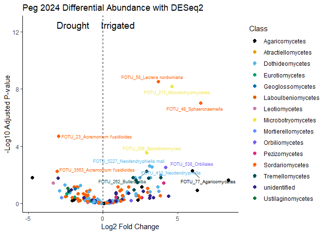<!-- -->

``` r
# Save the plot
ggsave("Plots/Diff_abundance_2024_peg.png",
       plot = deseq24_volcano,
             width = 12, height = 8, dpi = 400)
```


